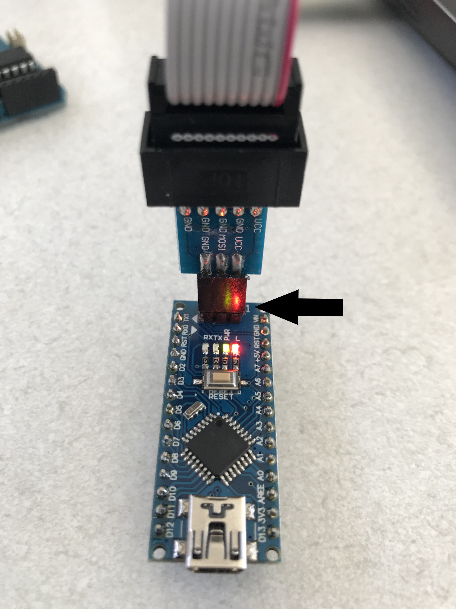
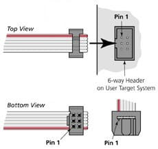
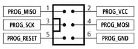
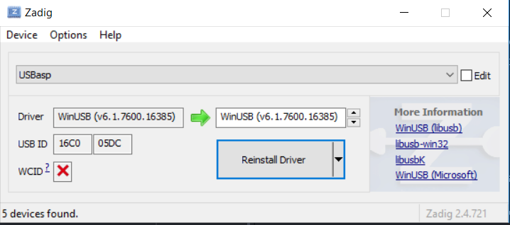
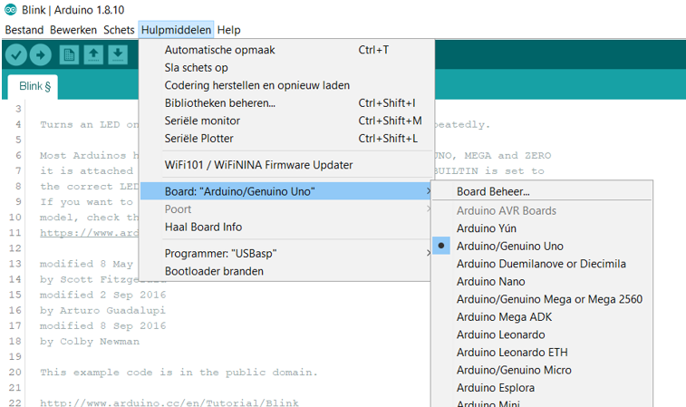
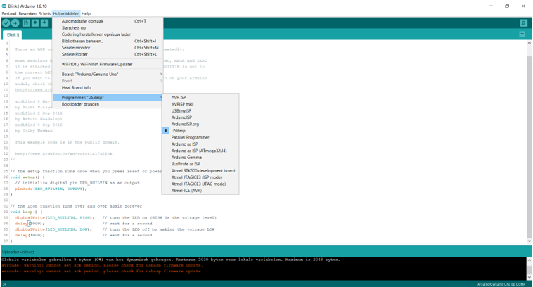
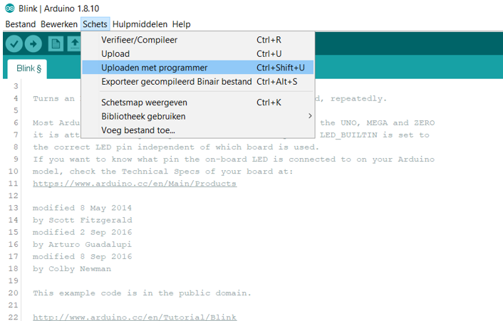

#  Nederlands

In dit hoofdstuk wordt uitgelegd hoe je via de ICSP (In Circuit Serial Programmer) een Arduino-achtige kunt programmeren. De tekst is verder uitsluitend in het Engels.

# English

In this chapter is explained how to program an Arduino like chip through ICSP (In Circuit Serial Programmer).

* First buy(can be found for less than &euro; 1) and connect the USB ASP. Pay attention to the connection of the header with the ICSP connector on the PCB. Some USB ASP do not have a notch to indicate pin 1. Most of the time the flat cable has a red wire on pin 1. On the Arduino Uno there is a very very small white dot at pin 1.

In an Arduino Nano there is a small '1' at the rear of the board:

Source: my own pictures

Source https://tutorial.cytron.io/2015/02/05/using-avr-usbasp-program-arduino/

* Now install the correct driver using the Zadig tool. [See](https://rayshobby.net/dead-simple-driver-installation-for-usbasp-and-usbtiny-on-windows/).

* Open the Arduino IDE and load an example program e.g. Blink.

* Select the correct target board e.g. Arduino Uno:

* Select the correct programmer:

* Now upload your program through the special USB ASP with the menu 'Upload with programmer':

[TOP](#English)
