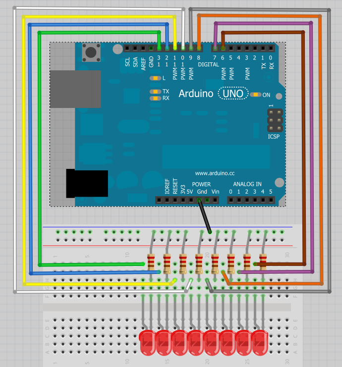

#  Nederlands

In deze cursus wordt stapsgewijs gewerkt aan het realiseren van een universele DCC schakeldecoder voor seinen en wissels. De cursus is verder geheel in het Engels.

#  English

In this course a universal DCC decoder for signals and switches is build step by step. We are using an Arduino Uno with 8 LEDs. This course is to encourage everyone to start loving the Arduino platform to be used in model railroad automation.



## 01 Blinking LED

This is the famous example build in every Arduino by default. The LED on pin 13 blinks with a frequency of 1/2 Hz.
Keywords in this example: **void, setup, pinMode, loop, digitalWrite, delay, HIGH, LOW**
```c++
void setup() {
  // initialize digital pin 13 as an output.
  pinMode(13, OUTPUT);
}

// the loop function runs over and over again forever
void loop() {
  digitalWrite(13, HIGH);   // turn the LED on (HIGH is the voltage level)
  delay(1000);              // wait for a second
  digitalWrite(13, LOW);    // turn the LED off by making the voltage LOW
  delay(1000);              // wait for a second
}
```


## 02 Blinking LED code quality

Keywords in this example: **const**

Most software developers will have two fields of improvement of the previous code

1. Get rid of 'magic' number
2. Split code into functional parts in separate files or tabs


#### No 'magic' numbers

In the code we refer to pin 13 three times. As the code gets bigger changing pin 13 to for example pin 3 is tedious work and one code part is easily forgotten. Thats why a constant is defined (name is written in capitals) and in the code every reference to the pin is done by SIGNALPIN.

#### Split code into functional parts

In this example a second file is created by clicking in the Arduino IDE on New Tab. In that new file with name 'SignalControl' three functions are created to initialize the output port and to switch the LED on and off.

**SignalControl.ino**

```c++
const int SIGNALPIN = 13;

void SignalControl_Init() {
  // initialize digital pin as an output.
  pinMode(SIGNALPIN, OUTPUT);
}

void SignalControl_On() {
  digitalWrite(SIGNALPIN, HIGH);   // turn the LED on (HIGH is the voltage level)
}

void SignalControl_Off() {
  digitalWrite(SIGNALPIN, LOW);   // turn the LED off (LOW is the voltage level)
}
```

**02_BlinkingLEDCodeQuality.ino**

```c++
const int DELAYTIME = 1000;

void setup() {
  // initialize signal output
  SignalControl_Init();
}

// the loop function runs over and over again forever
void loop() {
  SignalControl_On();   // turn the signal on
  delay(DELAYTIME);     // wait for a second
  SignalControl_Off();  // turn the signal off
  delay(DELAYTIME);     // wait for a second
}
```
Suppose the LED is connected to the Arduino with the anode connected to power. Then switching the LED on means writing a LOW to the output port. If a function SignalControl_On was **not** used in every place in the code of the main program the developer must be aware that the LED is connected differently.

If our DCC switch and signal decoder becomes more universal and remotely programmable the fact that the LED is switched on either by putting the output LOW or HIGH depending on some setting, all that intelligence is 'hidden' in the file SignalControl.ino. The developer of the main program only switches a LED on or off. When the electronics of the Arduino is extended with some hardware to enlarge the number of outputs(for example by using an I2C extender like the MCP23070) again the software for controlling that extender is 'hidden' in SignalControl.ino.

## 03 Blinking LED object oriented: work with classes and header files

In [this article](https://www.arduino.cc/en/Hacking/libraryTutorial) is explained how our example 02 can be rewritten into an object oriented solution with a header file, an implementation file and a main program. Also a good tutorial can be found [here](https://roboticsbackend.com/arduino-object-oriented-programming-oop/).

Keywords in this example: **class, public, #include, #ifndef, #define, #endif**

**SignalControl.h**

```c++
#ifndef SignalControl_h
#define SignalControl_h

#include "Arduino.h"

const int SIGNALPIN = 13;

class SignalControl
{
  public: SignalControl();
    void On();
    void Off();
};

#endif
```

A class definition (in the .h file) is an abstract of how the class SignalControl behaves to 'users' of this class. The user of the class, the software developer, can create one or more instances of this class. The class has three public functions: On(), Off() and the function, which is called automatically when an instance is created, with the same name as the class name (by convention). Class definitions are put into a header file with extension .h.

**SignalControl.cpp**

```c++
#include "SignalControl.h"

SignalControl::SignalControl() {
  // initialize digital pin as an output.
  pinMode(SIGNALPIN, OUTPUT);
}

void SignalControl::On() {
  digitalWrite(SIGNALPIN, HIGH);   // turn the LED on (HIGH is the voltage level)
}

void SignalControl::Off() {
  digitalWrite(SIGNALPIN, LOW);   // turn the LED off (LOW is the voltage level)
}
```

Knowing the meaning of all the definitions in the header file, this code of the cpp file containing the implementations of the definitions is almost the same as in the previous example.

**03_BlinkingLEDCodeQualityObjectOriented.ino**
```c++
#include "SignalControl.h"

const int DELAYTIME = 1000;

SignalControl signalcontrol;  //instatiate class

void setup() {
}

// the loop function runs over and over again forever
void loop() {
  signalcontrol.On();   // turn the signal on
  delay(DELAYTIME);     // wait for a second
  signalcontrol.Off();  // turn the signal off
  delay(DELAYTIME);     // wait for a second
}
```

**In the examples below we will use conventional Arduino programming without classes. All files will have extension .ino**

## 04 Four Blinking LEDS

The example is extended to blink 4 LEDs in turn.
Keywords in this example: **[** and **]** for arrays

**SignalControl.ino**

```c++
const int NUMBEROFPINS = 4;
const int SIGNALPINS[NUMBEROFPINS] = {13, 12, 11, 10};

void SignalControl_Init() {
  // initialize digital pin 13 as an output.
  for (int i = 0; i < NUMBEROFPINS; i++)
  {
    pinMode(SIGNALPINS[i], OUTPUT);
  }
}

int SignalControl_NumberOfSignals(){
  return NUMBEROFPINS;
}

void SignalControl_On(int signalNumber) {
  digitalWrite(SIGNALPINS[signalNumber], HIGH);   // turn the LED on (HIGH is the voltage level)
}

void SignalControl_Off(int signalNumber) {
  digitalWrite(SIGNALPINS[signalNumber], LOW);   // turn the LED off (LOW is the voltage level)
}
```

**04_BlinkingLEDCodeQuality.ino**
```c++
const int DELAYTIME = 1000;

void setup() {
  // initialize signal output
  SignalControl_Init();
}

// the loop function runs over and over again forever
void loop() {
  for (int i = 0; i < SignalControl_NumberOfSignals(); i++)
  {
    SignalControl_On(i);   // turn the signal on
    delay(DELAYTIME);     // wait for a second
    SignalControl_Off(i);  // turn the signal off
  }
}
```
SignalControl.ino now has an array with pin numbers. The numbers of pins is a constant and is defined **before** the array gets its size. The initialization sets all output ports. The ON and OFF functions get a parameter to indicate which logical LED number 0..3 must be switched on or off. The programmer of the main program has no knowledge of the physical pin numbers. The only problem is that he also has no knowledge of the number of signals (later in the course will talk about the number of signal aspects to that's why we switch to 'number of signals').A function is created which returns the number of signals so in the main program we refer to that function. Changing the number of LEDs is done in **one** place. The file containing code to control a certain set of hardware is often called a 'library'.

## 05 Four blinking LEDS with different frequencies
In the previous example we created a sort of 'Knight Rider' (old television series with an intelligent car having a set of LEDs at the front). Now the task is to let each LED blink at different frequencies. To solve this we must get rid of the delay().

Keywords in this example: **unsigned long, millis()**

**SignalControl.ino**
```c++
const int NUMBEROFPINS = 4;
const int SIGNALPINS[NUMBEROFPINS] = {13, 12, 11, 10};
const int SIGNALTIME[NUMBEROFPINS] = {1000, 500, 300, 100};

unsigned long previousMillis[NUMBEROFPINS];        // will store last time LED was updated
int signalState[NUMBEROFPINS];

void SignalControl_Init() {
  // initialize digital pin 13 as an output.
  for (int i = 0; i < NUMBEROFPINS; i++)
  {
    pinMode(SIGNALPINS[i], OUTPUT);
    signalState[i] = LOW;
    SignalControl_OnOff(i, signalState[i]);
    previousMillis[i] = 0;
  }
}

void SignalControl_OnOff(int signalNumber, int state) {
  digitalWrite(SIGNALPINS[signalNumber], state);
}

void SignalControl_Blink() {
  unsigned long currentMillis = millis();             // current time
  for (int i = 0; i < NUMBEROFPINS; i++)
  {
    if (currentMillis - previousMillis[i] >= SIGNALTIME[i]) {   //time of this specific signal has passed - invert
      previousMillis[i] = currentMillis;
      // if the LED is off turn it on and vice-versa:
      if (signalState[i] == LOW) {
        signalState[i] = HIGH;
      } else {
        signalState[i] = LOW;
      }
      SignalControl_OnOff(i, signalState[i]);
    }
  }
}
```
**05_FourBlinkingLEDSDifferentFrequency.ino**

```c++
void setup() {
  // initialize signal output
  SignalControl_Init();
}

// the loop function runs over and over again forever
void loop() {
  SignalControl_Blink();
}
```
The blinking software is now completely transferred into the library. The state of each signal is remembered in array ledState and the last time we flipped that signal is stored in array previousMillis. In the initalization the state is set to LOW and the signal/LED is turned off. In the previous code examples we assumed that setting an output of the Arduino implicitly sets the output LOW. Not assuming but setting it yourself is better. The same is for the array previousMillis: set it to 0 in the initialization function.

## 06 Four aspect signal

In the real world of model trains were are not switching individual LEDs on and off but rather switch a combination of one or more LEDs on, off or blinking. A signal is set to a specific aspect. In SignalControl.ino a 2D- array is specified containing the transformation of aspect to one ore more burning LEDs. In this example a keyboard key is send to the Arduino through the Arduine IDE monitor and the Arduino will light up the aspect HALT, WARN, PASS or SLOW (just imaginary aspects with imaginary light settings).

Keywords in this example: **enum, Serial.begin, Serial.print, Serial.available, Serial.read**

**SignalControl.ino**

```c++
const int NUMBEROFPINS = 3;
const int SIGNALPINS[NUMBEROFPINS] = {13, 12, 10}; //for RED, YELLOW and GREEN LED

const int NUMBEROFASPECTS = 4;
enum ledState {
  OFF, ON     //first OFF, will be 0 written to output port
};

int aspectLEDS [NUMBEROFASPECTS][NUMBEROFPINS] = {
  {ON, OFF, OFF},  //HALT
  {OFF, ON, OFF},  //WARN
  {OFF, OFF, ON},  //PASS
  {ON, OFF, ON}    //SLOW
};

void SignalControl_Init() {
  // initialize digital pin 13 as an output.
  for (int i = 0; i < NUMBEROFPINS; i++)
  {
    pinMode(SIGNALPINS[i], OUTPUT);
  }
}

void SignalControl_ShowAspect(int aspectNumber) {
  Serial.print("Showing aspect: ");
  Serial.println(aspectNumber);
  for (int i = 0; i < NUMBEROFPINS; i++) {
    digitalWrite(SIGNALPINS[i], aspectLEDS[aspectNumber][i]);
  }
}
```

**06_FourAspectSignal.ino**

```c++
enum sigalAspects {
  HALT, WARN, PASS, SLOW
};
void setup() {
  // initialize signal output
  SignalControl_Init();
  Serial.begin(9600);
}

// the loop function runs over and over again forever
void loop() {
  char inputchar = ' ';
  if (Serial.available()) {
    inputchar = Serial.read();
    switch (inputchar) {
      case 'H':
        SignalControl_ShowAspect(HALT);
        break;
      case 'W':
        SignalControl_ShowAspect(WARN);
        break;
      case 'P':
        SignalControl_ShowAspect(PASS);
        break;
      case 'S':
        SignalControl_ShowAspect(SLOW);
        break;
    };
  }
}
```

## 07 Four aspect signal with blink

The previous example can easily be extended to a version with a third state of a LED: blinking. Again a software timer is used (not a delay). An extra feature of this example is the possibility to have different lights for each aspect depending on the user selected country.

**SignalControl.ino**

```c++
const int NUMBEROFPINS = 3;
const int SIGNALPINS[NUMBEROFPINS] = {13, 12, 10}; //for RED, YELLOW and GREEN LED
unsigned long previousMillis[NUMBEROFPINS];        // will store last time LED was updated
int signalState[NUMBEROFPINS];

const int NUMBEROFASPECTS = 4;
const int BLINKTIME = 500;
enum ledState {
  OFF, ON, BLINK     //first OFF, will be 0 written to output port
};

int aspectLEDS [NUMBEROFCOUNTRIES][NUMBEROFASPECTS][NUMBEROFPINS] = {
  { //NL
    {ON, OFF, OFF},  //HALT
    {OFF, ON, OFF},  //WARN
    {OFF, OFF, ON},  //PASS
    {OFF, ON, BLINK} //SLOW does not exist in NL
  },
  { //DE
    {ON, OFF, OFF},  //HALT
    {OFF, ON, ON},   //WARN
    {OFF, OFF, ON},  //PASS
    {OFF, ON, BLINK} //SLOW does not exist in DE
  }
};
int currentAspect;

void SignalControl_Init() {
  // initialize digital pin 13 as an output.
  for (int i = 0; i < NUMBEROFPINS; i++)
  {
    pinMode(SIGNALPINS[i], OUTPUT);
  }
}

void SignalControl_ShowAspect(int aspectNumber) {
  Serial.print("Showing aspect: ");
  Serial.println(aspectNumber);
  currentAspect = aspectNumber;
  for (int i = 0; i < NUMBEROFPINS; i++) {
    if (aspectLEDS[currentCountry][currentAspect][i] == ON || aspectLEDS[currentCountry][currentAspect][i] == OFF) {
      digitalWrite(SIGNALPINS[i], aspectLEDS[currentCountry][aspectNumber][i]);
    }
  }
}

void SignalControl_Blink() {
  unsigned long currentMillis = millis();             // current time
  for (int i = 0; i < NUMBEROFPINS; i++)
  {
    if ((aspectLEDS[currentCountry][currentAspect][i] == BLINK) && (currentMillis - previousMillis[i] >= BLINKTIME)) {   //time of this specific signal has passed - invert
      previousMillis[i] = currentMillis;
      // if the LED is off turn it on and vice-versa:
      if (signalState[i] == LOW) {
        signalState[i] = HIGH;
      } else {
        signalState[i] = LOW;
      }
      digitalWrite(SIGNALPINS[i], signalState[i]);
    }
  }
}
```
**07_FourAspectSignalBlink.ino**
```c++
const int NUMBEROFCOUNTRIES = 2;

enum countries {
  NL, DE
};

enum sigalAspects {
  HALT, WARN, PASS, SLOW
};

countries currentCountry = NL;

void setup() {
  // initialize signal output
  SignalControl_Init();
  Serial.begin(9600);
}

// the loop function runs over and over again forever
void loop() {
  char inputchar = ' ';
  if (Serial.available()) {
    inputchar = Serial.read();
    switch (inputchar) {
      case 'H':
        SignalControl_ShowAspect(HALT);
        break;
      case 'W':
        SignalControl_ShowAspect(WARN);
        break;
      case 'P':
        SignalControl_ShowAspect(PASS);
        break;
      case 'S':
        SignalControl_ShowAspect(SLOW);
        break;
      case '1':
        currentCountry = NL;;
        break;
      case '2':
        currentCountry = DE;;
        break;
    };
  }
  SignalControl_Blink();
}
```
## Brightness start simple

Fading is a lot more complex. In these cases it is wise to start with a smaller example instead of trying to extend the previous example.

Dimming a LED is done through pulse width modulation. At a speed invisible for the human eye the LED is switched on during a certain period and off. The ratio on-off will give the impression that the LED is dimmed.

This example has one LED. Experiment with the values of HIGHTIME and LOWTIME. The sum of HIGHTIME and LOWTIME is the PWM cycle period. In the example this is 20 msec so the LED will flicker at 50 Hz. Lower frequencies are irritating to the eye. Setting the brightness to 1 msec on and 19 msec off is still visible. Flickering at 50 Hz can be made visible in two ways: turn your head fast while lokking at the LED and using the camera of a mobile phone.

```c++
const int SIGNALPIN = 13;
const int HIGHTIME = 1;
const int LOWTIME = 19;

void setup() {
  // initialize digital pin  as an output.
  pinMode(SIGNALPIN, OUTPUT);
}

// the loop function runs over and over again forever
void loop() {
  digitalWrite(SIGNALPIN, HIGH);   // turn the LED on (HIGH is the voltage level)
  delay(HIGHTIME);                 // wait for HIGHTIME msec
  digitalWrite(SIGNALPIN, LOW);    // turn the LED off by making the voltage LOW
  delay(LOWTIME);                  // wait for LOWTIME msec
}
```

```c++
void setup() {
  // initialize signal output
  SignalControl_Init();
}

// the loop function runs over and over again forever
void loop() {
  SignalControl_Blink();
}
```

## Brightness without the delay function

Now we rewrite the example above to get rid of the delay function. The smallest time division is one step in the PWM cycle. The LED is switched on at the beginning of the cycle and switched off at the moment the cycle reaches the presetted brightness (ledBrightness) of the LED. If ledBrightness = 0 the LED is always off (we need this in a later example).

**SignalControl.ino**

```c++
const int SIGNALPIN = 13;

const int PWMTIME = 20;        // time in msec for one PWM cycle.
const int PWMINCREASE = 1;     // each PWM cycle is divided into steps of PWMINCREASE msec
int pwmCycle;                  // each PWM cycle this starts with 1 and increases each PWMINCREASE msec up to PWMTIME

unsigned long previousMillis;  // will store last time PWM cycle was updated
int ledBrightness;               // will store brightness as the PWM width value between 0 and PWMTIME

void SignalControl_Init() {
  // initialize digital pin 13 as an output.
  pinMode(SIGNALPIN, OUTPUT);
  pwmCycle = 1;
  ledBrightness = 2;  // lowest brightness for this experiment
}

void SignalControl_Blink() {
  unsigned long currentMillis = millis();                // current time
  if (currentMillis - previousMillis >= PWMINCREASE) {   // PWMINCREASE msec have passed since last time
    previousMillis = currentMillis;                      // wait for next moment
    pwmCycle = pwmCycle + PWMINCREASE;                   // next PWMINCREASE msec within one PWM cycle
    if (pwmCycle > PWMTIME) {                            // if one PWM cycle is completed, repeat by starting at 1
      pwmCycle = 1;
    };
    int ledState;
    if (ledBrightness >= pwmCycle) {   // switch LED on or off during one cycle at the moment the setting of the brightness is reached
      ledState = HIGH;                 // HIGH means set LED on
    } else {
      ledState = LOW;                  // LOW means set LED off
    }
    digitalWrite(SIGNALPIN, ledState); //set output according to ledState
  }
}

```

**09_BrightnessWithoutDelay.ino**

```c++
void setup() {
  // initialize signal output
  SignalControl_Init();
}

// the loop function runs over and over again forever
void loop() {
  SignalControl_Blink();
}
```

## Fading

Now the example above is extended to get a fading effect.The brightness is slowely increased until maximum and then decreased at the same speed until minimum.

**SignalControl.ino**

```c++
const int SIGNALPIN = 13;

const int PWMTIME = 20;        // time in msec for one PWM cycle. 20 msec means 50 Hz cycle.
const int PWMINCREASE = 1;     // each PWM cycle is divided into steps of PWMINCREASE msec
int pwmCycle;                  // each PWM cycle this starts with 1 and increases each PWMINCREASE msec up to PWMTIME
int brightCycle;               // count PWM cycles
const int BRIGHTINCREASECYCLES = 2; // after BRIGHTINCREASECYCLES times a complete PWM cycle brightness is increased or decreased

unsigned long previousMillis;  // will store last time PWM cycle was updated

void SignalControl_Init() {
  // initialize digital pin 13 as an output.
  pinMode(SIGNALPIN, OUTPUT);
  pwmCycle = 1;
  brightCycle = 0;
}

void SignalControl_Blink() {
  unsigned long currentMillis = millis();                // current time
  if (currentMillis - previousMillis >= PWMINCREASE) {   // PWMINCREASE msec have passed since last time
    previousMillis = currentMillis;                      // wait for next moment
    pwmCycle = pwmCycle + PWMINCREASE;                   // next PWMINCREASE msec within one PWM cycle
    if (pwmCycle > PWMTIME) {                            // if one PWM cycle is completed, repeat by starting at 1
      pwmCycle = 1;
      brightCycle ++;                            // increase cycle number
      if (brightCycle > BRIGHTINCREASECYCLES) {  // it is time to increase or decrease brightness
        brightCycle = 0;
        if ((ledBrightness < PWMTIME) && (ledDimOrBright == UP)) { // as long not at maximum
          ledBrightness = ledBrightness + 1;         // increase brightness
          if (ledBrightness == PWMTIME) {                         // if at maximum, for now invert to dimming
            ledDimOrBright = DOWN;
          }
        };
        if ((ledBrightness > 1) && (ledDimOrBright == DOWN)) { // as long not at minimum
          ledBrightness = ledBrightness - 1;    // increase brightness
          if (ledBrightness == 1) {                          // if at maximum, for now invert to dimming
            ledDimOrBright = UP;
          }
        };
      };
    };
    int ledState;
    if (ledBrightness >= pwmCycle) {   // switch LED on or off during one cycle at the moment the setting of the brightness is reached
      ledState = HIGH;                 // HIGH means set LED on
    } else {
      ledState = LOW;                  // LOW means set LED off
    }
    digitalWrite(SIGNALPIN, ledState); //set output according to ledState
  }
}
```

The big change between this code and the previous example starts after **pwmCycle = 1;**
Use this program to experiment with fade timing.

**10_FadingWithoutDelay.ino**

```c++
const int UP = 1;
const int DOWN = -1;

int ledState;       // is LED dimming of getting brighter
int ledBrightness;  // will store brightness as the PWM width value between 0 and PWMTIME
int ledDimOrBright; // should led get brighter +1 of must it dimm -1

void setup() {
  // initialize signal output
  SignalControl_Init();
  ledBrightness = 1;
  ledDimOrBright = UP;
}

// the loop function runs over and over again forever
void loop() {
  SignalControl_Blink();
}
```

## Fading and blinking without delay

The next step in complexity is to have a LED blink combined with fading.


## Fading on transition from one aspect to another

On receiving a command the lights of the current aspect must be dimmed during a dimming period and the lights of the new aspect must get brighter during a dimming period.


## Further plans for this course

* Queue during fading new command can be received

* Transition from green to red through short yellow

* Interrupts

* Timers

* EEPROM

* OLED display

* DCC sniffer

* Complete DCC switching decoder
