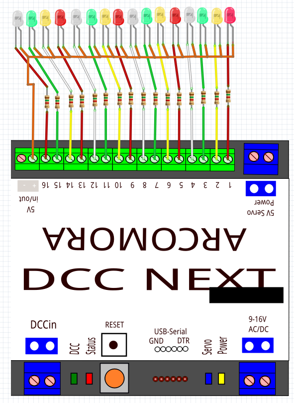

#  Nederlands

[Navigate to English version](#English)

## Schema DCCNext

De DCCNext heeft 16 uitgangen, die op verschillende pinnen van de Arduino zijn aangesloten.

Een normaal Arduino-board bevat een Atmel ATMega386 met pinnen van de chip, die verbonden zijn met pinnen op het board.

 Bron: https://github.com/MCUdude/MiniCore

De tekening van de DCCNext is niet compleet:

 Bron: https://www.arcomora.com/arsigdec/

Hierbij de aansluitingen van de DCCNext en pinnummers zoals je die op de DCCNext, de Arduino en op de Atmelchip ziet:

|DCCNext|Arduino pin|Atmel    |
|-------|-----------|---------|
|       | 0 RX      |PD0/RXD  |
|       | 1 TX      |PD1/TXD  |
|       | 2 DCC in  |PD2      |
|1      | 3         |PB3      |
|2      | 4         |PD4      |
|3      | 5         |PD5      |
|4      | 6         |PD6      |
|5      | 7         |PD7      |
|6      | 8         |PB0      |
|7      | 9         |PB1      |
|8      | 10        |PB2      |
|9      | 11        |PB3      |
|10     | 12        |PB4      |
|       | 13        |PB5/LED  |
|11     | 14/A0     |PC0/ADC0 |
|12     | 15/A1     |PC1/ADC1 |
|13     | 16/A2     |PC2/ADC2 |
|14     | 17/A3     |PC3/ADC3 |
|15     | 18/A4     |PC4/ADC4 |
|16     | 19/A5     |PC5/ADC5 |
|       | 20        |PB6/XTAL |
|       | 21        |PB7/XTAL |
|       | 22        |PC6/RESET|

## Assemblage

Netjes volgens de handleiding monteren en solderen. Op advies van Cees Baarda van de HCCm een stuk doorzichting plakplastic over de sticker aan de bovenzijde aangebracht.

## Tester

Om de DCCNext te kunnen testen zijn op alle uitgangen 4 rode, 4 gele, 4 groene en 4 witte LED's middels een testprint met bij de LED-kleur behorende draad- en adereindhuls-kleur aangesloten. Oranje = 5V. De AC/DC van 16V is voor de test aangesloten op DCC.

Dit schema is gemaakt met Fritzing door eerst de DCCNext over te tekenen met Inkscape en daarna er een Fritzing component van te maken zoals beschreven in een apart [hoofdstuk](../Fritzing/README.md). Gebouwd ziet dit er als volgt uit:

## Configureren

M.b.v. de handleiding van de [ArSigDec](https://www.globalvisuals.nl/downloads/arsigdecmanualdb.pdf) van Arcomora worden voor Nederland een standaard in de database aanwezig P-sein met en een P-sein zonder cijferbak geconfigureerd.

Adres 150 P-sein met cijferbak. Adressen 150 en 151 met ieder ROOD- en GROEN-commando's.
Adres 152 P-sein zonder cijferbak. Adressen 152 en 153 met ieder ROOD- en GROEN-commando's.

#### Upload

De eerste keer dat de DCCNext wordt aangesloten en de gebruiker voor de shortcut Arsigdec heeft gekozen zal het programma de USB-poort zoeken en als dat gelukt is het programma Arsigdec op de Arduino laden.

#### Eerste configuratie

De eerste keer na het uploaden worden een aantal parameters ingesteld.

#### Heropenen

Als de Arduino wordt aangesloten op de laptop, terwijl er eerder een goede uload is geweest incl. basisconfiguratie dan volgt een kort welkom:

#### Standaardsein configureren

Als eerst wordt een Nederlands P-sein met cijferbak (database nummer 1) gekozen op DCC startadres 150:

Evenzo is een Nederlands P-sein zonder cijferbak (database nummer 2) gekozen op DCC startadres 152.

Met een T-commando kunnen vanuit de laptop de LED's worden getest. Een klein nadeel is  (waarschijnlijk omdat in de aanwezige installatie alles common anode is) dat alle LED's meteen gaan branden (dit is een verbeterpunt van de ArSigDec). Bij 16 test-LED's op één Atmel386 in het bordje is dat te veel stroom. Maak eerst een paar LED-aansluitingen los of configureer meteen het maximum aantal seinen binnen de DCCNext. In het laatste geval zal de DCCNext na het typen van een E (Operation Mode) bijna alle seinen doven.

## DCC commando's naar aspect

Om de configuratie testen worden eerst via de DCC Command Centre (b.v. DR5000) en/of MultiMaus ROOD- en GROEN-commando's naar de ingestelde adressen gestuurd om te controleren welke commando's nodig zijn voor welk aspect.

Sein 1 4 aspecten, database nummer 1

|Commando|Aspect                                    |
|--------|------------------------------------------|
|150-R   |Naar rood, als hiervoor groen dan via geel|
|150-G   |Naar groen, als hiervoor rood dan via geel|
|151-R   |Naar geel                                 |
|151-G   |Naar geel+wit                             |

Sein 2 3 aspecten, database nummer 2

|Commando|Aspect                                    |
|--------|------------------------------------------|
|152-R   |Naar rood, als hiervoor groen dan via geel|
|152-G   |Naar groen, als hiervoor rood dan via geel|
|153-R   |Naar geel                                 |
|153-G   |Geen reactie                              |

Dit is alles conform de handleiding.

## RocRail configuratie

De hierboven bekeken ROOD- en GROEN-commando's moeten nu door een juiste configuratie uit RocRail komen. Op de site van Arcomora wordt verwezen naar een [video](https://www.youtube.com/watch?v=dic4zqEXa8o) waarin wordt uitgelegd dat bij de DCCNext de adresseermethode 'Linear' moet worden gekozen.

Maak een sein in RocRail met b.v. de naam sgNext1:

Zet in het tabblad Interface het poortadres op 150 (PADA) en Control op Linear:

Zet in het tabblad Details de juiste volgnummers voor RED 0, voor GREEN 1 en voor YELLOW 2:

* Klik steeds op het sein sgNext1 in de RocRail interface dan gaat het aspect ROOD, GEEL en GROEN om beurten branden (met netjes een overgang van ROOD naar GROEN via een korte tussenstand GEEL). Een andere mogelijkheid is om op het sein de rechtermuis te klikken; je kunt dan meteen het gewenste aspect kiezen.
* Bekijk de test DCCNext en de logging in de RocRail interface. Als alles correct is ingesteld zie je dat RocRail dezelfde commando's stuurt als hiervoor met de hand is uitgeprobeerd.

#  English

## Schema DCCNext

The DCCNext has 16 outputs connected to different pins of the Arduino.

A normal Arduino board has a Atmel ATMega386 with pins on the chip connected to pins on the board.

 Bron: https://github.com/MCUdude/MiniCore

The schema DCCNext is not complete:

 Bron: https://www.arcomora.com/arsigdec/

Here are the pins of the DCCNext en pinnummers, the Arduino and the Atmel chip:

|DCCNext|Arduino pin|Atmel    |
|-------|-----------|---------|
|       | 0 RX      |PD0/RXD  |
|       | 1 TX      |PD1/TXD  |
|       | 2 DCC in  |PD2      |
|1      | 3         |PB3      |
|2      | 4         |PD4      |
|3      | 5         |PD5      |
|4      | 6         |PD6      |
|5      | 7         |PD7      |
|6      | 8         |PB0      |
|7      | 9         |PB1      |
|8      | 10        |PB2      |
|9      | 11        |PB3      |
|10     | 12        |PB4      |
|       | 13        |PB5/LED  |
|11     | 14/A0     |PC0/ADC0 |
|12     | 15/A1     |PC1/ADC1 |
|13     | 16/A2     |PC2/ADC2 |
|14     | 17/A3     |PC3/ADC3 |
|15     | 18/A4     |PC4/ADC4 |
|16     | 19/A5     |PC5/ADC5 |
|       | 20        |PB6/XTAL |
|       | 21        |PB7/XTAL |
|       | 22        |PC6/RESET|

## Assembly

Assemble and solder as mentioned in the manual. On advice of Cees Baarda of the Model RailRoad department of the Dutch Hobby COmputer Club a piece of transparent plastic was put over the upside sticker.

## Tester

To test the DCCNext 4 red, 4 yellow, 4 green and 4 white LEDs were connected with an experimental PCB with correcponding wire and insulation terminal. Orange = 5V. The AC/DC of 16V was connected to DCC during this test.

The schema was made with Fritzing by drawing the DCCNext by hand with Inkscape and then create a Fritzing component from it as described in [hoofdstuk](../Fritzing/README.md).

Assembled:

## Configure

With the [ArSigDec](https://www.globalvisuals.nl/downloads/arsigdecmanualdb.pdf) manual of  Arcomora a Dutch P signal with speed indicator and a P signal without speed indicator were configured.

Adres 150 P signal with speed indicator. Adresses 150 and 151 each possible with a RED and GREEN command.
Adres 152 P signal without speed indicator. Adresses 152 and 153 each possible with a RED and GREEN command.

#### Upload

THe first time a DCCNext is connected to a laptop the user can click shortcut Arsigdec and the program searches for the USB port. When succeeded the ArSigDec software is loaded into the DCCNext.

#### First configuration

The first time af reinstall some parameters must be set.

#### Reopen

A short welcome is shown when connecting the DCCNext to a laptop after first install.

#### Configure signal from database

We start with a Dutch P signal with speed indicator (database number 1) at DCC start adress 150:

Also a Dutch P signal without speed indicator (database number 2) at DCC startadress 152 was configured.

With a T command the LED can be tested from the laptop. A small disadvantage  (possibly due to the fact that we chose common anode) is that all LEDs start immediately (point of improvement of the ArSigDec). With 16 test LEDs on one Atmel386 is to much current. Disconnect a few LEDs or configure mdirectly the maximum number of signals in the DCCNext. Doing so will light up less LEDs when going to Operation Mode.

## DCC commands to aspect

To test the configuration using the DCC Command Centre (e.g. DR5000) or MultiMaus RED and GREEN commands were send to the efeect in aspect.

Signal 1 4 aspects, database number 1

|Command|Aspect                                         |
|-------|-----------------------------------------------|
|150-R  |To red, if previously green then short yellow  |
|150-G  |To green, if previously green then short yellow|
|151-R  |To yellow                                      |
|151-G  |To yellow+white                                |

Signal 2 3 aspects, database number 2

|Commando|Aspect                                         |
|--------|-----------------------------------------------|
|152-R   |To red, if previously green then short yellow  |
|152-G   |To green, if previously green then short yellow|
|153-R   |To yellow                                      |
|153-G   |No reaction                                    |

As mentioned in the manual.

## RocRail configuration

The RED and GREEN-commands must now come from RocRail after correct configuration. In the manual of ArSigDec is referred to a [video](https://www.youtube.com/watch?v=dic4zqEXa8o) explaining to use 'Linear' when connecting DCCNext to RocRail.

Create a signal sgNext1 in RocRail:

In the tab Interface set the port adress to 150 (PADA) and Control on Linear:

In the tab Details give the following numbers to RED 0, to GREEN 1 and to YELLOW 2:

* Click on the signal sgNext1 in the RocRail interface several times. The signal we go through the aspects RED, YELLOW and GREEN (with a short YELLOW when going from RED to GREEN directly). Another possibility is to right click the signal and chose the aspect.
* Look at the test DCCNext and the logging in the RocRail interface. If set correctly you will see RocRail sending the same commands as you did manually.
