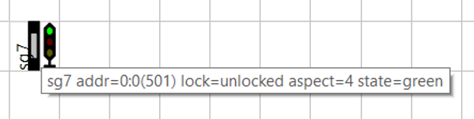

Er zijn diverse manieren om schakeldecoders te adresseren en de diverse fabrikanten verschillen onderling, maar zelfs binnen Digikeijs en RocRail verschillen qua adressering binnen één produkt.

## DR5000
In de DR5000 kunnen we met het schakelbord een wissel of sein bedienen. Bij het bedienen van wissel/sein 501 wordt in de logging het aangeroepen adres echter altijd één lager genoemd!!

In de Arduino-sniffer worden zowel PADA als MADA getoond; dus zowel 501 als 126:0.

## RocRail
In de gebruikersinterface van RocRail kan voor het adresseren van de DR4018 zowel PADA:

Of MADA:

We kunnen dus bij het instellen bij preset 1 de adressen 501, 502 en 503 gebruiken maar ook 126:1, 126:2 en 126:3 (omdat het gebruik van het getal 0 bij RocRail betekent niets mee doen moeten dus de waarden 1 hoger liggen).
De RocRail-gebruikersinterface toont bij PADA netjes het ingestelde adres 501:

Bij het adresseren middels MADA  zien we ineens een adres 1001 naast 501 ??

De RocView-logging toont echter weer een adres 1 lager onafhankelijk van PADA/MADA!!

Ook de logging van de RocRail server toont adressen 1 lager ongeacht PADA/MADA:

## On en off
Daarnaast zijn er twee begrippen om een wissel/sein te bedienen nl. on/off, groen/rood en rechtdoor/afbuigend. ON = GROEN = RECHTDOOR. Dit kun je o.a. testen door de schakelinterface en de logging van de DR5000 tegelijk open te zetten. Op de bediening van de MultiMaus (plaatje uit handleiding Fleischmann) is de linker wisseltoets rechtdoor en de rechter wisseltoets afbuigend zoals dat ook op het LCD wordt getoond.

There are several ways of adressing accessory decoders like the DR4018 and manufacturers use different ways and even Digikeijs and RocRail use more than one adressing method in the same product.

## DR5000
In the DR5000 we can use the switch board to control switches and signals. Switching adress 501 will show in the logging the adress minus 1!!

In de Arduino-sniffer worden zowel PADA als MADA getoond; dus zowel 501 als 126:0.

## RocRail
For RocRail you can use [PADA](./images/DR4018_RocRail_PADA_adressing.JPG) or [MADA](./images/DR4018_RocRail_MADA_adressing.png) for a DR4018. For preset 1 we can use adresses 501, 502 en 503 but also 126:1, 126:2 en 126:3 (because a value 0 in the RocRail interface means 'no meaning' the values are 1 higher). The RocRail user interface shows the [given adress](./images/DR4018_RocRail_Userinterface.png) with PADA; using [MADA](./images/DR4018_RocRail_UserinterfaceMADA.png) for adressing the signal we suddenly see an adress 1001 next to 501 ?? The RocView logging shows 1 [lower](./images/DR4018_RocRail_Logging.png) despite PADA/MADA!! The logging of the RocRail [server](./images/DR4018_RocRail_server_logging.png) shows adresses 1 lower despite PADA/MADA.

## On en off
There are two concepts in manipulating switches/signals on/off, green/red and straight/branch off. ON = GREEN = STRAIGHT. THis can be checked by opening the switch and logging interface of the DR5000 at the same time. On the [MultiMaus](./images/MultiMaus.png.png) (picture from Fleischmann manual) the left key is straight and the left key is branch off. The cooresponding symbol is shown in the LCD.
