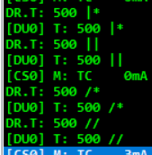

# Nederlands

[Navigate to English version](#English)

Er zijn diverse manieren om schakeldecoders te adresseren en de diverse fabrikanten verschillen onderling, maar zelfs binnen Digikeijs en RocRail verschillen qua adressering binnen één produkt. In de documentatie van RocRail wordt gesproken over Port Accessory Decoder Address (PADA) en Module Accessory Decoder Address (MADA) [zie](https://wiki.rocrail.net/doku.php?id=addressing-nl).

## NMRA

Accessory Digital Decoders can be designed to control momentary or constant-on devices, the duration of time each output is active being controlled by configuration variables CVs 515 through 518. Bit 3 of the second byte "C" is used to activate or deactivate the addressed device. (Note if the duration the device is intended to be on is less than or equal the set duration, no deactivation is necessary.) Since most devices are paired, the convention is that bit "0" of the second byte is used to distinguish between which of a pair of outputs the accessory decoder is activating or  deactivating. Bits 1 and 2 of byte two are used to indicate which of 4 pairs of outputs the packet is controlling. The most significant bits of the 9-bit address are bits 4-6 of the second data byte. By convention these bits (bits 4-6 of the second data byte) are in ones complement.

[Bron: NMRA 9.2.1](https://www.nmra.org/sites/default/files/s-9.2.1_2012_07.pdf)

## Roco

The visualization of the turnout number on the user interface is differently solved in some DCC systems and can significantly differ from the real DCC accessory decoder address plus port actually used in the track signal. According to DCC, there are four ports with two outputs each per accessory decoder address. One turnout can be connected per port. Usually one of the following options is used to visualize the turnout number:
1. Numbering from 1 with DCC address at 1 starting with 4 ports each (ESU, Uhlenbrock, ...). Switch #1: DCC-Addr=1 Port=0; Switch #5: DCC-Addr=2 Port=0; Switch #6: DCC-Addr=2 Port=1
2. Numbering from 1 with DCC address at 0 starting with 4 ports each (Roco). Switch #1: DCC-Addr=0 Port=0; Switch #5: DCC-Addr=1 Port=0; Switch #6: DCC-Addr=1 Port=1
3. Virtual switch number with freely configurable DCC address and port (Twin Center)
4. Displaying real DCC-address and port number (Zimo)

None of these visualization options can be described as “wrong” due to lack of specification in RP-9.2.1, where the visualization to the user is not mentioned at all. For the user, however, this can mean in consequence getting used to the fact that one and the same turnout at an ESU control panel is controlled under number 1, while it is switched on the Roco multiMaus and Z21 under number 5 ("shift by 4").

[Bron: Roco](https://www.z21.eu/media/Kwc_Basic_DownloadTag_Component/root-en-main_47-1652-959-downloadTag-download/default/d559b9cf/1558675126/z21-lan-protokoll-en.pdf)

## DR5000
In de DR5000 kunnen we met het schakelbord een wissel of sein bedienen. Bij het bedienen van wissel/sein 501 wordt in de logging het aangeroepen adres echter altijd één lager genoemd!!

In de Arduino-sniffer worden zowel PADA als MADA getoond; dus zowel 501 als 126:0.

## RocRail
In de gebruikersinterface van RocRail kan voor het adresseren van de DR4018 zowel PADA:

Of MADA:

We kunnen dus bij het instellen bij preset 1 de adressen 501, 502 en 503 gebruiken maar ook 126:1, 126:2 en 126:3 (omdat het gebruik van het getal 0 bij RocRail betekent niets mee doen moeten dus de waarden 1 hoger liggen).
De RocRail-gebruikersinterface toont bij PADA netjes het ingestelde adres 501:

Bij het adresseren middels MADA  zien we ineens een adres 1001 naast 501 ??

De RocView-logging toont echter weer een adres 1 lager onafhankelijk van PADA/MADA!!

Ook de logging van de RocRail server toont adressen 1 lager ongeacht PADA/MADA:

## On en off
Daarnaast zijn er twee begrippen om een wissel/sein te bedienen nl. on/off, groen/rood en rechtdoor/afbuigend.

ON  = GROEN = RECHTDOOR

OFF = ROOD  = AFBUIGEND

Dit kun je o.a. testen door de schakelinterface en de logging van de DR5000 tegelijk open te zetten. Op de bediening van de MultiMaus (plaatje uit handleiding Fleischmann) is de linker wisseltoets rechtdoor en de rechter wisseltoets afbuigend zoals dat ook op het LCD wordt getoond.

# English

There are several ways of adressing accessory decoders like the DR4018 and manufacturers use different ways and even Digikeijs and RocRail use more than one adressing method in the same product. In the RocRail documentation there are Port Accessory Decoder Address (PADA) and Module Accessory Decoder Address (MADA) [look at](https://wiki.rocrail.net/doku.php?id=addressing-en).

## NMRA

Accessory Digital Decoders can be designed to control momentary or constant-on devices, the duration of time each output is active being controlled by configuration variables CVs 515 through 518. Bit 3 of the second byte "C" is used to activate or deactivate the addressed device. (Note if the duration the device is intended to be on is less than or equal the set duration, no deactivation is necessary.) Since most devices are paired, the convention is that bit "0" of the second byte is used to distinguish between which of a pair of outputs the accessory decoder is activating or  deactivating. Bits 1 and 2 of byte two are used to indicate which of 4 pairs of outputs the packet is controlling. The most significant bits of the 9-bit address are bits 4-6 of the second data byte. By convention these bits (bits 4-6 of the second data byte) are in ones complement.

[Bron: NMRA 9.2.1](https://www.nmra.org/sites/default/files/s-9.2.1_2012_07.pdf)

## Roco

The visualization of the turnout number on the user interface is differently solved in some DCC systems and can significantly differ from the real DCC accessory decoder address plus port actually used in the track signal. According to DCC, there are four ports with two outputs each per accessory decoder address. One turnout can be connected per port. Usually one of the following options is used to visualize the turnout number:
1. Numbering from 1 with DCC address at 1 starting with 4 ports each (ESU, Uhlenbrock, ...). Switch #1: DCC-Addr=1 Port=0; Switch #5: DCC-Addr=2 Port=0; Switch #6: DCC-Addr=2 Port=1
2. Numbering from 1 with DCC address at 0 starting with 4 ports each (Roco). Switch #1: DCC-Addr=0 Port=0; Switch #5: DCC-Addr=1 Port=0; Switch #6: DCC-Addr=1 Port=1
3. Virtual switch number with freely configurable DCC address and port (Twin Center)
4. Displaying real DCC-address and port number (Zimo)

None of these visualization options can be described as “wrong” due to lack of specification in RP-9.2.1, where the visualization to the user is not mentioned at all. For the user, however, this can mean in consequence getting used to the fact that one and the same turnout at an ESU control panel is controlled under number 1, while it is switched on the Roco multiMaus and Z21 under number 5 ("shift by 4").

[Bron: Roco](https://www.z21.eu/media/Kwc_Basic_DownloadTag_Component/root-en-main_47-1652-959-downloadTag-download/default/d559b9cf/1558675126/z21-lan-protokoll-en.pdf)

## DR5000
In the DR5000 we can use the switch board to control switches and signals. Switching adress 501 will show in the logging the adress minus 1!!

In the Arduino sniffer both PADA en MADA are shown; so both 501 and 126:0.

## RocRail
For RocRail you can use PADA for adressing the DR4018:

or MADA:

For preset 1 we can use adresses 501, 502 en 503 but also 126:1, 126:2 en 126:3 (because a value 0 in the RocRail interface means 'no meaning' the values are 1 higher). The RocRail user interface shows the given adress 501 with PADA:

Using MADA  for adressing the signal we suddenly see an adress 1001 next to 501 ??

The RocView logging shows 1 lower  despite PADA/MADA!!

The logging of the RocRail server shows adresses 1 lower despite PADA/MADA:

## On en off
There are two concepts in manipulating switches/signals on/off, green/red and straight/branch off.

ON  = GREEN = STRAIGHT

OFF = RED   = BRANCH OFF

This can be checked by opening the switch and logging interface of the DR5000 at the same time. On the (picture from Fleischmann manual) the left key is straight and the left key is branch off. The cooresponding symbol is shown in the LCD:

