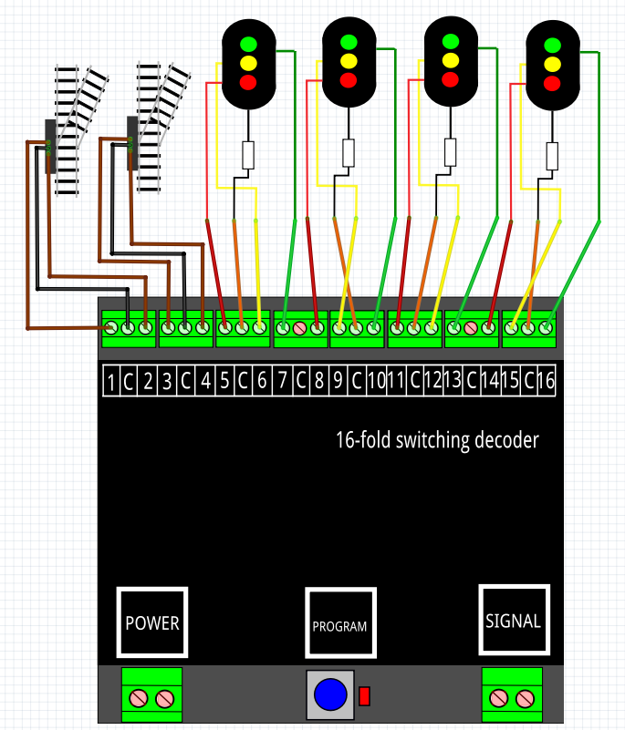

# Nederlands

[Navigate to English version](#English)

#### Aansluitschema

#### DR4018 configuratie

De volgende CV-adres-value-combinaties moeten UNDER CONSTRUCTION in de DR4018 worden geconfigureerd. Deze waarden zijn gekopieerd uit het hoofdstuk over preset 7 met twee wissels en 3 seinen:

CV|Waarde|Betekenis
--|------|---------
47|1|Preset
113|143|Pulse tijd+max.intensiteit uitgangspoort 1
114|143|Pulse tijd+max.intensiteit uitgangspoort 2
115|143|Pulse tijd+max.intensiteit uitgangspoort 3
116|143|Pulse tijd+max.intensiteit uitgangspoort 4
131|0|Geen sein
141|1|Uitgangspoort 1 aan bij activeren 1e adres
143|0|Sein 1 uit
144|2|Uitgangspoort 2 aan bij deactiveren 1e adres
147|4|Uitgangspoort 3 aan bij activeren 2e adres
150|8|Uitgangspoort 4 aan bij deactiveren 2e adres

**⚠️ CV 47 moet altijd als eerste worden geschreven, omdat de andere CV's wijzigingen zijn op preset 1**

#### Test

Op adres 501 GROEN wordt output 1 van de DR4018 geactiveerd gedurende 0.5 s; bij ROOD output 2.

Op adres 502 GROEN wordt output 3 van de DR4018 geactiveerd gedurende 0.5 s; bij ROOD output 4.

Vanaf adres 504 t/m adres 516 zal een GROEN de outputs 5 .. 16 activeren en ROOD decativeren.

#### RocRail

Om een DR4018 zoals hierboven geconfigureerd samen te laten werken met RocRail moet je de [handleiding](../Preset1/README.md) lezen van preset 1 voor de seinen en [handleiding](../Preset0/README.md) lezen van preset 0 voor de wissels.

# English

#### Wiring

#### DR4018 configuration

The next CV-adres-value-combinations must be written to the DR4018:

CV|Value|Meaning
--|------|------
47|1|Preset
113|143|Pulse time+max.intensity output port 1
114|143|Pulse time+max.intensity output port 2
115|143|Pulse time+max.intensity output port 3
116|143|Pulse time+max.intensity output port 4
131|0|No signal
141|1|Activate adres 1 output port 1 on
143|0|Signal 1 off
144|2|Deactivate adres 1 output port 2 on
147|4|Activate adres 2 output port 3 on
150|8|Deactivate adres 2 output port 4 on

**⚠️CV 47 must always be the first CV to set. The other CV values are changes on preset 1**

#### Test

A GREEN on adress 501 will activate output 1 of the DR4018 during 0.5 s; at RED output 2.

A GREEN on adress 502 will activate output 3 of the DR4018 during 0.5 s; at RED output 4.

From adress 504 until adress 516 a GREEN will activate output 5 .. 16 and RED will decativate it.

#### RocRail

To let a DR4018 configured like this work with RocRail take a look at the [manual](../Preset1/README.md) for preset 1 for signals and the [manual](../Preset0/README.md) for preset 0 for switches.
