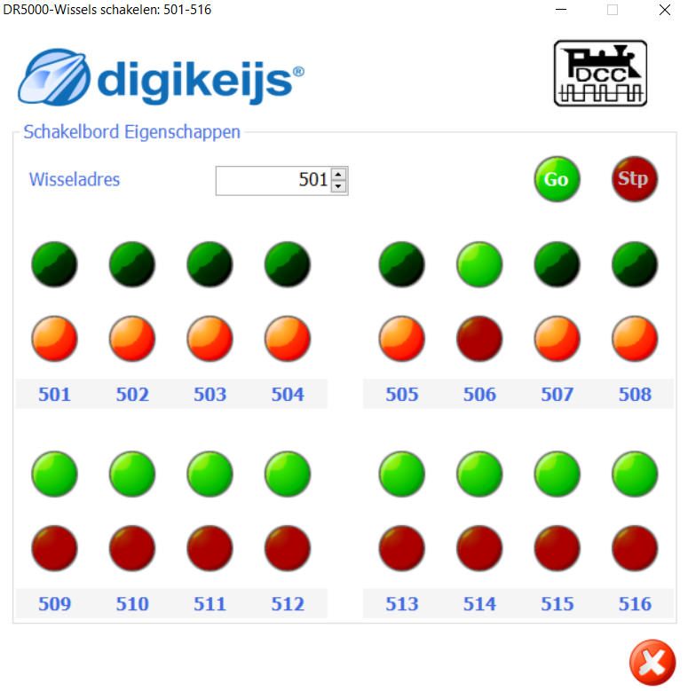

# Nederlands

[Navigate to English version](#English)

#### Inleiding

In mijn baan gebruik ik 4 schakeldecoders DR4018 op de vier hoeken van de tafel. Om bedrading te besparen werden zowel max. 2 wissels als 3 4-aspect NS-seinen op één decoder aangesloten. Hiertoe is documentatie geraadpleegd afkomstig van Digikeijs "DR4018 toepassing handleiding_beneluxforum.pdf". Echter als je maar 3-aspect seinen tot je beschikking hebt gaan er 3 signaaldraden verloren, die je voor een extra 3-aspect sein kunt gebruiken.

#### Aansluitschema

#### DR4018 configuratie

De volgende CV-adres-value-combinaties moeten in de DR4018 worden geconfigureerd. Deze waarden zijn gekopieerd uit het hoofdstuk over preset 7 met twee wissels en 3 seinen. Daarna is experimenteel de configuratie tot stand gekomen:

CV|Waarde|Betekenis
--|------|---------
47|1|Preset
113|143|Pulse tijd+max.intensiteit uitgangspoort 1
114|143|Pulse tijd+max.intensiteit uitgangspoort 2
115|143|Pulse tijd+max.intensiteit uitgangspoort 3
116|143|Pulse tijd+max.intensiteit uitgangspoort 4
131|0|Geen sein
141|1|Uitgangspoort 1 aan bij activeren 1e adres
143|0|Sein 1 uit
144|2|Uitgangspoort 2 aan bij deactiveren 1e adres
147|4|Uitgangspoort 3 aan bij activeren 2e adres
150|8|Uitgangspoort 4 aan bij deactiveren 2e adres
153|0|Geen uitgangspoort bij activeren 3e adres
159|0|Geen uitgangspoort bij activeren 4e adres

**⚠️ CV 47 moet altijd als eerste worden geschreven, omdat de andere CV's wijzigingen zijn op preset 1**

#### Test

Op adres 501 GROEN wordt output 1 van de DR4018 geactiveerd gedurende 0.5 s; bij ROOD output 2.

Op adres 502 GROEN wordt output 3 van de DR4018 geactiveerd gedurende 0.5 s; bij ROOD output 4.

Adres 503 en 504 geen actie.

Vanaf adres 505 t/m adres 516 zal een GROEN de outputs 5 .. 16 activeren en dus de LED aanzetten en ROOD decativeren. Het linker sein zal het volgende beeld tonen:

|505|506|507|Sein |
|---|---|---|-----|
|G  |R  |R  |Rood |
|R  |G  |R  |Geel |
|R  |R  |G  |Groen|

Via de interface van b.v. een DR5000 kan dit eenvoudig worden getest b.v. een GEEL sein betekent 505 R, 506 G en 507 R:

#### RocRail

Om een DR4018 zoals hierboven geconfigureerd samen te laten werken met RocRail moet je de [handleiding](../Preset1/README.md) lezen van preset 1 voor de seinen en [handleiding](../Preset0/README.md) lezen van preset 0 voor de wissels.

# English

#### Introduction

In my modeltrain track I use 4 accessory decoders DR4018 in the four corners of the table. To save wiring both 2 switches and 3 Dutch signals are connected to the same decoder. The documentation comes from the site of Digikeijs and is a Dutch document "DR4018 toepassing handleiding_beneluxforum.pdf". However having only 3 aspects per signal leaves 3 outputs from the DR4018 unused. These 3 outputs can be used for an extra 3 aspect signal.

#### Wiring

#### DR4018 configuration

The next CV-adres-value-combinations must be written to the DR4018. These values have ben copied from the chapter on preset 7 with two switches and 3 signals. Using this as a start, we got the following set of values by experimenting:

CV|Value|Meaning
--|------|------
47|1|Preset
113|143|Pulse time+max.intensity output port 1
114|143|Pulse time+max.intensity output port 2
115|143|Pulse time+max.intensity output port 3
116|143|Pulse time+max.intensity output port 4
131|0|No signal
141|1|Activate adres 1 output port 1 on
143|0|Signal 1 off
144|2|Deactivate adres 1 output port 2 on
147|4|Activate adres 2 output port 3 on
150|8|Deactivate adres 2 output port 4 on
153|0|No output on activate 3rd adress
159|0|No output on activate 4th adress

**⚠️CV 47 must always be the first CV to set. The other CV values are changes on preset 1**

#### Test

A GREEN on adress 501 will activate output 1 of the DR4018 during 0.5 s; at RED output 2.

A GREEN on adress 502 will activate output 3 of the DR4018 during 0.5 s; at RED output 4.

Adress 503 and 504 no action.

From adress 505 until adress 516 a GREEN will activate output 5 .. 16 and so the LED is on and RED will decativate it.

The leftmost signal will show:

|505|506|507|Signal|
|---|---|---|------|
|G  |R  |R  |Red   |
|R  |G  |R  |Yellow|
|R  |R  |G  |Green |

Through the interface of e.g. a DR5000 this can be tested easily. A yellow signal means 505 R, 506 G and 507 R:

#### RocRail

To let a DR4018 configured like this work with RocRail take a look at the [manual](../Preset1/README.md) for preset 1 for signals and the [manual](../Preset0/README.md) for preset 0 for switches.
