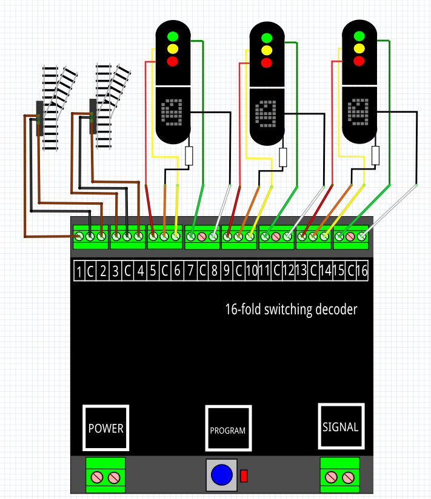

# Nederlands

[Navigate to English version](#English)

In mijn baan gebruik ik 4 schakeldecoders DR4018 op de vier hoeken van de tafel. Om bedrading te besparen worden zowel max. 2 wissels als 3 4-aspect NS-seinen op één decoder aangesloten. Hiertoe is documentatie geraadpleegd afkomstig van Digikeijs "DR4018 toepassing handleiding_beneluxforum.pdf":

De volgende CV-adres-value-combinaties moeten in de DR4018 worden geprogrammeerd:

CV|Waarde|Betekenis
--|------|---------
47|7|Preset
113|143|Pulse tijd+max.intensiteit uitgangspoort 1
114|143|Pulse tijd+max.intensiteit uitgangspoort 2
115|143|Pulse tijd+max.intensiteit uitgangspoort 3
116|143|Pulse tijd+max.intensiteit uitgangspoort 4
131|0|Geen sein
141|1|Uitgangspoort 1 aan bij activeren 1e adres
143|0|Sein 1 uit
144|2|Uitgangspoort 2 aan bij deactiveren 1e adres
147|4|Uitgangspoort 3 aan bij activeren 2e adres
150|8|Uitgangspoort 4 aan bij deactiveren 2e adres

**⚠️CV 47 moet altijd als eerste worden geschreven, omdat de andere CV's wijzigingen zijn op preset 7**

Om een DR4018 zoals hierboven geconfigureerd samen te laten werken met RocRail moet je de [handleiding](../Preset7/README.md) lezen van preset 7 voor de seinen.

# English

In my modeltrain track I use 4 accessory decoders DR4018 in the four corners of the table. To save wiring both 2 switches and 3 Dutch signals are connected to the same decoder. The documentation comes from the site of Digikeijs and is a Dutch document "DR4018 toepassing handleiding_beneluxforum.pdf":

The next CV-adres-value-combinations must be written to the DR4018:

CV|Value|Meaning
--|------|------
47|7|Preset
113|143|Pulse time+max.intensity output port 1
114|143|Pulse time+max.intensity output port 2
115|143|Pulse time+max.intensity output port 3
116|143|Pulse time+max.intensity output port 4
131|0|No signal
141|1|Activate adres 1 output port 1 on
143|0|Signal 1 off
144|2|Deactivate adres 1 output port 2 on
147|4|Activate adres 2 output port 3 on
150|8|Deactivate adres 2 output port 4 on

**⚠️CV 47 must always be the first CV to set. The other CV values are changes on preset 7**
To configure a DR4018 with signals as described above in RocRail read the [manual](../Preset7/README.md) of preset 7.
