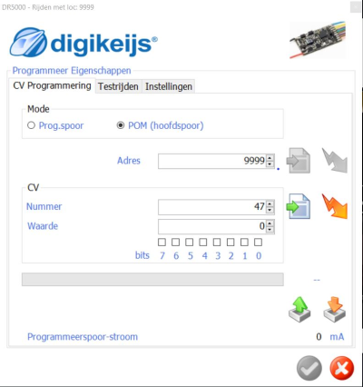

# Nederlands

In deze repository zijn alle 14 standaard aanwezige CV-settings van de Digikeijs schakeldecoder DR4018 beschreven in [tabelvorm](DR4018_overview.md). Helaas is deze tabel niet beschikbaar bij de documentatie van Digikeijs.

Kijk voor het instellen van een adres en preset in de DR4018 [hier](../DR4018_programming/README.md).

Hoe is deze tabel verkregen?

* Klik op het hoofdscherm van de DR5000 op de aansluiting van het **programmeer** spoor
* Schrijf de gekozen standaardinstelling (0 - 13) weg onder CV 47

* Maak een tekstbestand met daarin alle op te vragen CV-adressen (behalve 47) b.v. 1-46, 48-255
* Zet de DR4018 in programmeermode door op knop in te drukken
* Gebruik de interface van de DR5000-besturingssoftware om alle CV-adressen uit het bestand op te vragen en deze uit de DR4018 te lezen door op de knop  te drukken
* Wacht ong. 6 minuten
* Bewaar het Excel-bestand met CV-adressen en -waarden

* Pas op: soms verlaat de DR4018 de programmeermode. Het leesproces is niet te stoppen dus afwachten en opnieuw proberen.

# English

In this repository all of the 14 standard programmed CV settings of the Digikeijs switching decoder DR4018 are shown in a [table](DR4018_overview.md).This overview is not available from Digikeijs.

Look [here](DR4018_adresCVRW.md) for setting the adress and preset of a DR4018.

In which way have these CV-settings been collected?

* Connect a DR4018 to a DR5000 command station on the **programming** track
* Give the DR4018 an adress e.g. 501 and write the choosen standard configuration (0-13) at CV 47

* Create a text file with all CV-adresses to select (except 47) e.g. 1-46, 48-255
* Put the DR4108 in programming mode by pushing the button
* Use the interface of the DR5000-control software to get the CV-adresses from the file to read them from the DR4018 by pressing button 
* Wait approx. 6 minutes
* Save the Excel file with CV-adresses and values

* Attention: sometimes the DR4018 leaves the programming mode. THe process of reading can not be stopped so wait and try again. Unfortunately this table is not available by Digikeijs.
