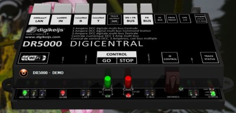
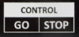
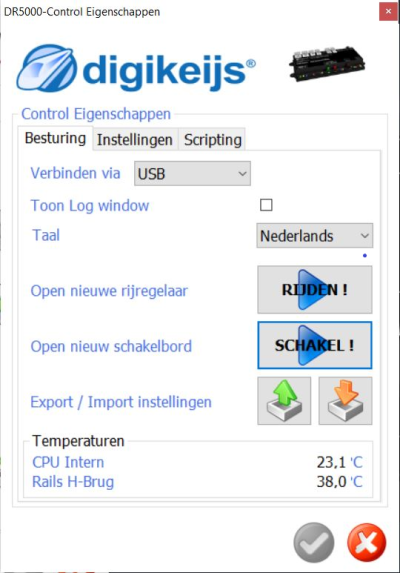
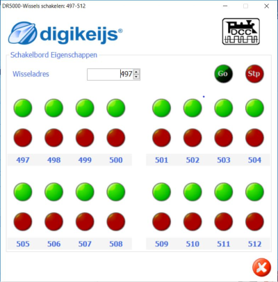
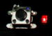
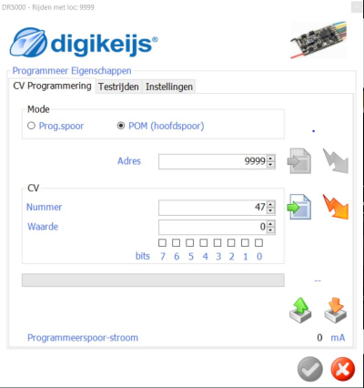
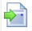

# Nederlands

[Navigate to English version](#English)

De DR4018 kan een adres geprogrammeerd krijgen en CV-waarden kunnen worden geschreven:

* Sluit een DR4018 aan op een DR5000 command station op het programmeer- of het hoofdspoor
* Start de gebruikersinterface van de DR5000 op de laptop:

* Klik in de interface op 'Control GO STOP' 
* Klik in het daaropvolgende scherm op 'Schakel'

* Klik in het daaropvolgende scherm op de combobox totdat adres 497 verschijnt en dat we dus wissel 501 zouden kunnen bedienen:

* Druk op de programmerknop op de DR4018
* Bedien één keer wissel 501 met een druk op de rode of groene knop op het schakelscherm
* De DR4018 heeft nu adres 501

Om een CV-waarde op te slaan in de DR4018:

* Kies het scherm CV-programmering

* Druk op de programmerknop op de DR4018
* Zet adres op 9999
* Kies het gewenste CV-adres en waarde
* Druk op de knop met de lichtflits 

⚠️De interface zegt dat de waarde is weggeschreven, maar als deze niet op het programmeerspoor zit weet je dat nooit zeker!!

Van de DR4018 kunnen ook CV-waarden worden uitgelezen:

* Sluit een DR4018 aan op een DR5000 command station op het **programmeer** spoor
* Vergeet niet een weerstand van 150 tot 270 ohm tussen C en output 1 aan te sluiten (handleiding DR4018)
* Zet de DR4018 in programmeerstand
* Kies het gewenste CV-adres en klik op de knop (wit blad met groene pijl) 
* Het programma leest de CV-waarde of geeft een foutmelding

# English

The DR4018 can be given an adress and CV values can be written:

* Connect a DR4018 to a DR5000 command station on the programming or main track
* Do not forget to connect a resistor of 150 to 270 ohm between C and output 1 (manual DR4018)
* Start the user interface of the DR5000 on the laptop (in Dutch):

* Click on 'Control GO STOP'
* Click in next screen on 'Switch' (in Dutch):

* Click in the next screen on the combobox until adress 497 appears so we could operate switch 501 (in Dutch):

* Push the programming button on the DR4018
* Operate switch 501 once by pushing either red or green in the switch panel
* The DR4018 now has adress 501

To store a CV value in the DR4018:

* Choose the CV-programmering Interface

* Push the programming button on the DR4018
* Set the adress to 9999
* Set the CV adress and value
* Push the flash button 

⚠️The interface will inform you that the value was written but if you are not on the programming track you can't be sure!!

CV-values of the DR4018 can be read:

* Connect a DR4018 on a DR5000 command station on the **programming** track
* Choose the wanted CV-adress and click the button (white sheet with green arrow) 
* The program then reads the CV-value or produces an error message
