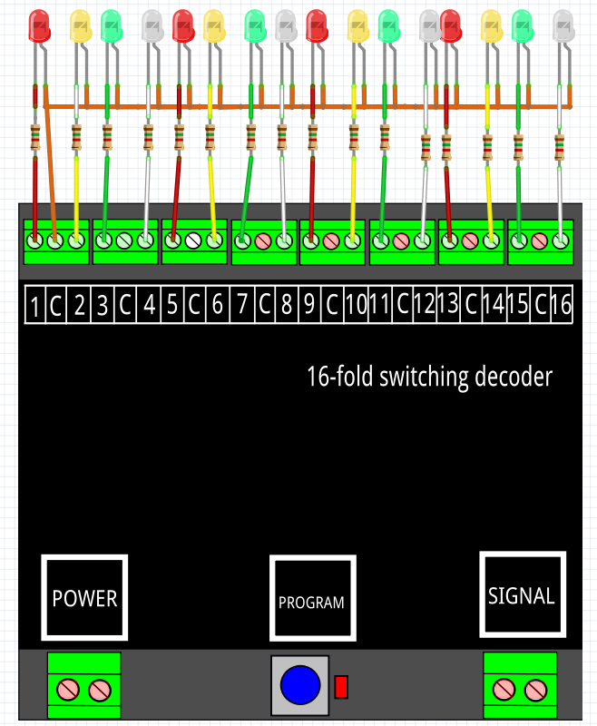

# Nederlands

[Navigate to English version](#English)

Om de werking van een DR4018 met een bepaalde preset en of handmatige CV-aanpassing te testen is het handig dit niet in de modelspoorbaan te doen, maar een aparte DR4018 met test-LED's te hebben.

Een kleine experimentele printplaat is gebouwd met 16 LED's telkens in de kleuren rood, geel, groen, wit (met in het achterhoofd een Nederlands seinbeeld met rood, geel en groen en witte snelheidsmatrix) met serieweerstand van 1k5. De waarde van 1k5 is berekend; een DCC signaal wordt gebruikt als voeding op de DR4018 en is 15-20V. Bij een spanningsval van 2V over de LED moet de weerstand max. 18V overbruggen bij een stroom van 10-20 mA. Er is gekozen voor een serieweerstand van 1k5 wat een veilige stroom van 12 mA betekent. De elektrische schakeling is getekend met Fritzing:

.

En gebouwd:

.

# English

To test the DR4018 with a certain preset and maybe some etxra CV-settings it can be usefull not do this in a working modeltrain situation, but rather using a small test circuit with LED's.

A small printed experimental circuit board with 16 LED's in the colours red, yellow, green and white (baring in mind a Dutch signal with red, yellow, green and a white speed indicating matrix) with serial resistors of 1k5. The value of 1k5 was calculated; a DCC signal is used as power supply for the DR4018 and is 15-20V. With approx. 2V over the LED the resistor gets a of max. 18V at a current of 10-20 mA. A value of 1k5 was chosen which gives a save current of 12 mA.The electric schematic is drawn with Fritzing:

.

And build:

.
