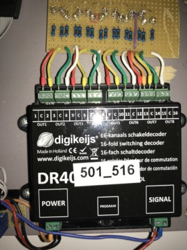

# Nederlands

Om de werking van een DR4018 met een bepaalde preset en of handmatige CV-aanpassing te testen is het handig dit niet in de modelspoorbaan te doen, maar een aparte DR4018 met test-LED's te hebben.

Een kleine experimentele printplaat is gebouwd met 16 LED's telkens in de kleuren rood, geel, groen, wit (met in het achterhoofd een Nederlands seinbeeld met rood, geel en groen en witte snelheidsmatrix). De elektrische schakeling is under construction; het eindresultaat:

.

In de situatie van een modelspoorbaan is het zeer handig te weten (na het loshalen van een DR4018) welke draden bij welk sein horen. Een tip van collega Theo Goumans van de HCCm. Hij gebruikt gekleurd krimpkous. Kijk ook naar de gebruikte kabelbinders en gekleurde adereindhulzen met dezelfde kleur als de bedrading:

# English

To test the DR4018 with a certain preset and maybe some etxra CV-settings it can be usefull not do this in a working modeltrain situation, but rather using a small test circuit with LED's.

A small printed experimental circuit board with 16 LED's in the colours red, yellow, green and white (baring in mind a Dutch signal with red, yellow, green and a white spee indicating matrix). The electric schematic is under construction. The final result:

.

In the situation of a modeltrain a very usefull tip for knowing which wire belongs to which signal (after disconnecting a DR4018) is to use coloured shrinking tube. This tip came from a college Theo Goumans from the Modeltrain Department of the Dutch Hobby Computer Club. Take also a look at the cable ties and coloured terminal crimps with the same colour as the wires:

.
