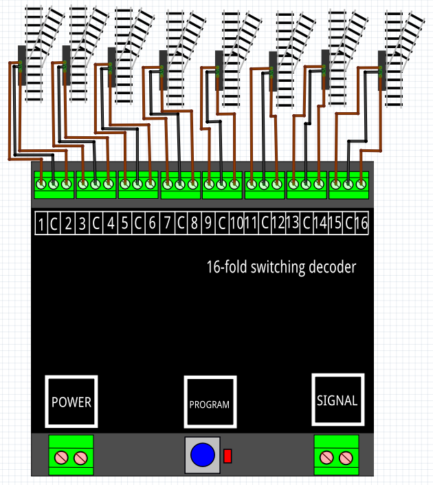

# Nederlands

[Navigate to English version](#English)

Om een DR4018 met preset 0 samen te laten werken met RocRail zijn de volgende stappen ondernomen.

* Sluit een testcircuit aan op de DR4018
* Geef de DR4018 een adres b.v. 501 en preset 0 (in CV 47)
* Controleer de werking door het schakelbord van de DR5000 te gebruiken om adres 201 steeds GROEN en ROOD te geven
* Ga naar RocRail
* Vul bij Algemeen de identificatie van het wissel in

* Vul in het tabblad Interface het adres van het wissel in b.v. 201. Hierdoor zullen ROOD- en GROEN- opdrachten het wissel op poort 1 en 2 van de DR4018 laten bewegen zodra in de interface van het baanplan wordt geklikt.

# English

To have a DR4018 work under RocRail the follwing steps have been taken:

* Connect the DR4018 to a test circuit
* Give the DR4018 an adress e.g. 501 and preset 0 (in CV 47)
* Check by using the switch interface of the DR5000 to send RED and GREEN to adress 201
* Go to RocRail
* In the tab General fill the name

* In the tab Interface fill adress 201. RED and GREEN commands are sent by RocRail as the user clicks on the railroad plan.

