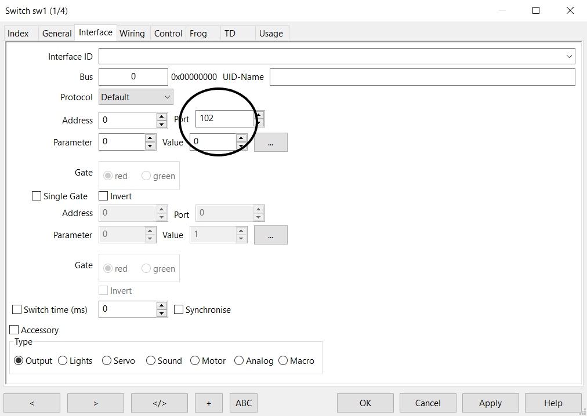

# Nederlands

[Navigate to English version](#English)

#### Aansluiting

Plaatje uit de documentatie van Digikeijs.

#### RocRail

Om een DR4018 met preset 0 samen te laten werken met RocRail zijn de volgende stappen ondernomen.

* Sluit een testcircuit aan op de DR4018
* Geef de DR4018 een adres b.v. 102 en preset 0 (in CV 47)
* Controleer de werking door het schakelbord van de DR5000 te gebruiken om adres 102 steeds GROEN en ROOD te geven. Een GROEN commando op adres 102 stuurt aansluiting 1 van de DR4018; een ROOD commando stuurt aansluiting 2.
* Ga naar RocRail
* Vul bij Algemeen de identificatie van het wissel in

* Vul in het tabblad Interface het adres van het wissel in b.v. 102.

#### Testen

* Met deze configuratie zullen ROOD- en GROEN- opdrachten het wissel op aansluiting 1 en 2 van de DR4018 laten bewegen zodra op de wissel in de interface van het baanplan wordt geklikt.

#### Logging

In de logging van RocView verschijnt de actie (met meest recente actie boven) waarbij weer het technische adres 1 lager is dan het adres in de gebruikersinterface:

In de logging van RocRail verschijnt de actie (met meest recente actie onder) waarbij weer het technische adres 1 lager is dan het adres in de gebruikersinterface:

#### Ontkoppelaar

Een ontkoppelaar wordt net als een wissel aangesloten met dan met maar één spoel. In RocRail maken we een Output Accessory met een naam b.v. dc1 en een poortadres:

Het testen gaat door er in de interface net als bij een wissel op te klikken. Na een seconde wordt het gedeactiveerd door de DR4018.

# English

#### Electric schema

Picture from Digikeijs documentation.

#### RocRail configuration

To have a DR4018 work under RocRail the follwing steps have been taken:

* Connect the DR4018 to a test circuit
* Give the DR4018 an adress e.g. 102 and preset 0 (in CV 47)
* Check by using the switch interface of the DR5000 to send RED and GREEN to adress 102. A GREEN command on adress 102 will influence connector 1 of the DR4018; a RED command controls connector 2.
* Go to RocRail
* In the tab General fill the name

* In the tab Interface fill adress 102.

#### Testing

* With this configuration RED and GREEN commands are sent by RocRail as the user clicks on the switch in the railroad plan.

#### Logging

In the logging of RocView the action is show (most recent at the top) with a technical adress 1 lower than in the user interface:

In the logging of RocRail the action is show (most recent at the bottom) with a technical adress 1 lower than in the user interface:

#### Decoupler

A decoupler is connected like a switch but with only one coil. In RocRail we create an Output Accessory with a name e.g. dc1 and a portadress:

Clicking the Output Accessory in the user interface will activate it. After a second it is deactivated by the DR4018.
