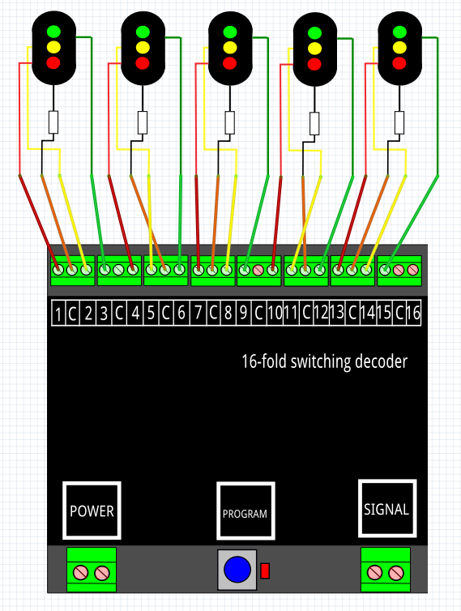

# Nederlands

[Navigate to English version](#English)

#### Aansluitschema

5 seinen met 3 lampen aangesloten op een DR4018:

#### Preset 1 en RocRail

Om een DR4018 met preset 1 samen te laten werken met RocRail zijn de volgende stappen ondernomen:

* Sluit een testcircuit of een sein aan op de DR4018
* Geef de DR4018 een adres b.v. 501 en preset 1 (in CV 47)
* Controleer de werking door het schakelbord van de DCC Commando Centrale (b.v. de DR5000) te gebruiken om adres 501, 502 t/m 516 steeds GROEN en ROOD te geven. Één adres is verbonden met één LED; GROEN betekent LED aan en ROOD LED uit (501 GROEN poort 1 gaat aan, 501 ROOD poort 1 gaat uit). De individuele LED's rood, geel en groen kunnen dus individueel aan en uit geschakeld worden, maar kunnen ook gezamenlijk branden; de DR4018 heeft geen besef van een seinbeeld van een bepaald land. Een besturingsprogramma zoals RocRail moet dus als b.v. rood naar groen moet worden omgeschakeld twee commando's sturen: rode lamp RED-commando en groene lamp GREEN-commando.
* Ga naar RocRail
* Maak (eventueel) een testsein b.v. sg7
* Vul in het tabblad General de naam in b.v. sg7

* Vul in het tabblad Interface de adressen 501, 502 en 503 voor resp. de seinkleuren RED, GREEN en YELLOW. Laat Command op Default staan.

* ❗**Vink het vakje 'Pair gates' aan**
* Klik steeds op het sein sg7 in de RocRail interface dan gaat het aspect ROOD, GEEL en GROEN om beurten branden. Een andere mogelijkheid is om op het sein de rechtermuis te klikken; je kunt dan meteen het gewenste aspect kiezen.
* Bekijk de test DR4018 en de logging in de RocRail interface. Als alles correct is ingesteld zie je dat RocRail dezelfde commando's stuurt als hiervoor met de hand is uitgeprobeerd.

**Het gebruik van preset 1 is handig bij gebruik van driekleurige seinen. Er wordt geen onnodige uitgang aan wit besteed. Helaas houd je bij 5 3-kleurige seinen één output over. Overweging: zet 4 3-kleurige seinen en 2 wissels op 1 DR4018.**

# English

#### Wiring

5 signals with 3 lights each on a DR4018:

#### Preset 1 and RocRail

To have a DR4018 work under RocRail the follwing steps have been taken:

* Connect the DR4018 to a test circuit or a real signal
* Give the DR4018 an adress e.g. 501 and preset 1 (in CV 47)
* Check the functionality with the switch interface of the DCC Command Station (e.g.DR5000) to set adresses 501, 502 and GREEN OR RED. Onde adress is connected to one LED. A GREEN command switches the LED on and a RED command switches it off. The individual LEDs red, yello green can be switched on and off individually, but can also be turned on together; the DR4018 no knowledge of an existing aspect in some country. The controlling software like RocRail must therefore on a transition from red to green light send two commands: red light RED command and green light GREEN command.
* Go to RocRail
* Make (if neccessary) a test signal
* In the tab General fill the name e.g. sg7

* In the tab Interface fill the adresses 501, 502 and 503 for RED, GREEN and YELLOW. Leave the Command setting to Default.

* ❗ **Check the box 'Pair gates' on**
* Click on the signal sg7 in the RocRail interface several times. The signal we go through the aspects RED, YELLOW and GREEN. Another possibility is to right click the signal and chose the aspect directly.
* Look at the test DR4018 and the logging in the RocRail interface. If set correctly you will see RocRail sending the same commands as you did manually.

**Using preset 1 has the advantage of not wasting an extra output to a superfluous white light. Unfortunately having 5 3-colour signals leaves 1output unused. Consider: put 4 3-colour signals and 2 switches on 1 DR4018.**
