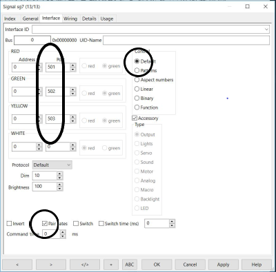

# Nederlands

Om een DR4018 met preset 1 samen te laten werken met RocRail zijn de volgende stappen ondernomen:

* Sluit een testcircuit aan op de DR4018
* Geef de DR4018 een adres b.v. 501 en preset 1 (in CV 47)
* Controleer de werking door het schakelbord van de DR5000 te gebruiken om adres 501, 502 etc. steeds GROEN en ROOD te geven
* Ga naar RocRail
* Maak (eventueel) een testsein b.v. sg7
* Vul in het tabblad General de naam in b.v. sg7

* Vul in het tabblad Interface de adressen 501, 502 en 503 voor resp. de seinkleuren RED, GREEN en YELLOW

* ❗**Vink het vakje 'Pair gates' aan**
* Klik steeds op het sein sg7 in de RocRail interface
* Bekijk de test DR4018 en de logging

**Het gebruik van preset 1 is handig bij gebruik van driekleurige seinen. Er wordt geen onnodige uitgang aan wit besteed. Helaas houdt je bij 5 3-kleurige seinen één output over. Overweging: zet 4 3-kleurige seinen en 2 wissels op 1 DR4018.**

# English

To have a DR4018 work under RocRail the follwing steps have been taken:

* Connect the DR4018 to a test circuit
* Give the DR4018 an adress e.g. 501 and preset 1 (in CV 47)
* Check the functionality with the switch interface of the DR5000 to set adresses 501, 502 etc. GREEN OR RED
* Go to RocRail
* Make (if neccessary) a test signal
* In the tab General fill the name e.g. sg7

* In the tab Interface fill the adresses 501, 502 and 503 for RED, GREEN and YELLOW

* ❗ **Check the box 'Pair gates' on**
* Click on the signal sg7 in the RocRail interface several times
* Look at the test DR4018 and the logging

**Using preset 1 has the advantage of not wasting an extra output to a superfluous white light. Unfortunately having 5 3-colour signals leaves 1output unused. Consider: put 4 3-colour signals and 2 switches on 1 DR4018.**
