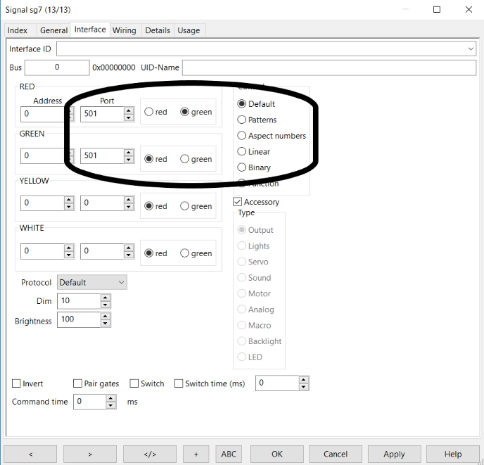

# Nederlands

[Navigate to English version](#English)

#### Aansluitschema

Bij preset 2 worden 8 seinen met ieder 2 lampen aangesloten.

Tekening uit de documentatie van Digikeijs.

#### Preset 2 en RocRail

Om een DR4018 met preset 2 samen te laten werken met RocRail zijn de volgende stappen ondernomen:

* Sluit een testcircuit of een sein aan op de DR4018
* Geef de DR4018 een adres b.v. 501 en preset 2 (in CV 47)
* Controleer de werking door het schakelbord van de DCC Commando Centrale (b.v. de DR5000) te gebruiken om adres 501, 502 t/m 508 steeds GROEN en ROOD te geven. Één adres is verbonden met twee LED's; GROEN op dit adres 501 betekent LED op poort 1 aan (en op poort 2 uit) en ROOD LED op poort 2 aan (en op poort 1 uit). Idem adres 502 voor poorten 3 en 4 etc. De DR4018 heeft geen besef van een seinbeeld van een bepaald land. Een besturingsprogramma zoals RocRail moet dus als b.v. rood naar groen moet worden omgeschakeld twee commando's sturen: rode LED een RED-commando en de groene LED een GREEN-commando.
* Ga naar RocRail
* Maak (eventueel) een testsein b.v. sg7
* Vul in het tabblad General de naam in b.v. sg7
* Laat Control op Default staan
* Vul bij RED als poort het eerste adres 501 in en vink radio button green aan
* Vul bij GREEN als poort het eerste adres 501 in en vink radio button red aan
* Laat Pair gates ongemoeid
* Klik steeds op het sein sg7 in de RocRail interface dan gaat het aspect ROOD en GROEN om beurten branden. Een andere mogelijkheid is om op het sein de rechtermuis te klikken; je kunt dan meteen het gewenste aspect kiezen.
* Bekijk de test DR4018 en de logging in de RocRail interface. Als alles correct is ingesteld zie je dat RocRail dezelfde commando's stuurt als hiervoor met de hand is uitgeprobeerd.

**Het gebruik van preset 2 is handig bij gebruik van tweekleurige seinen. Er worden geen onnodige uitgangen aan geel en wit besteed.**

# English

#### Wiring

With preset 2 8 signals with 2 lamps each can be connected.

Drawing from Digikeijs documentation.

#### Preset 2 aND RocRail

To have a DR4018 with preset 2 work under RocRail the follwing steps have been taken:

* Connect the DR4018 to a test circuit or a real signal
* Give the DR4018 an adress e.g. 501 and preset 2 (in CV 47)
* Check the functionality with the switch interface of the DCC Command Station (e.g.DR5000) to set adresses 501 until 508 to RED and GREEN. One adress is connected to two LED's. A GREEN command switches the LED op port 1 on (and the LED on port 2 off) and a RED command switches the LED on port 2 on (and the LED on port 1 off). The controlling software like RocRail must therefore on a transition from red to green light send two commands: red LED a RED command and green LED a GREEN command.
* Go to RocRail
* Make (if neccessary) a test signal
* In the tab General fill the name e.g. sg7
* Let control keep its value Default
* At RED fill the port number 501 and select radio button green
* At GREEN fill the same port number 501 and select radio button red
* Do not change Pair gates
* Click on the signal sg7 in the RocRail interface several times. The signal we go through the aspects RED and GREEN. Another possibility is to right click the signal and chose the aspect directly.
* Look at the test DR4018 and the logging in the RocRail interface. If set correctly you will see RocRail sending the same commands as you did manually.

**Using preset 2 has the advantage of not wasting extra outputs to a superfluous yellow and white light.**
