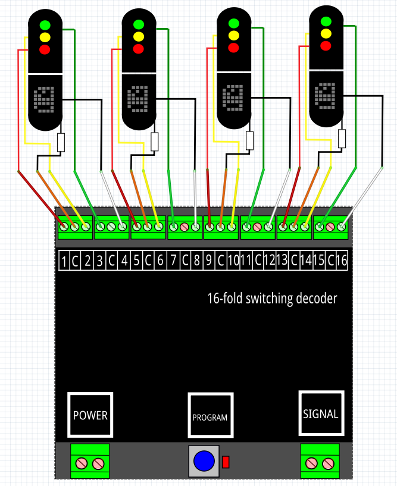
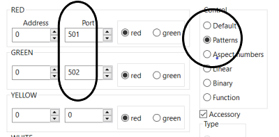
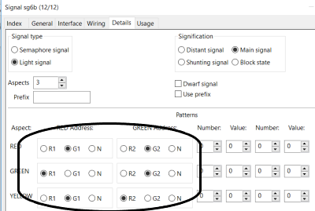

# Nederlands

[Navigate to English version](#English)

Om een DR4018 met preset 7 samen te laten werken met RocRail zijn de volgende stappen ondernomen:

* Sluit een testcircuit aan op de DR4018 of 4 NS-seinen:

Dit plaatje is afkomstig uit de handleiding van de DR4018 van Digikeijs.

* Geef de DR4018 een adres b.v. 501 en preset 7 (in CV 47)
* Controleer de werking door het schakelbord van de DR5000 (of MultiMaus) te gebruiken om adres 501 en 502 steeds om beurten of beide GROEN en ROOD te geven. Kijk of dit overeenkomt met de handleiding van de DR4018, Nederlands seinbeeld.
* ⚠️ **Zet de uitgang achter adres 503 op ROOD; RocRail zal dit derde adres NIET besturen. Doe je dit niet krijg je nooit het juiste seinbeeld, maar toont de DR4018 de andere 4 seinbeelden zoals GEEL KNIPPER**
* Ga naar RocRail
* Maak (eventueel) een testsein b.v. sg7
* Vul in het tabblad General de naam in b.v. sg7

* Vul in het tabblad Interface de adressen 501 en 502 voor een rood- en een groen adres en zet Control op **Patterns**

* Vul in het tabblad Details G1 en G2 bij RED, R1 en G2 bij GREEN en G1 en R2 bij YELLOW

* Klik steeds op het sein sg7 in de RocRail interface
* Bekijk de test DR4018 en de logging

**✅Een nadeel van het gebruik van preset 7 is dat als we alleen beschikking hebben over driekleurige seinen er steeds een output per sein van de DR4018 ongebruikt is en we dus in totaal 4 outputs over hebben. Het gebruik van preset 1 is dan een overweging waarbij dan 4 3-kleurige seinen en 2 wissels op 1 DR4018 de optimale benutting is.**

# English

To have a DR4018 with preset 7 work under RocRail the follwing steps have been taken:

* Connect the DR4018 to a test circuit or 4 Dutch signals:

This picture was copied from the manual of the DR4018 by Digikeijs.

* Give the DR4018 an adress e.g. 501 and preset 7 (in CV 47)
* Check the functionality with the switch interface of the DR5000 to set adresses 501 and 502 in turn or simultanious GREEN OR RED. Check if this is according the DR4018 manual for a Dutch signal.
* ⚠️**Set output behind adress 503 to RED; RocRail wil not control this third adress. Not setting this to RED will lead to the wrong signal aspects. You will get signal aspects like YELLOW FLASH.**
* Go to RocRail
* Make (if neccessary) a test signal
* In the tab General fill the name e.g. sg7

* In the tab Interface fill the adresses 501 and 502 for a red and green adress and set Control on **Patterns**

* Put in the tab Details G1 and G2 for RED, R1 and G2 for GREEN and G1 and R2 for YELLOW

* Click on the signal sg7 in the RocRail interface several times
* Look at the test DR4018 and the logging

**✅If only Dutch signals with three colours are available using preset 7 has the disdavantage of wasting an output per signal thus leaving a DR4018 with four unused outputs. Using preset 1 can be an advantage. In that case 4 3-colour signals and 2 switches on 1 DR4018 is the optimum.**
