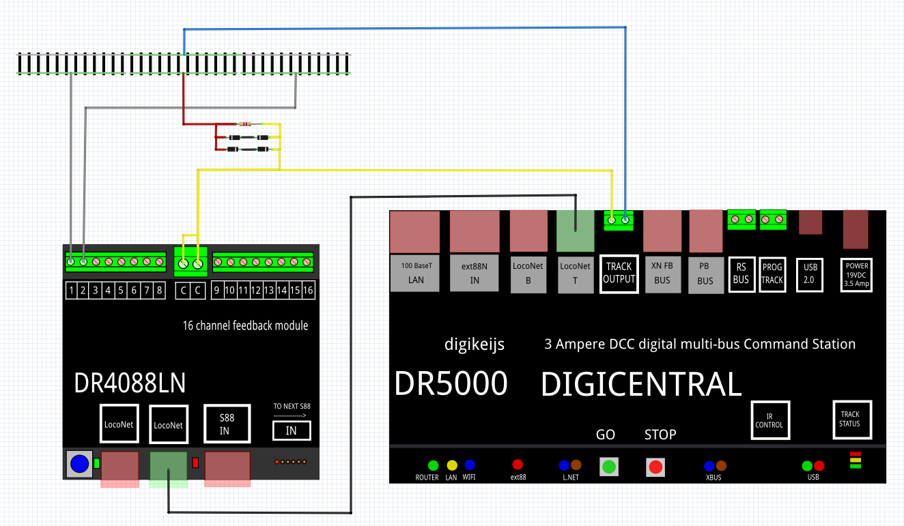
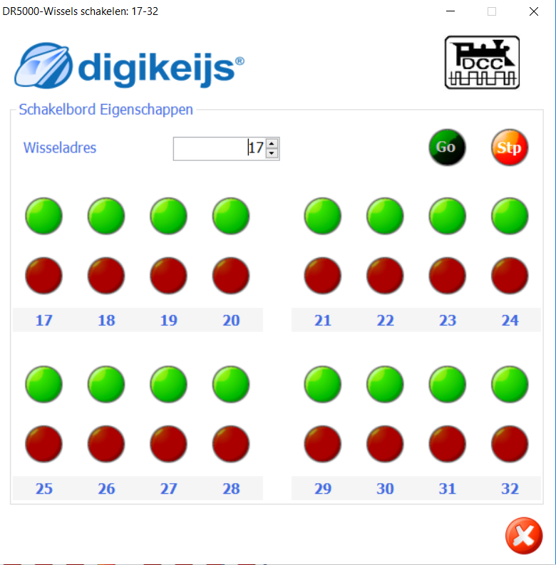
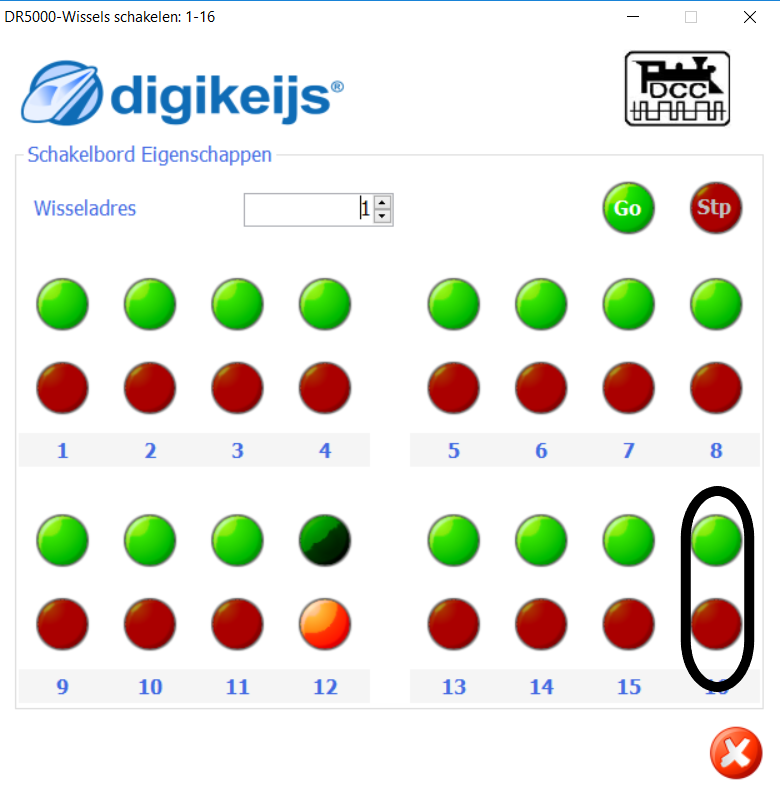
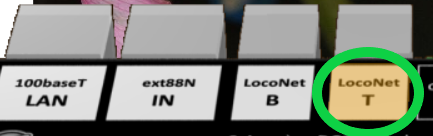
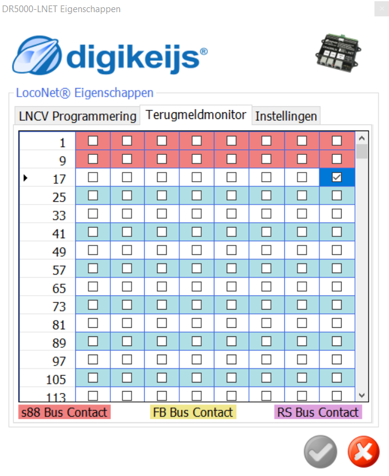
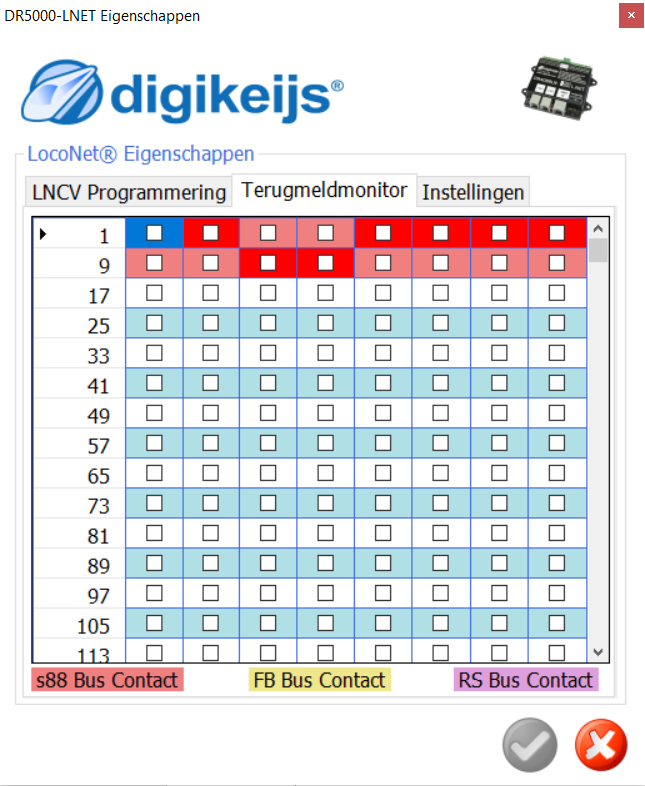
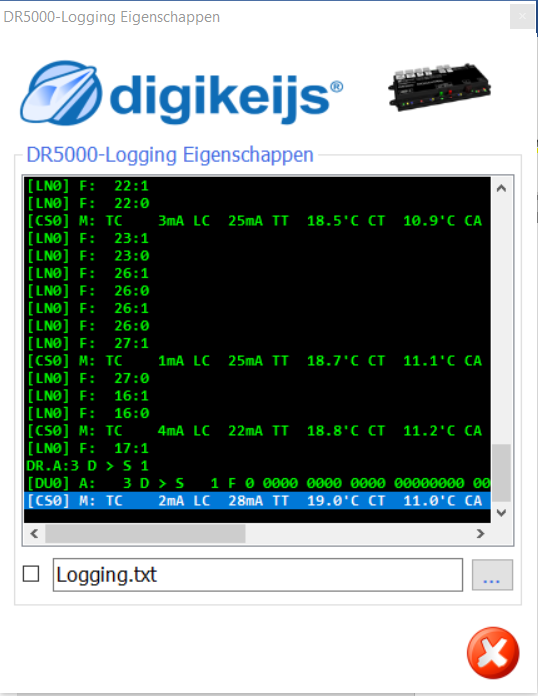
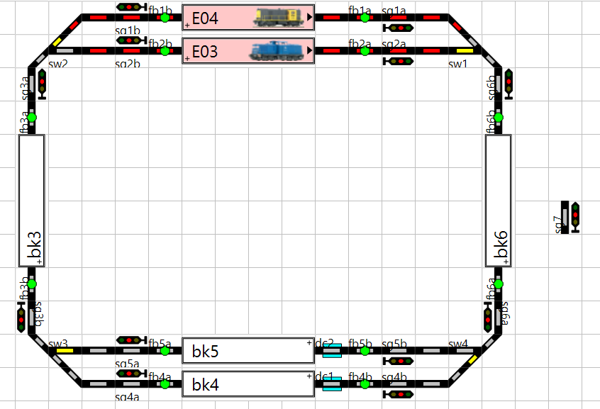
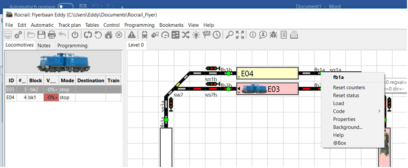
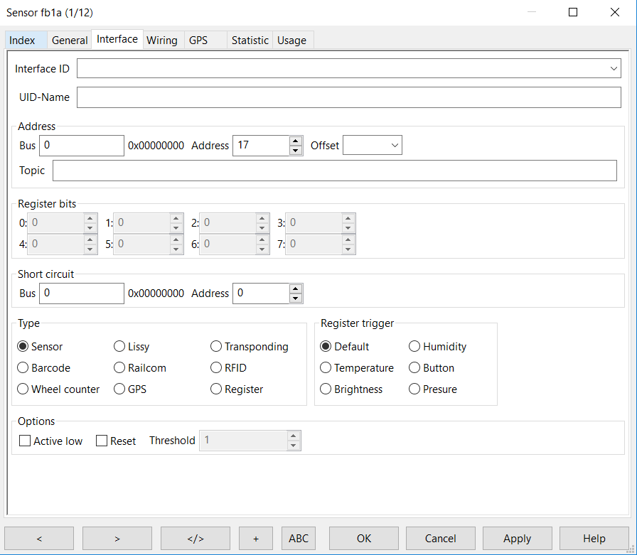

#  Nederlands

## Aansluitschema

Volgens diverse Nederlandse bronnen zoals [link](https://encyclopedie.beneluxspoor.net/index.php?title=Diodeschakeling) en [link](https://www.nproject.org/nl/modelspoor-digitaal-en-dcc/diodeschakeling-voor-toepassing-in-ongedetecteerde-secties-bij-een-digitale-modelbaan) en een uit Engeland [link](http://www.wiringfordcc.com/blockdet.htm) vermelden dat niet-gedetecteerde stukken rails via een diodebrug met de centrale moeten worden verbonden om zo het spanningsverlies over deze brug gelijk te maken aan het spanningsverlies over de brug in de bezetmelder. Er is maar één diodebrug in de baan; alle niet-gedetecteerde stukken rails zijn met elkaar verbonden.

Verder is de DR4088 via Loconet verbonden met de DR5000.

## DR4088 adres geven
Twee leuke video's om de DR4088 beginadres 17 te geven vind je [hier](https://www.youtube.com/watch?v=5ghAUfvjuvw) en [hier](https://www.youtube.com/watch?v=1XlbdtUaOn8).

* Start de DR5000 control software

* Schakel de baanspanning in door de groene knop op de interface van de DR5000-software

* Druk op de Control Go Stop op de interface van de DR5000-software

* Kies de Schakel optie op de interface van de DR5000-software

* Het schakelscherm zal verschijnen

* Klik één keer op de combobox om adres 17 te laten verschijnen. ⚠️Je kunt niet rechtstreeks de waarde 17 intypen.

* Druk op DR4088 op programmeerschakelaar: LED op de DR4088 gaat sneller knipperen
* Klik één keer op groen of rood van adres 17

* LED op de DR4088 gaat nog sneller knipperen
* Klik één keer op de combobox om adres 1 te laten verschijnen
* Klik één keer op groen of rood van adres 16 om de DR4088 te vertellendat er 16 ingangen zijn

## DR4088 werking testen

* Activeer Loconet-detectiescherm door op de stekker te klikken in de DR5000-interface

* Kies het tabblad Terugmeldmonitor

* Laat een loc rijden. Bij het rijden over een bezetmelder verschijnt een vink en wordt het vakje blauw.

* Na verlaten van de rail met bezetmelder verdwijnt de vink, maar blijft het laatst geactiveerde vakje blauw.

## DR4088 logging

Indien in het schakelcherm logging is ingeschakeld verschijnt b.v.

**Opvallend is dat het adres van de melder in de logging altijd 1 lager is dan dat wij als adres hebben opgegeven tijdens de configuratie**

## RocRail

* Zorg dat de complete baan ingevoerd is in RocRail inclusief de bezetmelders met hun adres

* Instellen van het adres per melder. Klik rechtermuis op melder

* Bij het tabblad Interface zet het juiste adres. Voor melder f1a is dat op deze baan 17

#  English

## Wiring

According to an English source [link](http://www.wiringfordcc.com/blockdet.htm) and several Dutch sources like [link](https://encyclopedie.beneluxspoor.net/index.php?title=Diodeschakeling) and [link](https://www.nproject.org/nl/modelspoor-digitaal-en-dcc/diodeschakeling-voor-toepassing-in-ongedetecteerde-secties-bij-een-digitale-modelbaan) undetected tracks must be connected to the command station through a diode bridge to compensate the loss of voltage which must be the same as the loss of voltage over the bridge build into the detector. There is only one bridge; all undetected tracks are connected to eachother.

The DR4088 is connected to the DR5000 over Loconet.

## Give DR4088 an adress
Helpful videos to give the DR4088 begin adress 17 are [here](https://www.youtube.com/watch?v=5ghAUfvjuvw) en [here](https://www.youtube.com/watch?v=1XlbdtUaOn8).

* Start the DR5000 control software

* Switch power on main track on by pushing the green button in the interface of the DR5000 software

* Push the Control Go Stop symbol in the interface of the DR5000 software

* Choose the switch option in the interface of the DR5000 software

* A switch board will appear

* Click the combobox once to show adress 17. ⚠️You can not enter the value 17 in the combobox directly.

* Push the programming button on the DR4088: the LED on the DR4088 will flicker
* Push once on GREEN or RED of adress 17

* The LED on the DR4088 will flicker even faster
* Click the combo box once to show adress 1
* Push once on GREEN or RED of adress 16 to tell the DR4088 that there are 16 inputs

## Test DR4088

* Activate the Loconet detection board by clicking the Loconet button in the DR5000 interface

* Choose the Feedback monitor

* Drive a loc. While crossing a feedback sensor the corresponding check box is selected/checked and the box becomes blue.

* After passing it changes to unchecked but the last visited feedback sensor remains blue.

## DR4088 logging

If the logging is enabled

**It is noticed that the adress of the feedback sensor in the logging is 1 lower than the adress given during configuration**

## RocRail

* Make sure that the complete track is put into RocRail including the feedback sensorswith their adresses

* Setting the adress per sensor. Click right mouse on sensor

* In the tab Interface set the correct adreas. The adress of feedback sensor fb1a on this track is 17.

