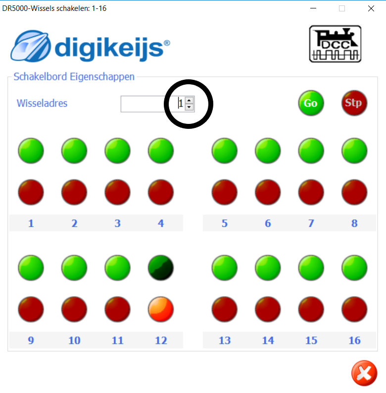

#  Nederlands
## DR4088 adres geven
Twee leuke video's om de DR4088 beginadres 17 te geven vind je [hier](https://www.youtube.com/watch?v=5ghAUfvjuvw) en [hier](https://www.youtube.com/watch?v=1XlbdtUaOn8).

* Start de DR5000 control software

* Druk op de Control Go Stop op de interface van de DR5000-software

* Schakel de baanspanning in door de groene knop op de interface van de DR5000-software

* Kies de Schakel optie op de interface van de DR5000-software

* Het schakelscherm zal verschijnen

* Klik één keer op de combobox om adres 17 te laten verschijnen. ⚠️Je kunt niet rechtstreeks de waarde 17 intypen.

* Druk op DR4088 op programmeerschakelaar: LED op de DR4088 gaat sneller knipperen
* Klik één keer op groen of rood van adres 17

* LED op de DR4088 gaat nog sneller knipperen
* Klik één keer op de combobox om adres 1 te laten verschijnen
* Klik één keer op groen of rood van adres 16 om de DR4088 te vertellendat er 16 ingangen zijn

## DR4088 werking testen

* Activeer Loconet-detectiescherm door op de stekker te klikken in de DR5000-interface

* Kies het tabblad Terugmeldmonitor

* Laat een loc rijden. Bij het rijden over een bezetmelder verschijnt een vink en wordt het vakje blauw. Na verlaten van de rail met bezetmelder verdwijnt de vink, maar blijft het laatst geactiveerde vakje blauw.

## DR4088 logging

Indien in het schakelcherm logging is ingeschakeld verschijnt b.v.

**Opvallend is dat het adres van de melder in de logging altijd 1 lager is dan dat wij als adres hebben opgegeven tijdens de configuratie**

#  English

TODO
