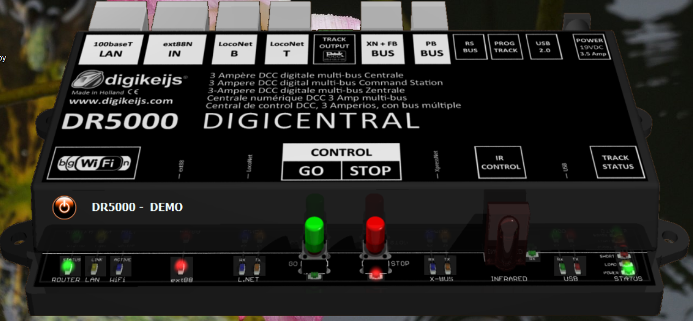
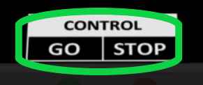
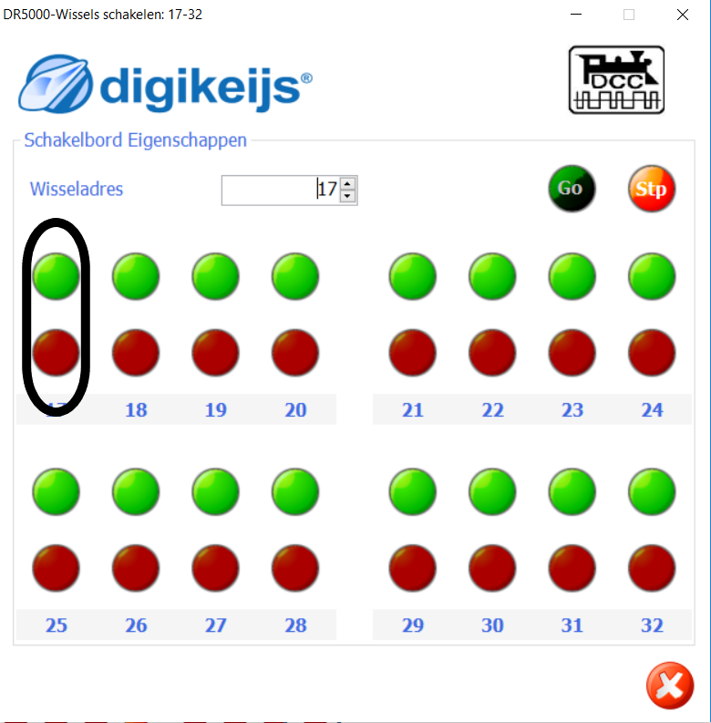

#  Nederlands

## DR4088 adres geven
Twee leuke video's om de DR4088 beginadres 17 te geven vind je [hier](https://www.youtube.com/watch?v=5ghAUfvjuvw) en [hier](https://www.youtube.com/watch?v=1XlbdtUaOn8).

* Start de DR5000 control software

* Schakel de baanspanning in door de groene knop op de interface van de DR5000-software

* Kies de Schakel optie op de interface van de DR5000-software

* Druk op de Control Go Stop op de interface van de DR5000-software

* Het schakelscherm zal verschijnen

* Klik één keer op de combobox om adres 17 te laten verschijnen. ⚠️Je kunt niet rechtstreeks de waarde 17 intypen.

* Druk op DR4088 op programmeerschakelaar: LED op de DR4088 gaat sneller knipperen
* Klik één keer op groen of rood van adres 17

* LED op de DR4088 gaat nog sneller knipperen
* Klik één keer op de combobox om adres 1 te laten verschijnen
* Klik één keer op groen of rood van adres 16 om de DR4088 te vertellendat er 16 ingangen zijn

## DR4088 werking testen

* Activeer Loconet-detectiescherm door op de stekker te klikken in de DR5000-interface

* Kies het tabblad Terugmeldmonitor

* Laat een loc rijden. Bij het rijden over een bezetmelder verschijnt een vink en wordt het vakje blauw. Na verlaten van de rail met bezetmelder verdwijnt de vink, maar blijft het laatst geactiveerde vakje blauw.

## DR4088 logging

Indien in het schakelcherm logging is ingeschakeld verschijnt b.v.

**Opvallend is dat het adres van de melder in de logging altijd 1 lager is dan dat wij als adres hebben opgegeven tijdens de configuratie**

#  English

## Give DR4088 an adress
Helpful videos to give the DR4088 begin adress 17 are [here](https://www.youtube.com/watch?v=5ghAUfvjuvw) en [here](https://www.youtube.com/watch?v=1XlbdtUaOn8).

* Start the DR5000 control software

* Switch power on main track on by pushing the green button in the interface of the DR5000 software

* Choose the switch option in the interface of the DR5000 software

* Push the Control Go Stop symbol in theinterface of the DR5000 software

* A switch board will appear

* Click the combobox once to show adress 17. ⚠️You can not enter the value 17 in the combobox directly.

* Push the programming button on the DR4088: the LED on the DR4088 will flicker
* Push once on GREEN or RED of adress 17

* The LED on the DR4088 will flicker even faster
* Click the combobox once to show adress 11
* Push once on GREEN or RED of adress 16 to tell the DR4088 that there are 16 inputs

## Test DR4088

* Activate the Loconet detection board by clicking the Loconet button in the DR5000 interface

* Choose the Feedback monitor

* Drive a loc. While crossing a feedback sensor selected check box is shown and the box becomes blue. After passing it changes to unchecked but the last visited feedback sensor remains blue.

## DR4088 logging

If the logging is enabled

**It is noticed that the adress of the feedback sensor in the logging is 1 lower than the adress given during configuration**
