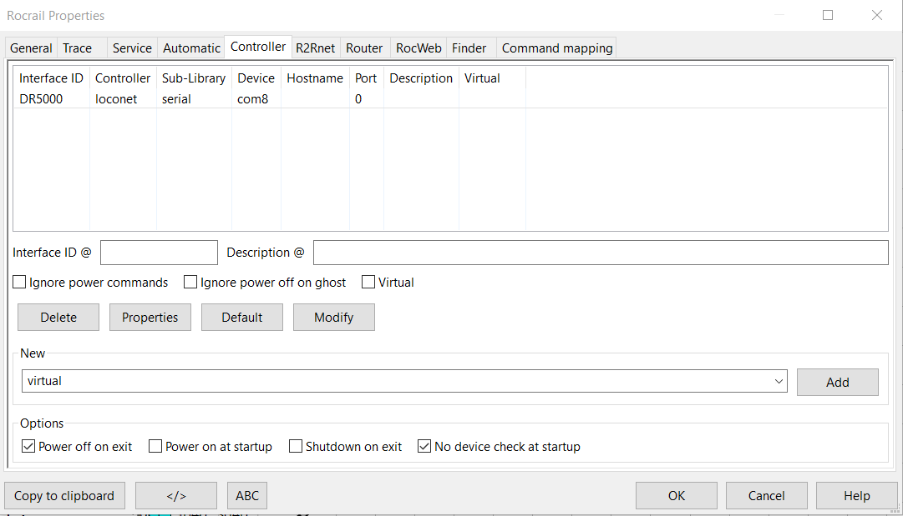
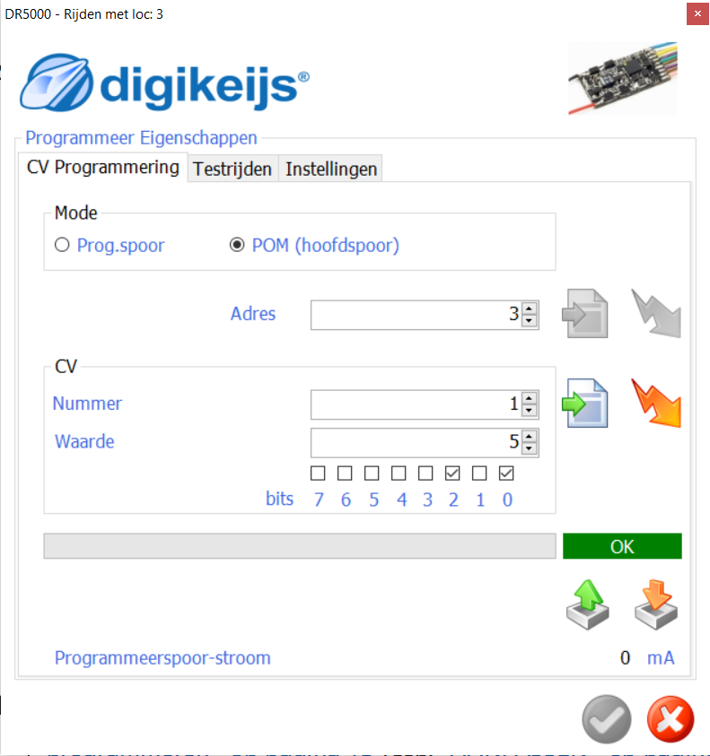

#  Nederlands

[Navigate to English version](#English)

## DR5000

* Start de DR5000 control software

* Schakel de baanspanning in door de groene knop op de interface van de DR5000-software

* Druk op de Control Go Stop op de interface van de DR5000-software

* Kies de Rijden optie op de interface van de DR5000-software

* Het rijdenscherm zal verschijnen

* Experimenteer met het rijden van een loc met een bepaald adres

## DR5000 S88

Zorg er voor dat als S88 niet gebruikt wordt het aantal S88-modules op 0 wordt gezet (default 16). Indien per ongeluk de Loconetbezetmelders bij 1 beginnen conflicteert dit met de niet-aanwezig maar wel geconfigureerde eerste 16 S88-melders ([zie ook de website van Digikeijs](https://support.digikeijs.com/hc/nl/articles/360003501257-LocoNet-adres-1-t-m-16-geven-foutmelding)).

## DR5000 logging

Indien in het schakelcherm logging is ingeschakeld verschijnt b.v.

## Multimaus

❗Zodra de Multimaus de loc in beweging zet zie je dat terug in de interface en in de logging.

## RocRail

* Sluit DR5000 aan op laptop via USB
* Goede [video](https://www.youtube.com/watch?v=WPyYzsw9E1Q)
* Eerst DR5000 software opstarten en kijken naar COM-poorten
* Noteer de Loconet-COM-poort.
* Dan in RocRail virtuele controller verwijderen en nieuwe toevoegen.

* En op Loconet en 115200 bps zetten

  

## TCPIP

* Klik op de UTP-stekker in de grafische weergave van de DR5000
* Wijzig eventueel het IP-adres
* Zet het DR5000-protocol op Loconet over TCP/IP Binary

***Let op: ook al staan de configuratiegegevens van de DR5000 omtrent TCPIP ingevuld de bediening vanuit de DR5000-interface wordt nog steeds via de USB uitgevoerd. Na het verbreken van de USB-verbinding werkt de GUI van de DR5000 zelf niet langer!***

## Loc adres wijzigen

Het is niet mogelijk om m.b.v. de MultiMaus in combinatie met de DR5000 een nieuwe loc (standaard geleverd met adres 3) een nieuw adres te geven op het hoofdspoor; dit zou via een apart programeerspoor moeten. Dit kan wel via het scherm CV programmering via POM (Programming On Main). Kies als adres 3 (het standaard adres) en CV 1 (de CV van het loc adres) en geef het nieuwe adres op; in dit geval 5.

# English

## DR5000

* Start the DR5000 control software

* Switch power on main track on by pushing the green button in the interface of the DR5000 software

* Push the Control Go Stop symbol in the interface of the DR5000 software

* Choose the drive option in the interface of the DR5000 software

* A drive board will appear in the interface

* Experiment driving a loc with the given adress

## DR5000 S88

Make sure when not using the S88 the number of S88 modules must be set to 0 (default 16). If the Loconet sensors are configured to 1 by accident this could otherwise conflict with the configured but absent S888 sensors ([see also the website of Digikeijs](https://support.digikeijs.com/hc/en-us/articles/360003501257-LocoNet-addresses-1-to-16-gives-an-error)).

## DR5000 logging

If enabled speed changes are visible in the logging

## Multimaus

❗Operations on the MultiMaus are reflected in the use rinterface and in the logging

## RocRail

* Connect DR5000 to laptop via USB
* Gooed [video](https://www.youtube.com/watch?v=WPyYzsw9E1Q)
* First statup DR5000 software en look at COM ports
* Take note of Loconet COM port
* Remove in RocRail virtual controller and aad new

* Set to Loconet and 115200 bps

  

## TCPIP

* Click on the UTP-plug in grafical image of the DR5000
* Change the IP adress if neccessary
* Change the DR5000 protocol to Loconet over TCP/IP Binary

***Attention: Even if the configuration poarameters on TCPIP of the DR5000 are known the control from the DR5000 interface is still running through the USB cable. After disconnecting the USB the GUI of the DR5000 itself will no longer function!***

## Change loc adress

To change the adress of a new loc with the MultiMaus in combination with the DR5000 is only possible using a programming track (standard a new loc has adress 3). This can be done on the main track using POM (Programming On Main) by the CV programming form. Choose adress 3 (the standaard adress) and CV 1 (the CV of the loc adress) and enter the new adress; in this example 5.

