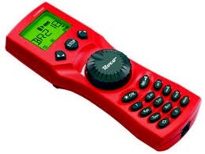

#  Nederlands

[Navigate to English version](#English)

## DR5000

* Start de DR5000 control software

* Schakel de baanspanning in door de groene knop op de interface van de DR5000-software

* Druk op de Control Go Stop op de interface van de DR5000-software

* Kies de Rijden optie op de interface van de DR5000-software

* Het rijdenscherm zal verschijnen

* Experimenteer met het rijden van een loc met een bepaald adres

## DR5000 logging

Indien in het schakelcherm logging is ingeschakeld verschijnt b.v.

## Multimaus

❗Zodra de Multimaus de loc in beweging zet zie je dat terug in de interface en in de logging.

## RocRail

* Sluit DR5000 aan op laptop via USB
* Goede [video](https://www.youtube.com/watch?v=WPyYzsw9E1Q)
* Eerst DR5000 software opstarten en kijken naar COM-poorten
* Noteer de Loconet-COM-poort.
* Dan in RocRail virtuele controller verwijderen en nieuwe toevoegen.

* En op Loconet en 115200 bps zetten

  

# English

## DR5000

* Start the DR5000 control software

* Switch power on main track on by pushing the green button in the interface of the DR5000 software

* Push the Control Go Stop symbol in the interface of the DR5000 software

* Choose the drive option in the interface of the DR5000 software

* A drive board will appear in the interface

* Experiment driving a loc with the given adress

## DR5000 logging

If enabled speed changes are visible in the logging

## Multimaus

❗Operations on the MultiMaus are reflected in the use rinterface and in the logging

## RocRail

* Connect DR5000 to laptop via USB
* Gooed [video](https://www.youtube.com/watch?v=WPyYzsw9E1Q)
* First statup DR5000 software en look at COM ports
* Take note of Loconet COM port
* Remove in RocRail virtual controller and aad new

* Set to Loconet and 115200 bps

  
