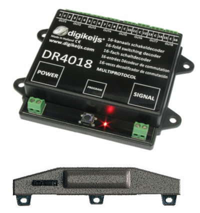
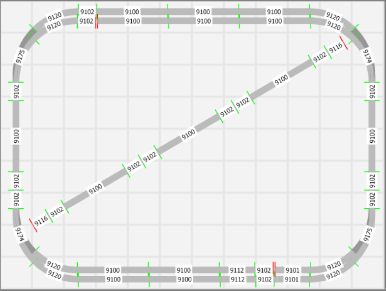

# Nederlands

[Navigate to English version](#English)

## Eerste stappen: stap 1

De hobby is begonnen door het aanschaffen van een beginnersset van Fleischmann voor &euro;289. Deze set bestaat uit:

* Digitale DCC bestuurbare loc
* 4 wagons
* Rails in rondje met één handwissel
* Multimaus
* Z21 start. Aanvankelijk werd de starterskit geleverd met een Roco 10764; vandaar dat er werd doorgegaan met de Digikeijs DR5000 in de volgende stap.

Met een startset kunnen met één trein rondjes worden gereden en ervaring worden opgedaan met het programmeren van de CV-waarden van de loc via de MultiMaus.

## Eerste stappen: stap 2

Vervolgens een goedkope maar complete DCC-centrale aangeschaft de Digikeijs DR5000 voor &euro;187 en een Digikeijs bezetmelder voor 2-rail de DR4088 LN CS voor &euro;67, die via Loconet met de centrale wordt verbonden (incl. een aan te schaffen Loconet-kabel). De DR5000 heeft ook een Xpressnet-aansluiting voor de Multimaus dus die gebruikt blijven worden.

Nu kan de loc worden bediend via de interface van de DR5000-software en kan de positie op de baan middels bezetmelders worden getoond. Dit is ook al het moment om de eerste computerbesturing aan te sluiten mits de wissel even buiten beschouwing wordt gelaten.

## Eerste stappen: stap 3
Elektrische bediening voor de Fleischmann-wissel (640000) voor &euro;24 en een Digikeijs schakeldecoder de Digikeijs DR4018 voor &euro;38.

Nu kan het wissel elektrisch worden bediend vanuit de DR5000-interface of het computerbesturingsprogramma.

## Eerste stappen: stap 4
Aanschaf van seinen (in NL &euro;28 of in China &euro;4). Aanschaf meerdere schakeldecoders DR4018.

## Volgende stap: ontwerp 1

Mijn baan is getekend in 3D Modelbahn Studio en in RocRail:

3D Modelbahn Studio is niet helemaal foutloos. Uitsluitend baanstukken zijn gebruikt uit de library en toch sluiten bepaalde stukken niet aan (twee rode vertikale streepjes).

De architectuur van de besturing:

Het elektrische schema is getoond van slechts een van de 4 DR4018. Voorlopig zijn de seinen met 3 lichten aangesloten alsof er 4 lichten zijn. Het DCC-signaal voor de DR4018 is aangesloten achter de diodebrug, omdat dit makkelijker bedraden is onder de tafel. De DR4018 ondervindt hiervan geen hinder.

Het uiteindelijke [RocRail-bestand in XML](./images/plan.xml) om de baan te besturen is bijgevoegd.

## Volgende stap: ontwerp 2

In deze baan zijn opstelsporen aangebracht.

# English

## First steps: step 1

The hobby started buying a starterkit from Fleischmann for &euro;289. This set contains:

* Digitae DCC controllable loc
* 4 wagons
* Rails in a circle and 1 manual switch
* Multimaus
* Z21 start. Originally the starterskit had a Roco 10764; that's why in the next step a Digikeijs DR5000 was introduced.

With a startset a train can circle and the user can experiment with programming CV values through a MultiMaus.

## First steps: step 2

The next step involves a complete DCC command station the Digikeijs DR5000 for &euro;187 and a  Digikeijs feedback module for 2-rail the DR4088 LN CS for &euro;67, which are interconnected through Loconet (incl. a Loconet-cable). The DR5000 also has a Xpressnet connection so the Multimaus can still be used.

Now the loc can be controlled by the interface of the DR5000 software its position on the track can be shown. At this moment a computer controlling program can be connected if the switch is left out.

## First steps: step 3
Elektric control for the Fleischmann switch (640000) for &euro;24 and Digikeijs switching decoder the Digikeijs DR4018 for &euro;38.

Now the switch can be operated from the DR5000 interface or the controlling computer program.

## First steps: step 4
By signals (in NL &euro;28 or in China &euro;4). By multiple switching decoders DR4018.

## Next step: design 1

My model railroad is drawn with 3D Modelbahn Studio and with RocRail:

3D Modelbahn Studio is not quite perfect. Although only library track pieces are used some pieces do not join (two red vertical stripes).

The control architecture:

The elektrical schema is drawn with only one of four DR4018. At the moment the 3 light signals are connected as 4 light signals with one spare connection. The DCC signal for the DR4018 is connected behind the diode bridge, because of ease of wiring under the table. The DR4018 has no problems receiving the DCC signal.

The final [RocRail-file in XML](./images/plan.xml) to control my modeltrain track is available.

## Next step: design 2

