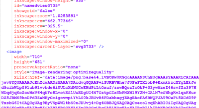
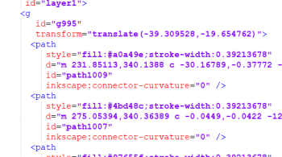
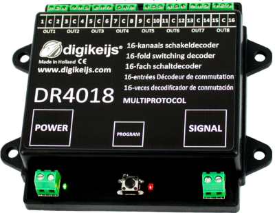
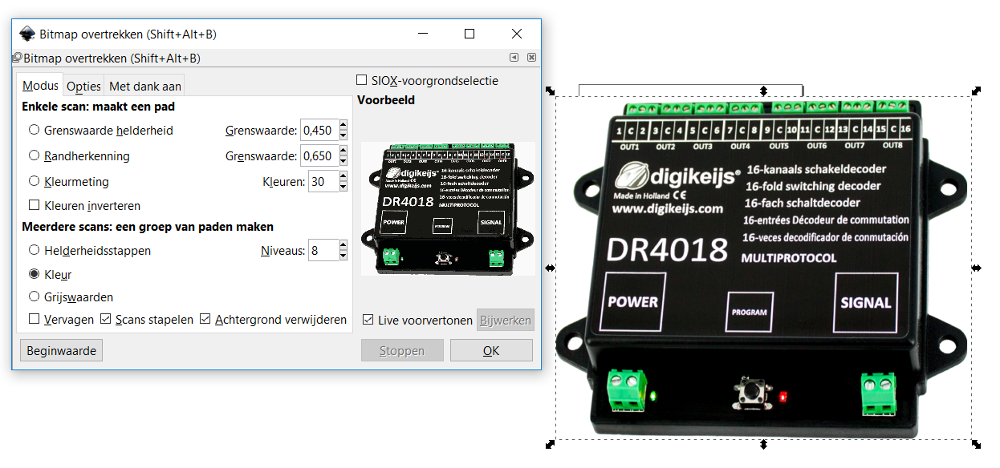

#  Nederlands

## Elektrische en aansluitschema's
Voor de beschrijving van de modelbaan worden zowel elektrische als aansluitschema's gebruikt. Aansluitschema's vind je ook in alle documenten van Digikeijs. Daarom is er gezocht naar een tool om aansluitschema's met een foto van b.v. de DR4018 te maken. Tools zoals KiCad zijn uitsluitend voor elektrische schema's. Fritzing kan beide.

Voor het maken van aansluit- en elektrische schema's wordt dus Fritzing gebruikt. Hoewel Fritzing zelf (en het internet) duidenden componenten bevat staan de DR5000, DR4088, DR4018 en de seinen, wissels en sporen hier natuurlijk niet bij. In dit document wordt beschreven hoe je zelf Fritzing-componenten maakt uit tekeningen.

Dit is een [samenvatting](https://learn.sparkfun.com/tutorials/make-your-own-fritzing-parts/all) van een artikel van Sparkfun. Alleen wordt in dat artikel de nieuwe component helemaal met de hand getekend en wordt niet uitgelegd hoe je een plaatje van een component zoals de DR4018 kunt gebruiken. Er is ook een handige [video](https://www.youtube.com/watch?v=5X7C2qb7rtM).

## SVG
Helaas bleek bij de eerste experimenten een geïmporteerd plaatje als bitmap

en niet als SVG-vectorcode te worden opgeslagen in het uiteindelijke SVG-bestand:

Fritzing tekent de bitmap-SVG-onderdelen niet; het moeten SVG-vectoren zijn. Hiervoor zijn er twee oplossingen:

1. Volg onderstaande stappen om een tekening of foto om te zetten naar een echt SVG-vector-bestand
2. Teken zelf met Inkscape de component. Het resultaat bestaat dan altijd uit SVG-vectoren

## PNG/JPG naar SVG omzetten

Voer de volgende stappen uit om een tekening/foto om te zetten in SVG-vectoren:

* Installeer Inkscape
* Snijd uit een geschikte tekening of foto dat deel dat je nodig hebt met de Snipping Tool. In dit voorbeeld is een plaatje uit de handleiding van Digikeijs gepakt.
* Bewaar als PNG

De volgende stappen zijn overgenomen [uit een video](https://www.youtube.com/watch?v=KRkx8kjmXZw)
* Open Inkscape
* Importeer PNG
* Selecteer het object (dat nu nog bitmap is)
* Ga naar het menu Paden
* Kies menustap Bitmap overtrekken

* Kies opties Kleuren en zet Vervagen uit en Achtergrond verwijderen aan
* Druk op Ok om conversie te starten
* ⚠️Er staan nu twee plaatjes in Inkscape, de originele en de geconverteerde
* Verschuif de geconverteerde
* Verwijder de originele (nog steeds bitmap)
* Bewaar overgebleven plaatje als SVG-bestand

## Fritzing component maken

* Installeer Fritzing
* Open Fritzing
* Verwijder het standaard getekende breadboard
* Pak een onderdeel uit de gereedschapskist
* TO BE CONTINUED

#  English

## SVG

Unfortunately imported pictures and photos are saved as bitmap by Inkscape

and not as SVG vector code in the final SVG file:

There are two solutions:

1. Follow the steps below to transform a drawing or picture into SVG-vectors
2. Draw a picture with Inkscape. The result will always be SVG-vectors

## Transform PNG/JPG into SVG

Here are the steps to follow:

* Install Inkscape
* Cut from a suitable drawing or photo the part needed with the Snipping Tool In this example a picture from the Digikeijs manual was taken.
* Save as PNG

The next steps are taken [from a video](https://www.youtube.com/watch?v=KRkx8kjmXZw)
* Open Inkscape
* Import the PNG
* Select the object (still being a bitmap )
* Go to Path
* Go to Trace bitmap

* Choose options Colors on, Smooth off, Remove Background on
* Push Ok to start conversion
* ⚠️There are now two objects in Inkscape, the original and the converted
* Move the converted
* Remove the original (still bitmap)
* Save remaining object as SVG

## Create Fritzing component

* Install Fritzing
* Open Fritzing
* TO BE CONTINUED
