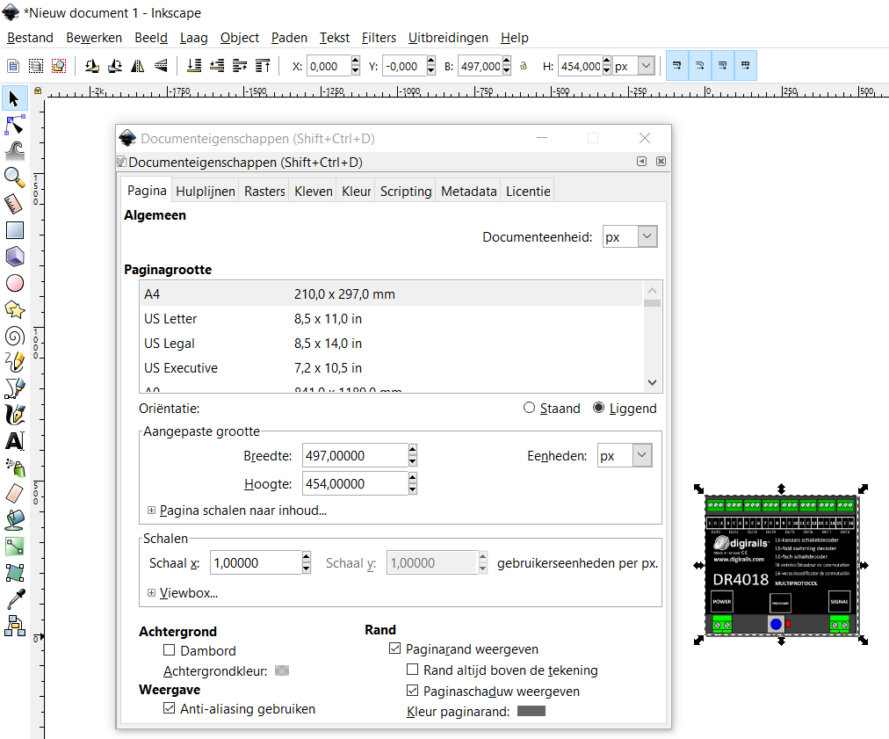

#  Nederlands

## Elektrische en aansluitschema's
Voor de beschrijving van de modelbaan worden zowel elektrische als aansluitschema's gebruikt. Aansluitschema's vind je ook in alle documenten van Digikeijs. Daarom is er gezocht naar een tool om aansluitschema's met een foto van b.v. de DR4018 te maken. Tools zoals KiCad zijn uitsluitend voor elektrische schema's. Fritzing kan beide.

Voor het maken van aansluit- en elektrische schema's wordt dus Fritzing gebruikt. Hoewel Fritzing zelf (en het internet) duidenden componenten bevat staan de DR5000, DR4088, DR4018 en de seinen, wissels en sporen hier natuurlijk niet bij. In dit document wordt beschreven hoe je zelf Fritzing-componenten maakt uit tekeningen.

Dit is een [samenvatting](https://learn.sparkfun.com/tutorials/make-your-own-fritzing-parts/all) van een artikel van Sparkfun. Alleen wordt in dat artikel de nieuwe component helemaal met de hand getekend en wordt niet uitgelegd hoe je een plaatje van een component zoals de DR4018 kunt gebruiken. Er is ook een handige [video](https://www.youtube.com/watch?v=5X7C2qb7rtM). Met dank aan Arnoud van Bers van de HAN voor hulp bij het gebruik van Inkscape en SVG.

## Breadboard als SVG
* Maak met Snipping Tool een plaatje b.v. van de DR4018. Snijd nauwkeurig langs randen

* Bewaar als PNG
* Pas eventueel aan met Paint 3D
* Kijk in Windows verkenner, selecteer het bestand en beweeg de muis over het item. Kijk naar breedte en hoogte in pixels b.v. 497 x 454

* Open Inkscape
* Stel documenteenheid op pixels; zet breedte en hoogte conform 497 x 454

* Kies in het menu Bestand - Importeren en selecteer het plaatje van de DR4018 als PNG. Verander niets aan de standaard-import-instellingen.

* Zet X en Y bovenaan in de taakbalk op 0 en B op 497 en H op 454 en de eenheid op px

* Teken een circel voor elektrische aansluitingen op juiste plek
* Kopieer deze circel meerdere keren voor overige aansluitingen en positioneer

* Bewaar als SVG met indicatie van een breadboard bestand b.v. DR4018_breadboard.SVG

## Elektrisch schema als SVG
* Open een SVG van een component met evenveel pootjes
* Pas de pootjes en hun benaming aan. Pas de naam van het component midden in de tekening aan.
* Edit in Inkscape

* Bewaar als SVG met indicatie van een schema bestand b.v. DR4018_schematic.SVG

## Fritzing component maken

* Open Fritzing
* Verwijder het standaard getekende breadboard
* Pak een onderdeel uit de gereedschapskist b.v. de Arduino Pro Mini

* Klik rechtermuis, Wijzig (nieuwe onderdelen bewerker)
* In het tabblad Breadboard kies in het menu Laad tekening en kies de zojuist gemaakte breadboard-samenvatting

* In het tabblad Aansluitingen kies namen voor alle aansluitingen

* In het tabblad Metadata kies juiste naam voor de component en de schrijver

* Ga naar tabblad Iccon en kies Gebruik de breadboard afbeelding

* Ga terug naar tabblad Breadboard kies rechts de juiste connector - kies knop afbeelding - selecteer met de muis links de juiste circel

* Ga naar tabblad Schematic en importeer het schema-bestand:

#  English
