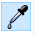

#  Nederlands

[Navigate to English version](#English)

## Elektrische en aansluitschema's
Voor de beschrijving van de modelbaan worden zowel elektrische als aansluitschema's gebruikt. Aansluitschema's vind je ook in alle documenten van Digikeijs. Daarom is er gezocht naar een tool om aansluitschema's met een foto van b.v. de DR4018 te maken. Tools zoals KiCad zijn uitsluitend voor elektrische schema's. Fritzing kan beide.

Voor het maken van aansluit- en elektrische schema's wordt dus Fritzing gebruikt.

 ⚠️**De toekomst van Fritzing is onzeker. De laatste update is van juni 2016** ⚠️.

 Mogelijke alternatieven zijn TinyCAD en TinkerCAD, omdat het werken met een aansluitschema voor veel gebruikers makkelijker te lezen is dan een elektronisch schema, dat je b.v. makkelijk met KiCad kan maken. Nader onderzoek van deze pakketten is nodig om te beoordelen of ze geschikt zijn voor het tekenen van aansluitschema's van modelspoorbanen en besturingslogica.

Hoewel Fritzing zelf (en het internet) duizenden componenten bevat staan de DR5000, DR4088, DR4018 en de seinen, wissels en sporen hier natuurlijk niet bij. In dit document wordt beschreven hoe je zelf Fritzing-componenten maakt uit tekeningen. 👍Met dank aan Arnoud van Bers van de HAN voor hulp bij het gebruik van Inkscape en SVG.

Dit is een [samenvatting](https://learn.sparkfun.com/tutorials/make-your-own-fritzing-parts/all) van een artikel van Sparkfun. Er is ook een handige [video](https://www.youtube.com/watch?v=5X7C2qb7rtM).

Alleen wordt in dat artikel de nieuwe component helemaal met de hand getekend en wordt niet uitgelegd hoe je een plaatje van de DR4018 voor het maken van een component kunt gebruiken. Er zijn drie manieren om een SVG-plaatje met Inktscape te maken:

1. Met de menustap Paden - Bitmap overtrekken. Hiermee maak je 'echte' SVG-commando's van een plaatje. Het resultaat is een groot bestand dat bij Fritzing tot zeer trage afhandeling leidt. Zo duurt het koppelen van een Fritzing-connector aan een SVG-element snel 5-10 sec.

2. PNG omzetten naar SVG als embedded image

3. Met de hand een component tekenen. Dit levert altijd een puur SVG-bestand. Onderaan zal aangetoond worden dat dit de snelst getekende Fritzing-component oplevert.

## Breadboard als SVG oplossing 1

Vanwege de traagheid in Fritzing is deze oplossing uitgeprobeerd, maar niet verder gedocumenteerd.

## Breadboard als SVG oplossing 2

#### PNG plaatje knippen

* Maak met Snipping Tool een plaatje b.v. van de DR4018. Snijd nauwkeurig langs de randen.

* Bewaar als PNG
* Pas eventueel aan met Paint 3D. 👉Bij Paint 3D kun je kleine stukjes gekleurd materiaal selecteren en kopiëren om het kopie over een ander stuk te schilderen.
* Bewaar weer als PNG
* Kijk in Windows verkenner, selecteer het bestand en beweeg de muis over het item. Kijk naar breedte en hoogte in pixels b.v. 497 x 454

#### PNG omzetten naar SVG in pixels

* Open Inkscape
* Stel bij menu - Documenteigenschappen de Eenheden op pixels; zet Breedte en Hoogte op 497 x 454

* Kies in het menu Bestand - Importeren en selecteer het plaatje van de DR4018 als PNG. Verander niets aan de standaard-import-instellingen.

* Zet X en Y bovenaan in de taakbalk op 0 en B op 497 en H op 454 en de eenheid op px. Doe je dit niet zullen de hierna te tekenen connectoren uiteindelijk op een andere plek getekend worden.

#### Importeerprobleem Fritzing oplossen met Notepad++

* Bewaar vanuit Inkscape als **gewone** SVG (niet de standaard Inktscape SVG) met indicatie van een breadboard bestand b.v. DR4018breadboard.SVG
* Ga naar een tekstverwerker als Notepad of Notepad++ en open dit Bestand
* Goed te zien is dat alle breedtes en hoogtes (en de viewBox) op 497 resp. 454 staan
* Verwijder de de regel met transform=translate...

* Zet onderaan het bestand waar de image-informatie eindigt de y op 0
* Bewaar het Bestand
* ⚠️Deze stappen zijn nodig om het Fritzing mogelijk te maken het bestand in te lezen. ALs de transform in het bestand staat, kan Fritzing het plaatje **niet renderen**

#### Connectoren toevoegen

* Open het zojuist gewijzigde bestand weer met Inkscape
* Teken een cirkel voor elektrische aansluiting op de juiste plek
* Kopieer deze cirkel meerdere keren voor overige aansluitingen en positioneer

* Bewaar als **gewone** SVG (niet de standaard Inktscape SVG) met indicatie van een breadboard bestand b.v. DR4018breadboard.SVG

* ⚠️De uiteindelijke Fritzing-component met deze SVG blijkt erg traag bij het maken van een echt schema. als bij dee DR4018-tester met 17 aansluitingen de DR4018 wordt geselecteerd en verschoven van uiterst links nar uiterst rechts op het scherm, duurt het hertekenen van de component met alle aansluitingen (op een laptop i7 met 16 GB RAM) bijna 2 sec.

## Breadboard als SVG oplossing 3

* We gaan weer uit van de DR4018
* Open Inktscape
* Stel bij menu - Documenteigenschappen de Eenheden op pixels; zet Breedte en Hoogte op 497 x 454
* Kies in het menu Bestand - Importeren en selecteer het plaatje van de DR4018 als PNG. Verander niets aan de standaard-import-instellingen. Laat het plaatje rechts van de documentranden staan.
* Zet B op 497 en H op 454 en de eenheid op px
* Teken de DR4018 na met Inktscape door vierkanten en cirkels over te trekken en teksten toe te voegen
* Voorbeeld: trek eerst de buitenkant over
* Schuif dit vierkant naar links richting de documentranden
* Pak de kleur uit het plaatje van de DR4108 met de color-picker 

* Trek een vierkant over de zwarte binnenkant van de DR4018, verplaats en kies met de color picker zwart

* Maak een groene connector
* Maak één schroefje
* Kopieer dit schroefje twee keer (meerdere objecten selecteren in Inkscape gebruik SHIFT)
* Kopieer de connector met drie schroefjes 8 keer en zet op de juiste plek
* Kopieer de connector met drie schroefjes en zet deze over de grotere connector voor SIGNAL of POWER. Vergroot de connector en kopieer nog een kopieer
* Etc. etc.

* ⚠️ Bij tekstvlakken moet je na het tekenen de tekst selecteren en met de menustap Tekst 'Omzetten naar tekst' behandelen; anders worden ze niet zichtbaar in de uiteindelijke SVG als je deze bekijkt met een browser of met Fritzing. Dit is een beetje vreemd gedrag van Inktscape.
* Verwijder als laatste het voorbeeldplaatje
* Bewaar als **gewone** SVG (niet de standaard Inktscape SVG) met indicatie van een breadboard bestand b.v. DR4018breadboard.SVG

## Elektrisch schema als SVG
* Open een SVG van een component met evenveel pootjes
* Pas de pootjes en hun benaming aan. Pas de naam van het component midden in de tekening aan.
* Edit in Inkscape

* Bewaar als SVG met indicatie van een schema bestand b.v. DR4018schematic.SVG

## Fritzing component maken met oplossing 2

* Open Fritzing
* Verwijder het standaard getekende breadboard
* Pak een onderdeel uit de gereedschapskist b.v. de Arduino Pro Mini en zet deze in de breadboard-tekening
* Klik rechtermuis, Wijzig (nieuwe onderdelen bewerker)

* Bewaar meteen voor de zekerheid onder een nieuwe naam:

* In het tabblad Breadboard kies in het menu Laad tekening en kies de zojuist gemaakte breadboard tekening van oplossing 2:

* In het tabblad Aansluitingen kies namen voor alle aansluitingen

* In het tabblad Metadata kies juiste naam voor de component en de schrijver

* Ga naar tabblad Icoon en kies Gebruik de breadboard afbeelding

* Ga terug naar tabblad Breadboard. Kies rechts de juiste connector - kies rechts de knop Selecteer afbeelding achter de zojuist gekozen connector - selecteer met de muis links de juiste circel in het schema. Er verschijnt rechts een vinkje ten teken dat de connector met het Breadboard gekoppeld is.

* Ga naar tabblad Schema en importeer het schema-bestand:
Kies rechts de juiste connector - kies rechts de knop Selecteer afbeelding achter de zojuist gekozen connector - selecteer met de muis links de juiste circel in het schema. Er verschijnt rechts een vinkje ten teken dat de connector met het Schema gekoppeld is.

* Laat het tabblad PCB ongemoeid; we gaan toch geen DR4018 op een printplaat monteren.

* Bewaar het nieuwe component

* Probeer de nieuwe component te verbinden met b.v. LED's.

* Exporteren en importeren van dit nieuwe component, [kijk op](https://fritzing.org/learning/tutorials/creating-custom-parts/using-sharing/)

## Fritzing component maken met oplossing 3

Herhaal bovenstaande stappen met oplossing 3.

👍Als we een schakeling maken op basis van de zelf getekende SVG-tekening blijkt een schakeling als de DR4018-tester vele malen sneller te werken als we de DR4018 selecteren in Fritzing en van links naar rechts slepen waarbij de verbindingen met de LED's als rubber touwtjes blijven bestaan.

#  English

## Electrical and connection schemas
To describe the model railroad track electrical and connection schemas are used. Connection schemas can be found in the manuals of Digikeijs. To make more schemas a drawing tool was selected which could produce both. It would be handy to start with a picture/photo of e.g. a DR4018 and create a schema from that. Tools like KiCad can not use an existing photo.

 ⚠️**The future of Fritzing is uncertain. The last update is of June 2016** ⚠️.

 Possible alternatives are TinyCAD and TinkerCAD. We emphasize on connection schemas because electrical schemas are harder to read for non experts. Further research has to be done to explorethe possibilities of drawing connection schemas of  model railroads and controlling logic.

Although Fritzing itself (and the internet) contain thousands of parts the DR5000, DR4088, DR4018 and signals, swithes and tracks can not be found. In this document we will create Fritzing parts from drawing. THanks to Arnoud van Bers of the HAN for the help with Inkscape and SVG.

This document was created with the  [help of](https://learn.sparkfun.com/tutorials/make-your-own-fritzing-parts/all) by Sparkfun. There is also a [video](https://www.youtube.com/watch?v=5X7C2qb7rtM).

In the article by Sparkfun they draw a component by hand. They do not explain how to use an existing picture of a part.

There are three ways of creating a SVG picture with Inktscape:

1. Use the menu Path - Trace Bitmap. With this option a real set of SVG commands is created from a photo or picture. The result is such a big file that Fritzing has big troubles handling it. Connecting a graphical object to a connector took (laptop i7 16 GB RAM) 5-10 sec.

2. Transform a PNG to SVG as embedded image

3. Draw a component by hand. This results in a pure SVG file. Below will be demonstrated that this solution leads to the fastest drawn parts in Fritzing.

## Breadboard as SVG solution 1

Due to performance issues this solution is not documented..

## Breadboard as SVG solution 2

#### Pick a PNG from picture

* Use Snipping Tool to make a PNG of a picture of the DR4018. Always cut the borders nicely.

* Save as PNG
* You can use Paint 3D to make small refinements. 👉With Paint 3D you can select small coloured parts and move them over other parts.
* Save as PNG
* Look at Windows explorer, select the file and move the mouse over the item to look at the size in pixels e.g. 497 x 454

#### Transform PNGto SVG in pixels

* Open Inkscape
* Set in menu - Document properties the units to pixels; set Width and Height to 497 x 454

* Open in menu File - Importer and choose the PNG picture of the DR4018. Don't change the defualt import settings.

* Put X and Y on top of the menubar to 0 and B to 497 and H to 454 and untis to px. Making an error will result in a component where the connection points differ from the picture.

#### Solve Fritzing import problem with Notepad++

* Save the file with Inkscape as **normal** SVG (not the Inktscape SVG) with some note that this is the breadboard view e.g. DR4018breadboard.SVG
* Use Notepad or Notepad++ open this file
* All width and heights are correct and in pixels are 497 resp. 454 (even viewBox))
* Remove the line with transform=translate...

* Set at the bottom of the file just beneath the embedded image y to 0
* Save the file
* ⚠️These steps are neccessary to be able for Fritzing to import and **render** this picture. With transform this is not possible.

#### Add connectors

* Open the previous file with Inkscape
* Draw a small circle for the electrical connection
* Copy this circle and position over eacht connector

* Save the file with Inkscape as **normal** SVG (not the Inktscape SVG) with some note that this is the breadboard view e.g. DR4018breadboard.SVG

* ⚠️The final Fritzing part using this SVG appears to draw very slow when creating electrical schemas. The schema of the DR4018 tester with 17 dragging the DR4018 while the connections stay as rubber bands takes (on a laptop i7 with 16 GB RAM) almost 2 sec.

## Breadboard as SVG solution 3

* Open Inktscape
* Set in menu - Document propertiesunits to pixels; set Width and Heigth  to 497 x 454
* Menu File - Import and select the picture of the DR4018 as PNG. Do not change anything to default import settings. Put the picture to the right of the document edges.
* Set W to 497 and H to 454 and unit to px in toolbar
* Redraw the DR4018 with the help of Inktscape using squares and circles and text boxes
* Example: start with outer edge of the picture of the DR4018. Redraw a square over the DR4018.
* Move this square to the document edges
* Take the colour picker to fill the square with the colour of the DR4018 gray surface 

* Drwa a smaller square over the black inside of the DR4018. Move it over the new picture and use colour picker to paint it black

* Draw small green square over a connector
* Draw one screw with a circle and a line
* Copy this screw two times (selecting more items in Inkscape use SHIFT)
* Copy connector with three screws 8 times and put on the right spot
* Copy connector with three screws over the bigger connector of SIGNAL or POWER. Enlarge and copy again
* Etc. etc.

* ⚠️ Using text boxes requires an extra step. After drawing select the text and got to menu Text 'Convert to text'. THis step is requeired otherwise text boxes are not shown in Fritzing. This is a strange 'feature' of Inktscape.
* The last step is to remove the PNG picture which only served as a picture to redraw
* Save the file with Inkscape as **normal** SVG (not the Inktscape SVG) with some note that this is the breadboard view e.g. DR4018breadboard.SVG

## Electrical schema as SVG
* Open a SVG from a part with the same number of connectors
* Adjust position and names of these connectors. Adjust the name of the new part in the middle.

* Save the file with Inkscape as **normal** SVG (not the Inktscape SVG) with some note that this is the electrical view e.g. DR4018schematic.SVG

## Create Fritzing part with solution 2

* Open Fritzing
* Remove standard breadboard
* Take a part out of the suitcase e.g. Arduino Pro Mini and put it in the  breadboard drawing
* Click right mouse. Change (new component)

* Just to be sure save as new component

* In the Breadboard tab choose menu Load drawing and choose breadboard SVG made in previous step

* Set the coreect number and names of the connectors in the tab Connectors

* Change in the tab Metadata the name of the new part and the writer

* Go to tab Icon and choose Use breadboard picture

* Go to tab Breadboard. Choose on the right side a connector - push the button select picture behind the selector - and click on the corresponding connector object in the big picture. A mark indicates that this connector is connected to some visual object.

* Go to tab Schema and importer the electrical schema SVG. Choose on the right side a connector - push the button select picture behind the selector - and click on the corresponding connector object in the big picture. A mark indicates that this connector is connected to some visual object.

* Leave the tab PCB; we are not putting a DR4018 on a PCB.

* Save the new part

* Try out the new part by connecting some LEDs.

* Exporter and importer this new part  [look at](https://fritzing.org/learning/tutorials/creating-custom-parts/using-sharing/)

## Create Fritzing part using solution 3

Repeat the steps above using SVG solution 3.

👍The final Fritzing part using this handmade SVG appears to draw very fast when creating electrical schemas. The schema of the DR4018 tester with 17 dragging the DR4018 while the connections stay as rubber bands redraws (on a laptop i7 with 16 GB RAM) almost instantaneously.

