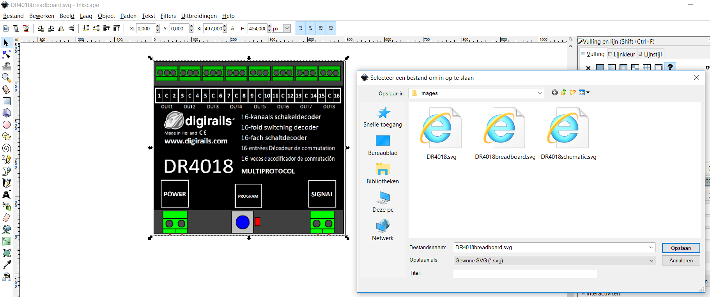

#  Nederlands

## Elektrische en aansluitschema's
Voor de beschrijving van de modelbaan worden zowel elektrische als aansluitschema's gebruikt. Aansluitschema's vind je ook in alle documenten van Digikeijs. Daarom is er gezocht naar een tool om aansluitschema's met een foto van b.v. de DR4018 te maken. Tools zoals KiCad zijn uitsluitend voor elektrische schema's. Fritzing kan beide.

Voor het maken van aansluit- en elektrische schema's wordt dus Fritzing gebruikt.

 ⚠️**De toekomst van Fritzing is onzeker. De laatste update is van juni 2016** ⚠️.

Hoewel Fritzing zelf (en het internet) duizenden componenten bevat staan de DR5000, DR4088, DR4018 en de seinen, wissels en sporen hier natuurlijk niet bij. In dit document wordt beschreven hoe je zelf Fritzing-componenten maakt uit tekeningen. 👍Met dank aan Arnoud van Bers van de HAN voor hulp bij het gebruik van Inkscape en SVG.

Dit is een [samenvatting](https://learn.sparkfun.com/tutorials/make-your-own-fritzing-parts/all) van een artikel van Sparkfun. Er is ook een handige [video](https://www.youtube.com/watch?v=5X7C2qb7rtM).

Alleen wordt in dat artikel de nieuwe component helemaal met de hand getekend en wordt niet uitgelegd hoe je een plaatje van de DR4018 voor het maken van een component kunt gebruiken.

## Breadboard als SVG

#### PNG plaatje knippen

* Maak met Snipping Tool een plaatje b.v. van de DR4018. Snijd nauwkeurig langs de randen.

* Bewaar als PNG
* Pas eventueel aan met Paint 3D. 👉Bij Paint 3D kun je kleine stukjes gekleurd materiaal selecteren en kopiëren om het kopie over een ander stuk te schilderen.
* Bewaar weer als PNG
* Kijk in Windows verkenner, selecteer het bestand en beweeg de muis over het item. Kijk naar breedte en hoogte in pixels b.v. 497 x 454

#### PNG omzetten naar SVG in pixels

* Open Inkscape
* Stel bij menu - Documenteigenschappen de Eenheden op pixels; zet Breedte en Hoogte op 497 x 454

* Kies in het menu Bestand - Importeren en selecteer het plaatje van de DR4018 als PNG. Verander niets aan de standaard-import-instellingen.

* Zet X en Y bovenaan in de taakbalk op 0 en B op 497 en H op 454 en de eenheid op px. Doe je dit niet zullen de hierna te tekenen connectoren uiteindelijk op een andere plek getekend worden.

#### Importeerprobleem Fritzing oplossen met Notepad++

* Bewaar vanuit Inkscape als **gewone** SVG (niet de standaard Inktscape SVG) met indicatie van een breadboard bestand b.v. DR4018breadboard.SVG
* Ga naar een tekstverwerker als Notepad of Notepad++ en open dit Bestand
* Goed te zien is dat alle breedtes en hoogtes (en de viewBox) op 497 resp. 454 staan
* Verwijder de de regel met transform=translate...

* Zet onder het bestand de y op 0
* Bewaar het Bestand
* ⚠️Deze stappen zijn nodig om het Fritzing mogelijk te maken het bestand in te lezen. ALs de transform in het bestand staat, kan Fritzing het plaatje **niet renderen**

#### Connectoren toevoegen

* Open het zojuist gewijzigde bestand weer met Inkscape
* Teken een cirkel voor elektrische aansluiting op de juiste plek
* Kopieer deze cirkel meerdere keren voor overige aansluitingen en positioneer

* Bewaar als **gewone** SVG (niet de standaard Inktscape SVG) met indicatie van een breadboard bestand b.v. DR4018breadboard.SVG

## Elektrisch schema als SVG
* Open een SVG van een component met evenveel pootjes
* Pas de pootjes en hun benaming aan. Pas de naam van het component midden in de tekening aan.
* Edit in Inkscape

* Bewaar als SVG met indicatie van een schema bestand b.v. DR4018schematic.SVG

## Fritzing component maken

* Open Fritzing
* Verwijder het standaard getekende breadboard
* Pak een onderdeel uit de gereedschapskist b.v. de Arduino Pro Mini en zet deze in de breadboard-tekening
* Klik rechtermuis, Wijzig (nieuwe onderdelen bewerker)

* Bewaar meteen voor de zekerheid onder een nieuwe naam:

* In het tabblad Breadboard kies in het menu Laad tekening en kies de zojuist gemaakte breadboard-samenvatting

* In het tabblad Aansluitingen kies namen voor alle aansluitingen

* In het tabblad Metadata kies juiste naam voor de component en de schrijver

* Ga naar tabblad Iccon en kies Gebruik de breadboard afbeelding

* Ga terug naar tabblad Breadboard. Kies rechts de juiste connector - kies rechts de knop Selecteer afbeelding achter de zojuist gekozen connector - selecteer met de muis links de juiste circel in het schema. Er verschijnt rechts een vinkje ten teken dat de connector met het Breadboard gekoppeld is.

* Ga naar tabblad Schema en importeer het schema-bestand:
Kies rechts de juiste connector - kies rechts de knop Selecteer afbeelding achter de zojuist gekozen connector - selecteer met de muis links de juiste circel in het schema. Er verschijnt rechts een vinkje ten teken dat de connector met het Schema gekoppeld is.

* Laat het tabblad PCB ongemoeid; we gaan toch geen DR4018 op een printplaat monteren.

* Bewaar het nieuwe component

* Probeer de nieuwe component te verbinden met b.v. LED's.

* Exporteren en importeren van dit nieuwe component, [kijk op](https://fritzing.org/learning/tutorials/creating-custom-parts/using-sharing/)

#  English
