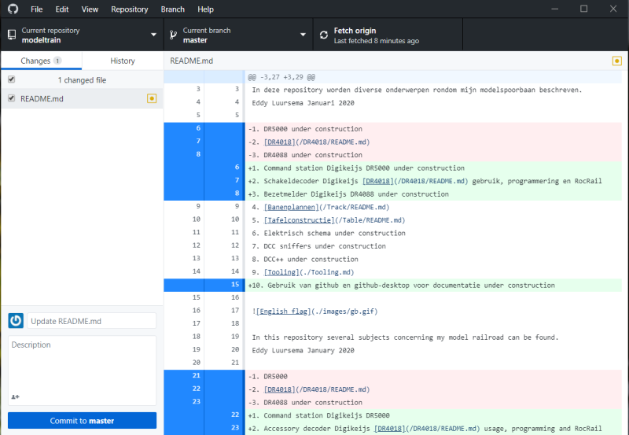
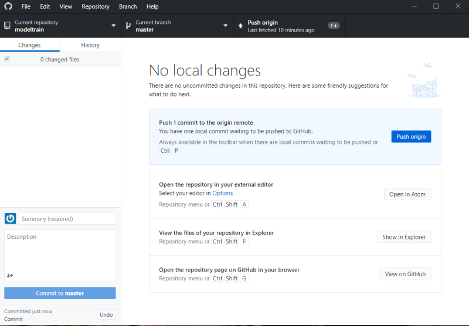

De volgende stappen zijn nodig om documentatie zoals deze site te realiseren:

* Maak een account aan op github en bewaar gebruikersnaam en wachtwoord
* Download github-desktop en installeer
* Stel github-account in op github-desktop
* Clone de directory

Herhaal onderstaande stappen steeds weer als de documentatie moet worden bijgewerkt:

* Maak/wijzig of verwijder een bestand en/of directory
* Commit de wijzigingen door linksonder op de knop te drukken. Geef eventueel commentaar mee in het vakje daarboven. Links zie je alle wijzigingen aan bestanden. Door op een bestand te klikken zie je zelfs de wijzigingen binnen de bestanden (indien mogelijk) bekijken.

* Push de wijzigingen naar github. De wijzigingen zijn nu zichtbaar voor de hele wereld.

The next steps are neccessary te create documentation like this site:

* Create an account on github and save username and wachtwoord
* Download github-desktop and install
* Set your github-account in github-desktop
* Clone the directory

Repeat the following steps eacht time tyhe documentation needs an update:

* Create/change/delete files and/or directories
* Commit the cahnges by clicking down left. It's possible to add a comment to your commit. On the left you see all files. By clicking a file you can see (if possible) the changes made to that particular file.

* Push the changes to github. These changes are now available to the whole world.

