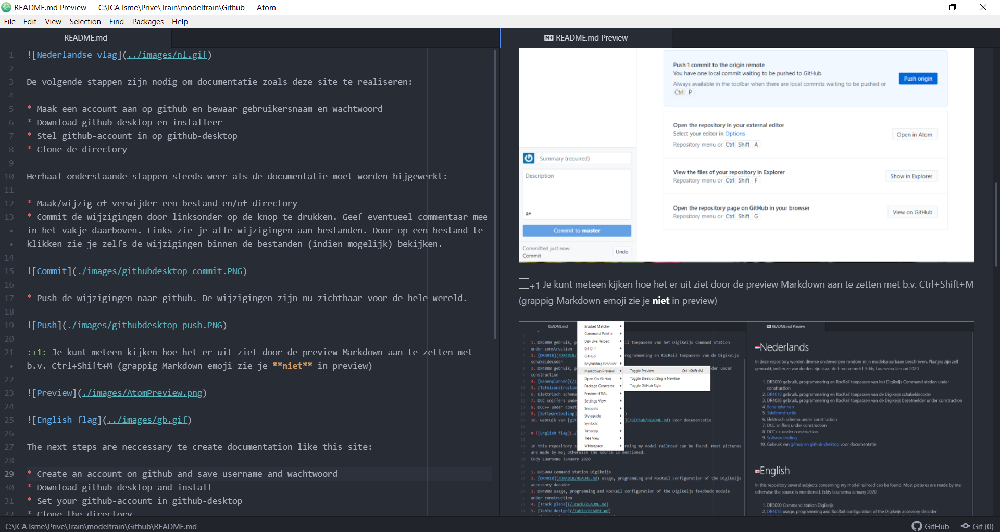
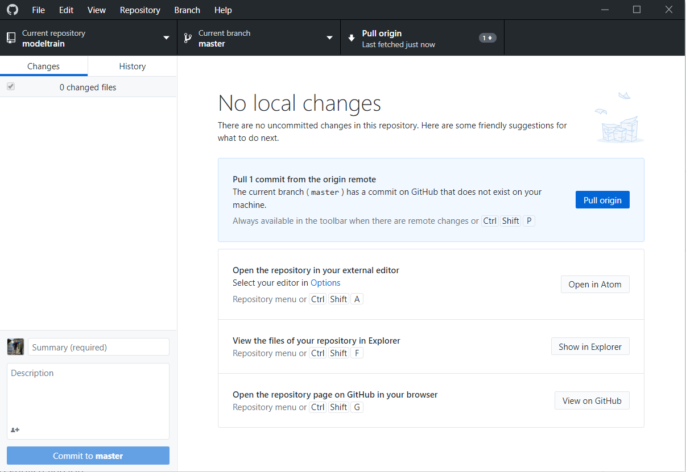

 Nederlands

[Navigate to English version](#English)

## Installeren

De volgende stappen zijn nodig om documentatie zoals deze site te realiseren in Github:

* Maak een account aan op github en bewaar gebruikersnaam en wachtwoord. Maak een eerste repository.
* Download git en installeer
* Download github-desktop en installeer
* Download Atom en installeer. Atom is niet nodig. Iedere testverwerker kun je gebruiken.
* Stel github-account en repository in op github-desktop
* Clone de directory naar je laptop

## Commit & push

Herhaal onderstaande stappen steeds weer als de documentatie moet worden bijgewerkt:

* Maak/wijzig of verwijder een bestand en/of mappen in de repository op je laptop
* Commit de wijzigingen in github-desktop door linksonder op de knop te drukken. Geef eventueel commentaar mee in het vakje daarboven. Links zie je alle wijzigingen aan bestanden. Door op een bestand te klikken zie je zelfs de wijzigingen binnen de bestanden (indien mogelijk).

* Push de wijzigingen naar github. De wijzigingen zijn nu zichtbaar voor de hele wereld.

👍 Je kunt meteen kijken hoe het er uit ziet door de preview Markdown aan te zetten met b.v. Ctrl+Shift+M (grappig [Markdown emoji](https://www.webfx.com/tools/emoji-cheat-sheet/) zie je **niet** in preview na standaard installatie. Daarvoor moet je extra Atom package installeren [zie](../Softwaretooling.md))

## Pull

Als er wijzigingen worden uitgevoerd op de Github-server b.v. via een browser en deze wijzigingen worden ge-commit, zie je in de github-desktop het volgende:

* Druk op Pull Origin om de wijzigingen ook op je lokale git-repository door te voeren

## Conflicten

Stel je wijzigt in dit document github-desktop in github-desktop, maar bijna tegelijkertijd direct op github via een browser in github-desktop. Daarna wordt als eerste de github-server via de browser ge-commit.
Als je daarna probeert gihub-desktop te comitten krijg je:

* Druk op Fetch

 English

The next steps are neccessary te create documentation like this site:

* Create an account on github and save username and password. Create first repository.
* Download git and install
* Download github-desktop and install
* Download Atom and install. Any text editor can be used instead.
* Set your github-account and repository in github-desktop
* Clone the directory to your laptop

Repeat the following steps eacht time tyhe documentation needs an update:

* Create/change/delete files and/or directories in the local repository
* Commit the changes by clicking down left. It's possible to add a comment to your commit. On the left you see all files. By clicking a file you can see (if possible) the changes made to that particular file on the right.

* Push the changes to github. These changes are now available to the whole world.

👍 You can see the result of your work immediately by switching on the preview of Markdown with Ctrl+Shift+M (funny [Markdown emoji](https://www.webfx.com/tools/emoji-cheat-sheet/) are **not** shown in the preview after standard installation. Add an extra Atom package  [see](../Softwaretooling.md))

Direct changes to the Github server which are committed are visible in the github desktop

* Push Pull Origin to update youre local git repository
