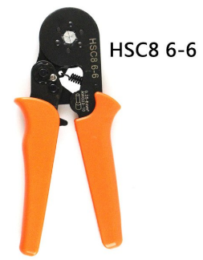
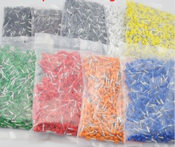
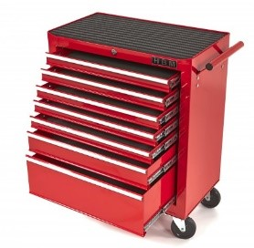
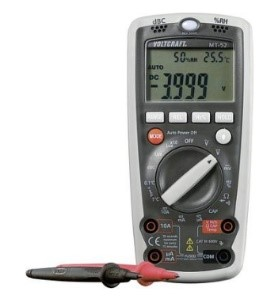
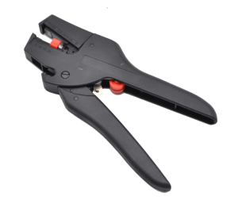
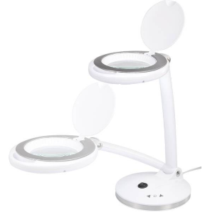
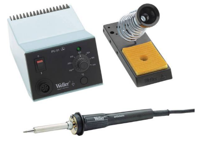
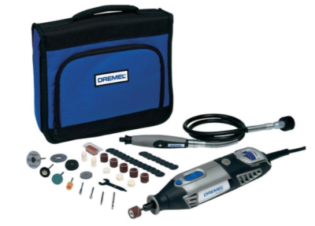
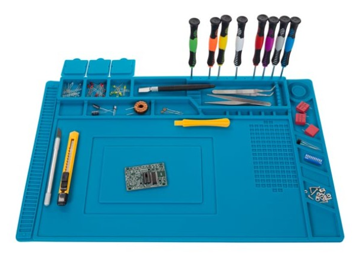
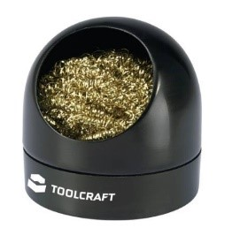

#  Nederlands
Een paar handige stukken gereedschap en hulpmiddelen bij het bouwen van een modelspoorbaan:

* Adereindhulstang
* Adereindhulzen diverse kleuren
* Gereedschapswagen
* Multimeter
* Striptang
* Loeplamp
* Soldeerstation temperatuurgeregeld
* Dremel
* Soldeermat
* Soldeertipreiniger

#  English

My table was designed using SketchUp:
Some handy tools for building your modeltrain:

* Self Adjustable Crimping Plier
* Crimp Connectors several colors
* Tool car
* Multimeter
* Strip tool
* Magnifying lamp
* Solder station temperature regulated
* Dremel
* Soldering working area
* Soldering tip cleaner

