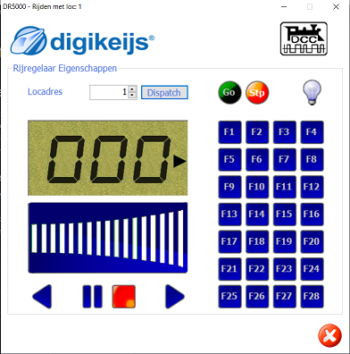
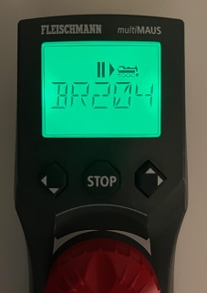
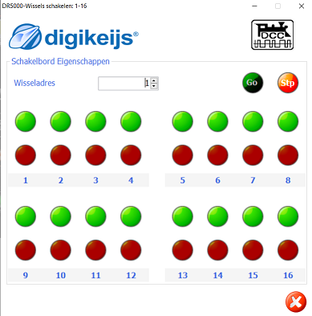
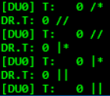
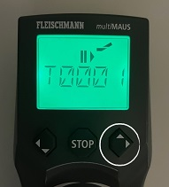

# Loconet

## Loconet via USB

Via https://download.cnet.com/Ultra-Serial-Port-Monitor/3000-2094_4-10969502.html een gratis sniffer gevonden om het USB-Loconet-verkeer tussen laptop en het DCC command stationn te bestuderen. Vervolgens is de GUI van het DCC command station (DR5000) gebruikt om verkeer te genereren door loc's, seinen en wissels te bedienen, loc's over melders te laten rijden en CV-waarden te configureren.

## Loc-bediening

De loc's worden bestuurd via de locomotieven-interface van de DR5000:

Dit kan natuurlijk ook prima via de multiMaus (de BR204 heeft adres 3):

De besturing van loc's staat vermeld in de  [Personal Edition van Loconet](https://www.digitrax.com/static/apps/cms/media/documents/loconet/loconetpersonaledition.pdf) van Digitrax. Zodra in de interface van het DCC station een loc-adres wordt gekozen, zien we een aanmelding in een zogenaamd slot. E0 06 62 is de aanmeldboodschap; de twee daarop volgende bytes het loc-adres waarbij van het tweede adresbyte het msb niet wordt meegenomen.

|Loc |Actie       | Bericht         |
|----|------------|-----------------|
|1   |Aanmelden   |E0 06 62 00 01 7A|
|2   |Aanmelden   |E0 06 62 00 02 79|
|3   |Aanmelden   |E0 06 62 00 03 78|
...
|127 |Aanmelden   |E0 06 62 00 7F 04|
|128 |Aanmelden   |E0 06 62 01 00 7A|
...
|4096|Aanmelden   |E0 06 62 20 00 5B|

Volgens de Personal Edition van Loconet van Digitrax is het laatste byte de checksum zijnde de EXOR van alle bits in het bericht behalve de checksum zelf (pag. 6): **The CHECKSUM is the 1's COMPLEMENT of the byte wise Exclusive Or of all the
bytes in the message, except the CHECKSUM itself.**

Na het aanmelden krijgen loc's een volgnummer in de volgorde waarin ze een slot kregen toegewezen. Na het inschakelen van de DR5000 stond de GUI op adres 1. Deze eerste loc krijgt zo te zien slot 2 (2e byte) en de tweede slot 3. Het lijkt dat het slot-volgnummer in onderstaande berichten 1 hoger is dan het aanmeldvolgnummer.

|Loc|Speed GUI   | Bericht    |
|---|------------|------------|
|1  |Speed 1     |A0 02 02 5F |
|1  |Speed 2     |A0 02 02 59 |
|2  |Speed 2     |A0 03 02 5E |
|3  |Speed 1     |A0 04 03 58 |
|3  |Speed 126   |A0 04 7F 24 |

De snelheden hierboven genoemd zijn afgeleid uit de logging van het DCC station en het bekijken van de Loconet-boodschap.
Bij snelheden is het 3e byte de snelheid. Bijzonder is dat de rijrichting eenmalig wordt verzonden.

## Loc functies

Het schakelen van lichten van de loc met adres 3 (slot 4). Pas op: alle functies kunnen gecombineerd worden zoals b.v. F1 en F2 aan:

|Loc            |Bericht     |
|---------------|------------|
|Verlichting aan|A1 04 30 6A |
|Verlichting aan|A1 04 20 7A |
|F1 aan         |A1 04 21 7B |
|F1 uit         |A1 04 20 7A |
|F2 aan         |A1 04 22 78 |
|F2 uit         |A1 04 20 7A |
|F1 en F2 aan   |A1 04 23 79 |
|....           ||
|F12 aan        |A3 04 08 50 |
|F12 uit        |A3 04 00 58 |
|F13 aan        |D4 20 04 08 01 06 D4 20 04 05 00 0A|
|F13 uit        |D4 20 04 08 00 07 D4 20 04 05 00 0A|
|....           ||
|F28 aan        |D4 20 04 09 00 06 D4 20 04 05 40 4A|
|F28 uit        |D4 20 04 09 00 06 D4 20 04 05 00 0A

## Wisselbediening

 Met het DCC station worden wissels bediend. Eerst wissel 1 rood via de SWITCH-interface van de DR5000 en meteen daarna groen. Rood is afbuigend, groen rechtdoor; dit wordt duidelijk getoond in de logging van de DR5000.

 

 Dit is meteen te zien in de logging (met weer opvallend nummer één lager dan nummer in de GUI):

 

 Hetzelfde kan bereikt worden door op de multiMaus rood/afbuigend te geven middels de rechter muisknop (witte cirkel):

|Actie        | Bericht                  |
|-------------|--------------------------|
|Wissel 1 R   | B0 00 10 5F / B0 00 00 4F|
|Wissel 1 G   | B0 00 30 7F / B0 00 20 6F|
|Wissel 2 R   | B0 01 10 5E / B0 01 00 4E|
|Wissel 2 G   | B0 01 30 7E / B0 01 20 6E|
..
|Wissel 512 R | B0 7F 13 23 / B0 7F 03 33|
|Wissel 512 G | B0 7F 33 03 / B0 7F 23 13|
|Wissel 513 R | B0 00 14 5B / B0 00 04 4B|
..
|Wissel 2048 R| B0 7F 1F 2F / B0 7F 0F 3F|
|Wissel 2048 G| B0 7F 3F 0F / B0 7F 2F 1F|

Als we kijken naar 'Wissel 1 R' is volgens pag. 10 0xB0 een wisselopdracht; dat klopt. In het 3e byte <SW2> met de waarde 0x10 is DIR = 0 voor Thrown/RED en ON=1. Kort daarna gaat ON weer naar 0. Het adres van de wissel is 0; hier zien we weer dat de technische (onder water) adressen één lager zijn dan in de interface wordt aangegeven/aangeklikt.

Als we kijken naar 'Wissel 1 G' is het 3e byte 0x30 dus DIR is 1 voor Closed/GREEN en ON = 1. Korte tijd later is ON weer 0.

Wissel 2 R klopt ook weer met een DIR = RED op adres 1 (in interface dus 2) met ON kort 1 dan 0.

**;<0xB0>,<SW1>,<SW2>,<CHK> REQ SWITCH function
<SW1> =<0,A6,A5,A4- A3,A2,A1,A0>, 7 ls adr bits. A1,A0 select 1 of 4 input pairs in a DS54
<SW2> =<0,0,DIR,ON- A10,A9,A8,A7> Control bits and 4 MS adr bits.
,DIR=1 for Closed,/GREEN, =0 for Thrown/RED
,ON=1 for Output ON, =0 FOR output OFF
 Note-,Immediate response of <0xB4><30><00> if command failed, otherwise no response**

## Melders

We laten loc's rijden over de baan en deze passeren daarbij melders. In de baan zijn 12 melders aanwezig beginnend met adres 17 (in de gebruikersinterface).

|Melder  | Bericht    |
|--------|------------|
|17 IN   |B2 08 50 15 |
|17 UIT  |B2 08 40 05 |
|18 IN   |B2 08 70 35 |
|18 UIT  |B2 08 60 25 |
|19 IN   |B2 09 50 14 |
|19 UIT  |B2 09 40 04 |
|20 IN   |B2 09 70 34 |
|20 UIT  |B2 09 60 24 |
..
|23 IN   |B2 0B 50 16 |
|23 UIT  |B2 0B 40 06 |
|24 IN   |B2 0B 70 36 |
|24 UIT  |B2 0B 60 26 |

L als bit5 van <IN2> geeft IN- of UITrijden aan. Melder 17 bij het inrijden (ws. intern adres 16) heeft een Loconet-adres met A6 = 1 -> 64. Zou de tekst kunnen zijn dat bij gebruik van de DR4088 als bezetmelder A1 en A0 altijd 0 zijn en dus het adres gedeeld moet worden door 4? Melder 18 (intern 17) heeft adres A6 = 1 dus 64 wat weer 16 zou kunnen betekenen, maar I=1 betekent waarschijnlijk het lsb van het adres hoewel dit niet zo duidelijk in de specificaties staat.

**; <0xB2>, <IN1>, <IN2>, <CHK>
<IN1> =<0,A6,A5,A4- A3,A2,A1,A0>, 7 ls adr bits. A1,A0 select 1 of 4 inputs pairs in a DS54
<IN2> =<0,X,I,L- A10,A9,A8,A7> Report/status bits and 4 MS adr bits.
"I"=0 for DS54 "aux" inputs and 1 for "switch" inputs mapped to 4K SENSOR space.
(This is effectively a least significant adr bit when using DS54 input configuration)
"L"=0 for input SENSOR now 0V (LO) , 1 for Input sensor >=+6V (HI)
"X"=1, control bit , 0 is RESERVED for future!**

😃Als de power wordt uit- en weer ingeschakeld zal de bezetmelder van alle 32 melders de toestand in één boodschap weergeven (het feit dat er 32 zijn i.p.v. de 16 ingesteld bij de DR4088 zou te maken kunnen hebben met het feit dat de DR5000 standaard staat ingesteld op 16 S88 ingangen):

B2 08 40 05 B2 08 60 25 B2 09 40 04 B2 09 60 24 B2 0A 40 07 B2 0A 60 27 B2 0B 40 06 B2 0B 60 26
B2 0C 40 01 B2 0C 60 21 B2 0D 40 00 B2 0D 60 20 B2 0E 40 03 B2 0E 60 23 B2 0F 40 02 B2 0F 60 22
B2 00 40 0D B2 00 60 2D B2 01 40 0C B2 01 60 2C B2 02 40 0F B2 02 60 2F B2 03 40 0E B2 03 60 2E
B2 04 40 09 B2 04 60 29 B2 05 40 08 B2 05 60 28 B2 06 40 0B B2 06 60 2B B2 07 40 0A B2 07 60 2A

### Power

|Actie    | Bericht    |
|---------|------------|
|Power on |83 7C       |
|Power off|82 7D       |

Conform specs.

## CV programmeren
Via interface van de DR5000 een CV waarde geprogrammeerd bv. adres 9999

|Adres|CV |Value|Bericht|
|-----|---|-----|-------|
|9999 |1  |0    |EF 0E 7C 6C 00 4E 0F 07 00 00 00 4C 4E 4A|
|9999 |1  |1    |EF 0E 7C 6C 00 4E 0F 07 00 00 01 4C 4E 4B|
|9999 |1  |2    |EF 0E 7C 6C 00 4E 0F 07 00 00 02 4C 4E 48|
|9999 |1  |3    |EF 0E 7C 6C 00 4E 0F 07 00 00 03 4C 4E 49|
|9999 |1  |127  |EF 0E 7C 6C 00 4E 0F 07 00 00 7F 4C 4E 35|
|9999 |1  |128  |EF 0E 7C 6C 00 4E 0F 07 02 00 00 4C 4E 48|
|9999 |1  |255  |EF 0E 7C 6C 00 4E 0F 07 02 00 7F 4C 4E 37|
|9999 |2  |0    |EF 0E 7C 6C 00 4E 0F 07 00 01 00 4C 4E 4B|
|9999 |3  |0    |EF 0E 7C 6C 00 4E 0F 07 00 02 00 4C 4E 48|
|9999 |128|0    |EF 0E 7C 6C 00 4E 0F 07 00 7F 00 4C 4E 35|
|9999 |255|0    |EF 0E 7C 6C 00 4E 0F 07 01 7E 00 4C 4E 35|
|1    |1  |0    |EF 0E 7C 6C 00 00 01 07 01 7E 00 4C 4E 75|
|127  |1  |0    |EF 0E 7C 6C 00 00 7F 07 00 00 00 4C 4E 74|

byte6 * 128 + byte 7 = adres

byte9-bit0 byte10 = CV-adres minus 1

byte9-bit1 byte11 = CV-waarde

## Loconet software

https://github.com/mrrwa/LocoNet

https://github.com/ClubNCaldes/LNetDCCpp
