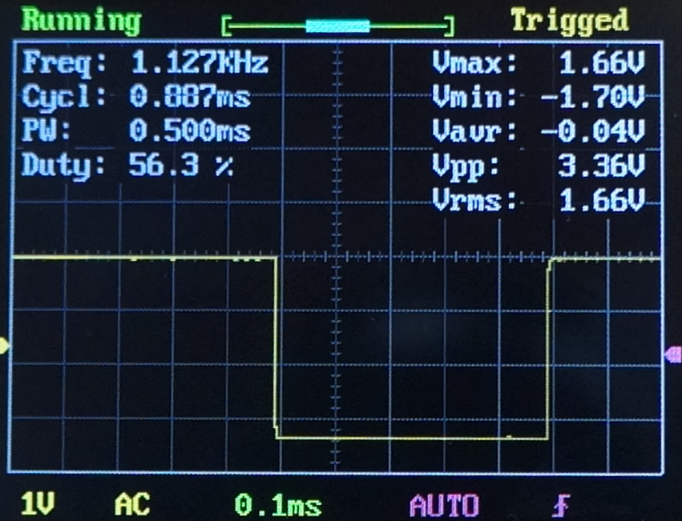
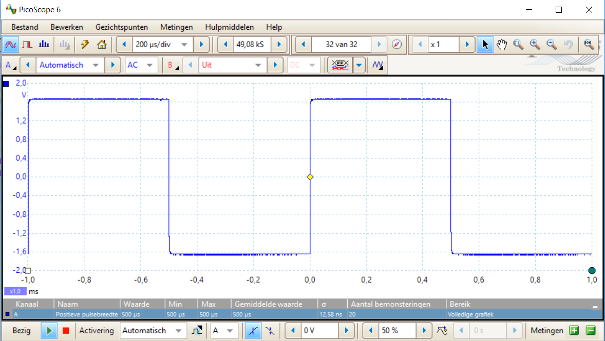
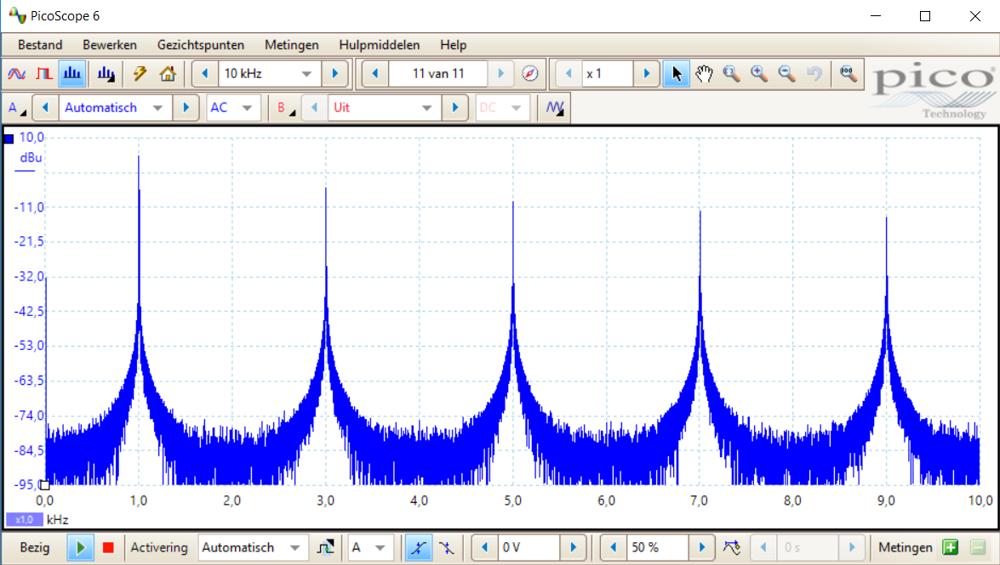
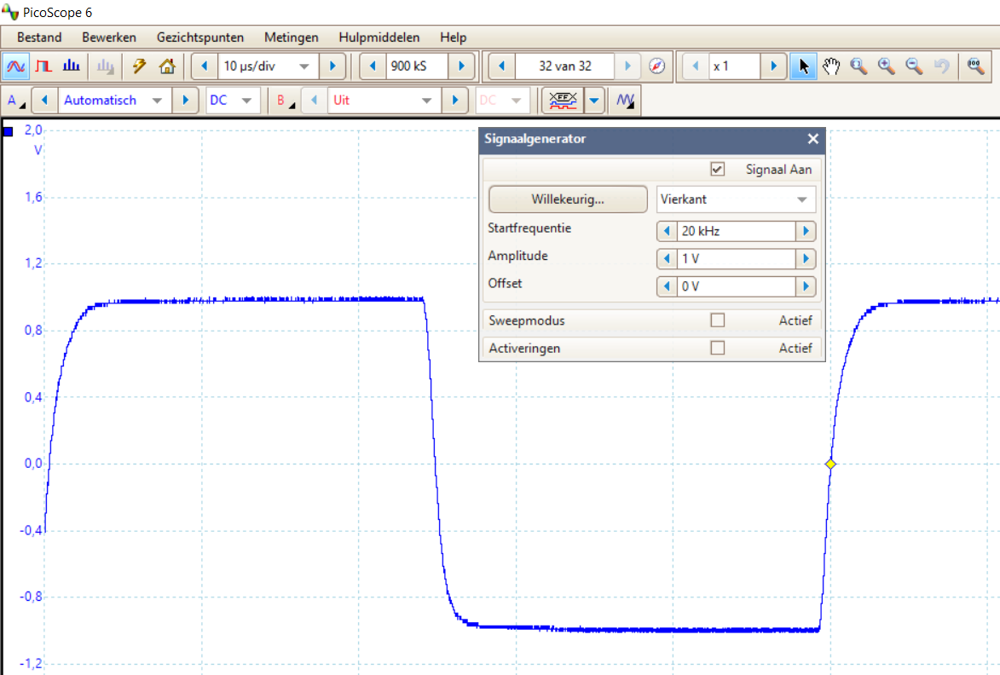
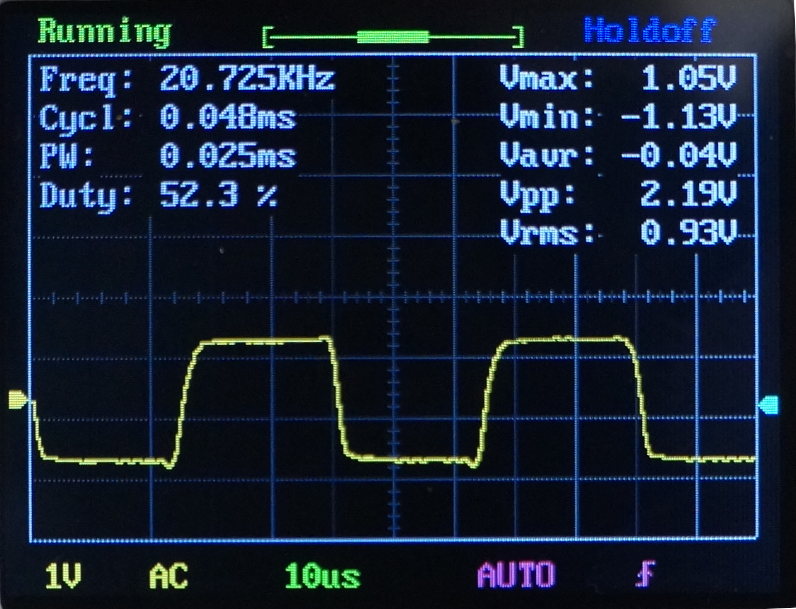
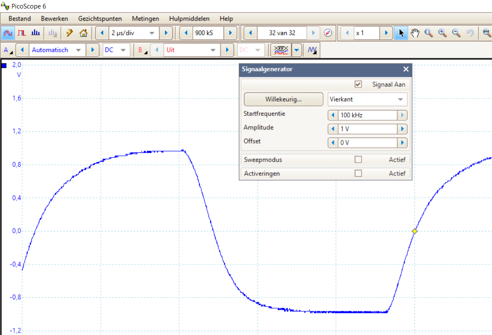
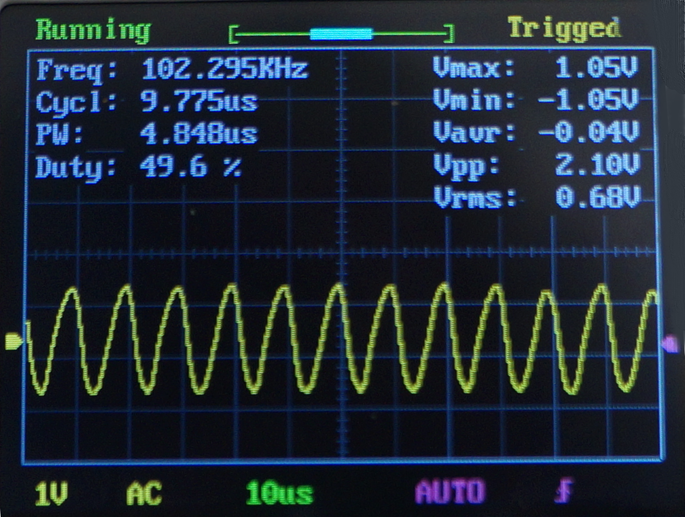
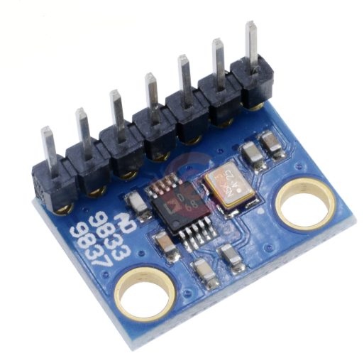

#  Nederlands

[Navigate to English version](#English)

## Testrapport DSO FNIRSI 150

De DSO FNIRISI is een zeer goedkope 1 kanaals analoge oscilloscoop uit China, die ook een aantal metingen kan uitvoeren, met een ingebouwde 1 kHz blokgolfgenerator. De scoop kent geen analyse van bestaande protocollen zoals I2C of DCC. De foto's van de DSO FNIRSI zijn trouwens gemaakt met een digitale camera een Sony Alpha 3000.

### Ingebouwde generator

Als je de ingebouwde 1kHz-generator (klein metalen lipje aan de achterzijde naast de BNC-plug) verbindt met de scoop zie je:

Hierbij valt op dat de blokgolf netjes recht is, maar de metingen niet erg nauwkeurig zijn; in dit voorbeeld toont de scoop een meetwaarde van 1.11 kHz.

Ter controle is de generator van de DSO FNIRSI 150 aan een duurdere oscilloscoop gehangen, de Picoscope 2205A. Dan is de blokgolf volgens de Picoscope netjes 1 kHz (schakel de meetfunctie in):

De spectrumanalyse laat zien dat keurig een 1 kHz sinus aanwezig is met natuurlijk de 3e, 5e etc. harmonische zodat een nette blokgolf ontstaat.

### 20 kHz blok

Vervolgens is de signaalgenerator van de Picoscop ingesteld op 20 kHz en gebruikt om deze eerst te bekijken op de Picoscoop zelf ter controle:

Hierbij valt op dat de Picoscope geen zuivere blokgolven van 20 kHz maakt.

Op de DSO FNIRISI worden deze 20 kHz 'blokgolven' als volgt weergegeven:

De stijgtijden zijn iets slechter dan op de Picoscope, er zit een overshoot vlak voor het beging van de volgende helling en de meetwaarde is helaas 20.7 kHz.

### 100 kHz blok

Vervolgens is de signaalgenerator van de Picoscop ingesteld op 100 kHz (het maximum van deze generator) en gebruikt om eerst te bekijken op de Picoscop ter controle:

Hierbij valt op dat ook de Picoscope geen zuivere blokgolven van 100 kHz maakt. Op de DSO FNIRISI wordt een 20 kHz 'blokgolf' weergegeven:

De stijgtijden zijn veel slechter dan op de Picoscope; het is nu een sinus geworden en de meetwaarde is rond de 102 kHz. Op zich logisch: als de bandbreedte 200 kHz bedraagt zal alleen de grondharmonische sinus van 100 kHz worden waargenomen.

#### Conclusie

Leuke analoge oscilloscoop voor weinig geld, maar met een beperkte bandbreedte.

### Praktische toepassing: PWM servo

Een kleine sketch om een servo heen en weer te bewegen is op een Arduino Uno gezet waarna het servo-stuursignaal met de DSO FNIRISI is bekeken:

### Praktische toepassing: PWM LED

TODO

### AD 9833 golfvormgenerator

Ook is een AD9833 golfvormgenerator gekocht; de Picoscoop was van de werkgever geleend. Eigenschappen:

* 0 - 12.5 MHz
* Blok, sinus en driehoek

TODO test op Picoscope, test op DSO FNIRSI, test op Tektronix

# English
