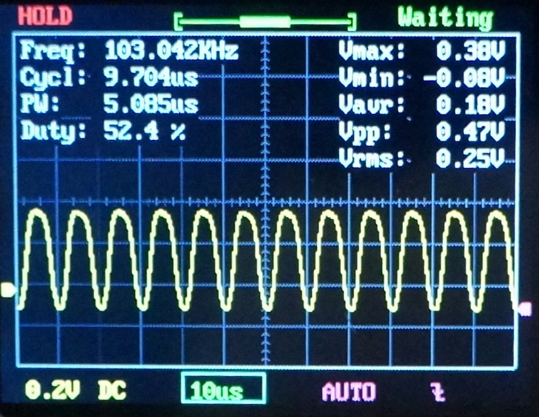
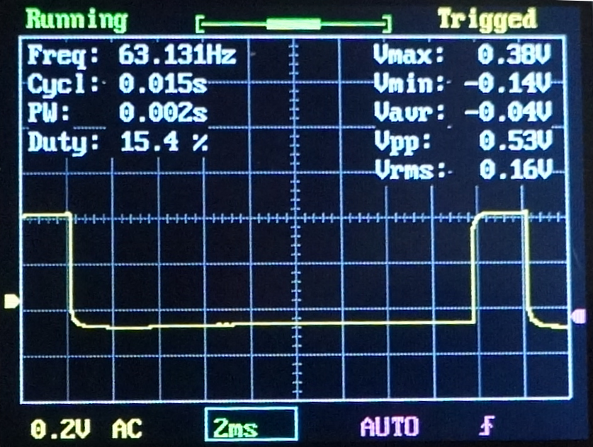
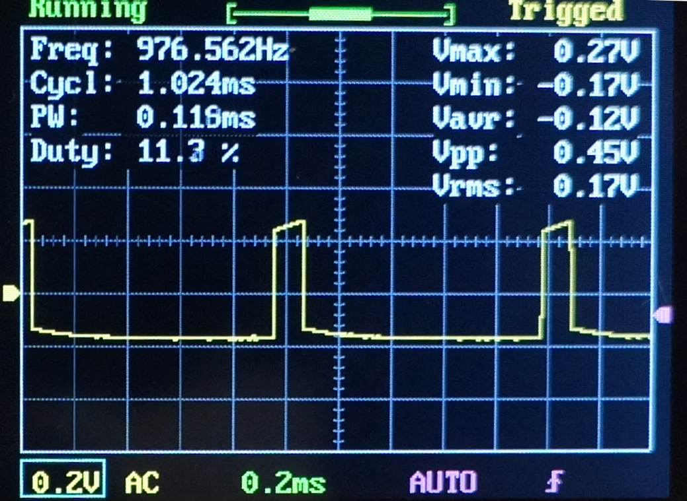
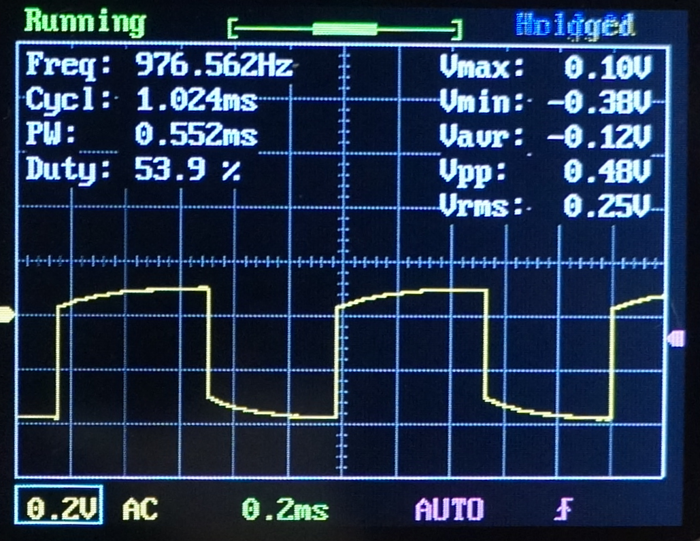

#  Nederlands

[Navigate to English version](#English)


## Testrapport DSO FNIRSI 150

De DSO FNIRISI is een zeer goedkope 1 kanaals analoge oscilloscoop uit China, die ook een aantal metingen kan uitvoeren, met een ingebouwde 1 kHz blokgolfgenerator. De scoop kent geen analyse van bestaande protocollen zoals I2C of DCC. De foto's van de DSO FNIRSI zijn trouwens gemaakt met een Sony Alpha 3000 digitale camera.

De metingen van de DSO FNIRSI zijn vergeleken met de Mixed Signal Oscilloscoop 2205A van Picoscope.

### Ingebouwde 1 kHz generator

De DSO FNIRSI heeft een ingebouwde 1kHz-generator (klein metalen lipje aan de achterzijde naast de BNC-plug):


Als je deze verbindt met de scoop zie je:


Hierbij valt op dat de blokgolf netjes recht is (op een kleine glitch na aan het einde van een overgang), maar de metingen niet erg nauwkeurig zijn; in dit voorbeeld toont de scoop een meetwaarde van 1.27 kHz.

Ter controle is de generator van de DSO FNIRSI 150 aan een duurdere oscilloscoop gehangen, de Picoscope 2205A. Dan is de blokgolf volgens de Picoscope netjes 1 kHz (schakel de meetfunctie in):


De spectrumanalyse laat zien dat keurig een 1 kHz sinus aanwezig is met natuurlijk de 3e, 5e etc. harmonische zodat een nette blokgolf ontstaat.


### 20 kHz blok Picoscope

Vervolgens is de signaalgenerator van de Picoscop ingesteld op 20 kHz en gebruikt om deze eerst te bekijken op de Picoscoop zelf ter controle:


Hierbij valt op dat de ingebouwde signaalgenerator van Picoscope geen zuivere blokgolven van 20 kHz maakt.

Op de DSO FNIRISI worden deze 20 kHz 'blokgolven' als volgt weergegeven:


De stijgtijden zijn iets slechter dan op de Picoscope, er zit een overshoot vlak voor het begin van de volgende helling en de meetwaarde is helaas 20.7 kHz.

### 20 kHz blok AD9833

De AD9833 maakt veel betere 20 kHz blokgolven (zie artikel hierna).


En deze 20 kHz worden ook op de DSO FNIRISI beter getoond (wel weer met afwijkende frequentie):


### 100 kHz blok Picoscope

Vervolgens is de signaalgenerator van de Picoscop ingesteld op 100 kHz (het maximum van deze generator) en gebruikt om eerst te bekijken op de Picoscop zelf ter controle:


Hierbij valt op dat ook de generator van de Picoscope geen zuivere blokgolven van 100 kHz maakt. Op de DSO FNIRISI wordt een 100 kHz 'blokgolf' weergegeven:


De stijgtijden zijn veel slechter dan op de Picoscope; het is nu een sinus geworden en de meetwaarde is rond de 102 kHz. Op zich logisch: als de bandbreedte 200 kHz bedraagt zal alleen de grondharmonische sinus van 100 kHz worden waargenomen.

### 100 kHz blok AD9833

Ook hier is de generator van de AD9833 veel beter op de Picoscope:


De DSO FNIRSI maakt nu geen echte sinussen meer van met een frequentie van 103 kHz.




#### Conclusie

Leuke analoge oscilloscoop voor weinig geld, maar met een beperkte bandbreedte.

### Praktische toepassing: PWM servo

Een kleine sketch [bron](https://www.arduino.cc/en/tutorial/sweep) om een servo heen en weer te bewegen is op een Arduino Uno gezet waarna het servo-stuursignaal met de DSO FNIRISI is bekeken.

```c++
/* Sweep
 by BARRAGAN <http://barraganstudio.com>
 This example code is in the public domain.

 modified 8 Nov 2013
 by Scott Fitzgerald
 http://www.arduino.cc/en/Tutorial/Sweep
*/

#include <Servo.h>

Servo myservo;  // create servo object to control a servo
// twelve servo objects can be created on most boards

int pos = 0;    // variable to store the servo position

void setup() {
  myservo.attach(9);  // attaches the servo on pin 9 to the servo object
}

void loop() {
  for (pos = 0; pos <= 180; pos += 1) { // goes from 0 degrees to 180 degrees
    // in steps of 1 degree
    myservo.write(pos);              // tell servo to go to position in variable 'pos'
    delay(5);                       // waits 15ms for the servo to reach the position
  }
  for (pos = 180; pos >= 0; pos -= 1) { // goes from 180 degrees to 0 degrees
    myservo.write(pos);              // tell servo to go to position in variable 'pos'
    delay(5);                       // waits 15ms for the servo to reach the position
  }
}
```
Angezien de DSO FNIRSI een analoge scoop is 'loopt' het beeld op de scoop netjes synchroon met de beweging van de servo. Goed is te zien dat een servo-besturingssignaal een cyclustijd heeft van 20 ms en dat de servo-positie verstopt zit in een kleine pulsbreedte tussen 1 en 2 msec:




Helaas is ook nu weer de kwaliteit van de blokgolven niet erg goed.

### Praktische toepassing: PWM LED

De duty cycle van een LED [bron](https://www.brainy-bits.com/rgb-led-with-an-arduino/) wordt langzaam in stapjes verhoogd van 0 naar 100 %.

```c++
// Define Pins
#define RED 3
#define GREEN 5
#define BLUE 6

#define delayTime 50 // fading time between colors


void setup()
{
pinMode(RED, OUTPUT);
pinMode(GREEN, OUTPUT);
pinMode(BLUE, OUTPUT);
digitalWrite(RED, HIGH);
digitalWrite(GREEN, HIGH);
digitalWrite(BLUE, HIGH);
}

// define variables
int redValue;
int greenValue;
int blueValue;


// main loop
void loop()
{
  redValue = 255; // choose a value between 1 and 255 to change the color.
  greenValue = 0;
  blueValue = 0;

  analogWrite(RED, 0);
  delay(5000);

   for(int i = 0; i < 255; i += 1) // fades out red bring green full when i=255
  {
    redValue -= 1;
    greenValue += 1;
    analogWrite(RED, 255 - redValue);
    analogWrite(GREEN, 255 - greenValue);
    delay(delayTime);
  }

  redValue = 0;
  greenValue = 255;
  blueValue = 0;

  for(int i = 0; i < 255; i += 1)  // fades out green bring blue full when i=255
  {
    greenValue -= 1;
    blueValue += 1;
    analogWrite(GREEN, 255 - greenValue);
    analogWrite(BLUE, 255 - blueValue);
    delay(delayTime);
  }

  redValue = 0;
  greenValue = 0;
  blueValue = 255;


  for(int i = 0; i < 255; i += 1)  // fades out blue bring red full when i=255
  {
  redValue += 1;
  blueValue -= 1;
  analogWrite(RED, 255 - redValue);
  analogWrite(BLUE, 255 - blueValue);
  delay(delayTime);
  }
}
```
Dit is goed zichtbaar te maken met toch enige vervorming in de blokken:






## AD9833

Met de AD9833 golfvormgenerator zijn nog een aantal extra metingen uitgevoerd.


### AD 9833 golfvormgenerator meetopstelling


Uit [bron](https://www.instructables.com/id/Signal-Generator-AD9833/) is een sketch overgenomen om met een Arduino en een AD9833-module een eenvoudig bediendbare golfvormgenerator te reasliseren (max. 1 Mhz in software). De uiteindelijke meetopstelling:


### AD 9833 golfvormgenerator tests: sinus

|AD9833  | beeld                  |display     |
|--------|------------------------|------------|
|100 Khz | 100 kHz                |100-102 kHz |
|150 kHz | 150 kHz                |150-152 kHz |
|200 kHz | 200 kHz 2 amplitudes   |200 kHz     |
|250 kHz | 250 kHz tussen 0 en max|252 kHz     |
|300 kHz | 200 kHz 2 amplitudes   |200 kHz     |
|400 kHz | 100 kHz                |100 kHz     |
|500 kHz | --                     |--          |

Volgens de fabrikant ligt de sample-frequentie van de DSO FRISNI ligt op 1 MHz. Echter is het apparaat niet in staat een sinus van 250 kHz te samplen. Sterker nog bij 300 kHz wordt een meetwaarde van 200 kHz aangegeven en dit lijkt op aliasing rond de Nyquist-frequentie van 250 kHz bij een samplefrequentie van 500 kHz [bron](https://e2e.ti.com/blogs_/archives/b/precisionhub/archive/2015/09/04/aliasing-in-adcs-not-all-signals-are-what-they-appear-to-be).

De Picoscope kan deze signalen tot 1 Mhz prima weergeven.

### AD 9833 golfvormgenerator tests: blokgolf

Bij 20 kHz is de stijgtijd ong. 5 &micro;s; de cyclustijd is ong. 50 &micro;s


Bij 40 kHz is de stijgtijd ong. 4 &micro;s; de cyclustijd is ong. 25 &micro;s


Bij 60 kHz is de stijgtijd ong. 4 &micro;s; de cyclustijd is ong. 16 &micro;s


Bij 80 kHz is de stijgtijd ong. 5 &micro;s, maar met twee stijgtijden van 5 &micro;s op een cyclustijd van 12 &micro;s is het nu bijna een sinus geworden.


Bij 100 kHz zien we:


Dit klopt met de eerdere opmerking over de sample-frequentie waarvan vermoed wordt dat deze op 500 kHz ligt. De Nyquist-frequentie is dan 250 kHz en een blokgolf van 100 kHz heeft als 3e harmonische 300 kHz en die wordt niet goed meegesampled. De grondgolf heet ook wel de 1e harmonische; de 2e heeft de dubbele frequentie van de grondgolf etc. ([bron](https://en.wikipedia.org/wiki/Harmonic))

# English
