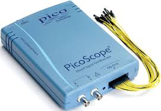

#  Nederlands

[Navigate to English version](#English)

In deze pagina's worden worden een aantal oscilloscopen en logic analyzers opgesomd, die handig kunnen zijn bij het bestuderen van DCC-signalen en Arduino-experimenten.

## Overzicht oscilloscopen en logic analyzers

Na een stuk literatuuronderzoek is onderstaand overzicht samengesteld. Zodra hardware beschikbaar komt zal de lijst worden aangevuld met meet- en andere praktische resultaten.

|Type                |#analog|#digital|BW    |Protocols|DCC|Prijs China|Prijs NL|
|--------------------|-------|--------|------|---------|---|-----------|--------|
|DSO FNIRSI 150      |1      |-       |200kHz| -       |❌ |&euro;13   |&euro;52|
|USB LA 24M          |2      |8       |24MHz |I2C/SPI  |✔️ |&euro; 5   |&euro; 10|
|Picoscope 2205A MSO |2      |16      |25MHz |I2C/SPI  |✔️ |-          |&euro; 500|

## DSO FNIRSI 150

[Meetrapport](./DSOFNIRSI150/README.md)

## USB LA 24M

## Picoscope 2205 MSO

# English
