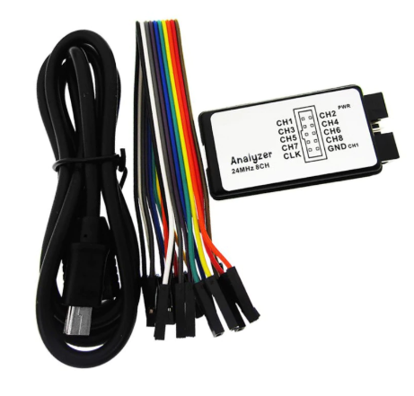
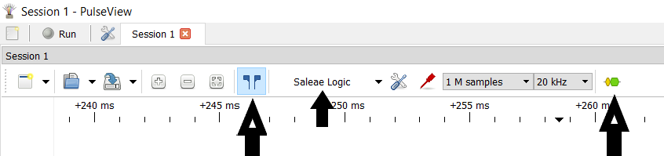
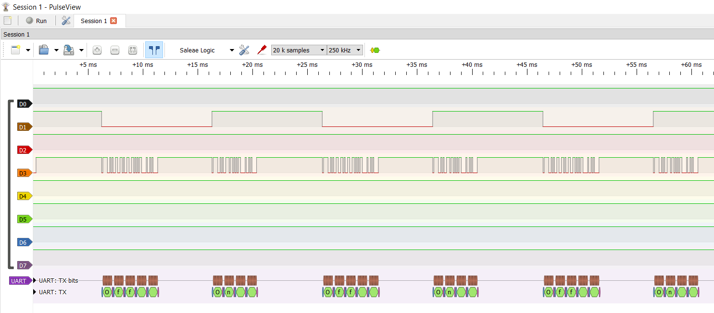
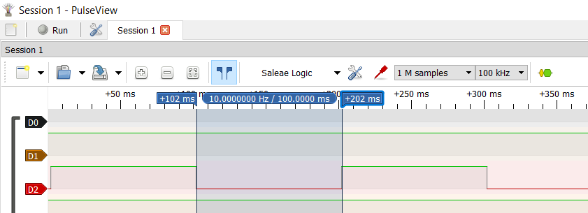
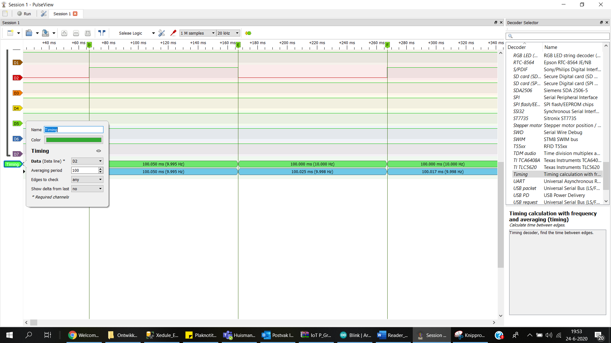

#  Nederlands

[Navigate to English version](#English)

In deze pagina's wordt de USB LA 24M besproken. Deze is in Nederland verkrijgbaar, maar op bij Chinese leveranciers zoals AliExpress.

## Installatie

Volg de instructies zoals aangegeven bij deze [link](https://learn.sparkfun.com/tutorials/using-the-usb-logic-analyzer-with-sigrok-pulseview). Het installeren van de Windows USB-driver niet vergeten. Ik heb zelf ondervonden dat ik dit een aantal keren heb uitgevoerd. Daarna verscheen bij op opstarten van PulseView meteen een gedetecteerd device (Salea Logic hoewel het een Chinese kloon betreft). Zie de kleine pijl in het menu.

 

#### Tips

* Gebruik scroll van de muis om in te zoomen en van links naar rechts in de tijd te schuiven
* Gebruik de 'Show cursors' (twee vlaggetjes) om nauwkeurige metingen te doen
* Het geel/goen-icoontje roept de protocoldecoders op
* Vergeet niet het theorema van Nyquist. De samplefrequentie moet minstens twee maal de hoogste frequentie zijn in het te meten signaal.

#### Eerste meting

Maak een klein Arduino programma dat een LED laat knipperen op b.v. 1 Hz en bij het inschakelen de tekst 'On' en bij het uitschakelen de tekst 'Off' toont via de seriële uitgang. Sluit de analyzer aan op de LED-pin en de seriële uitgang. Schakel bij de knop protocolanalyse de UART-analyse in. Je ziet het volgende:

Heel goed is het flippen van de pin en de seriële data te zien met start- en stopbit. De protocolanalyse laat de teksten zien inclusief carrige return en linefeed (tenminste als je println() hebt gebruikt).

#### Interval
Gebruik de vlaggetjes om de op de juiste plek te zetten en de analyzer toont het interval:

#### Timing
Door te dubbelklikken bovenaan in de tijdbalk kun je markering plaatsen. De analyzer toont de tijden. In de protocolanalyzer kun je ook Timing kiezen. Dan wordt een extra balk met tijden getoond:

# English
