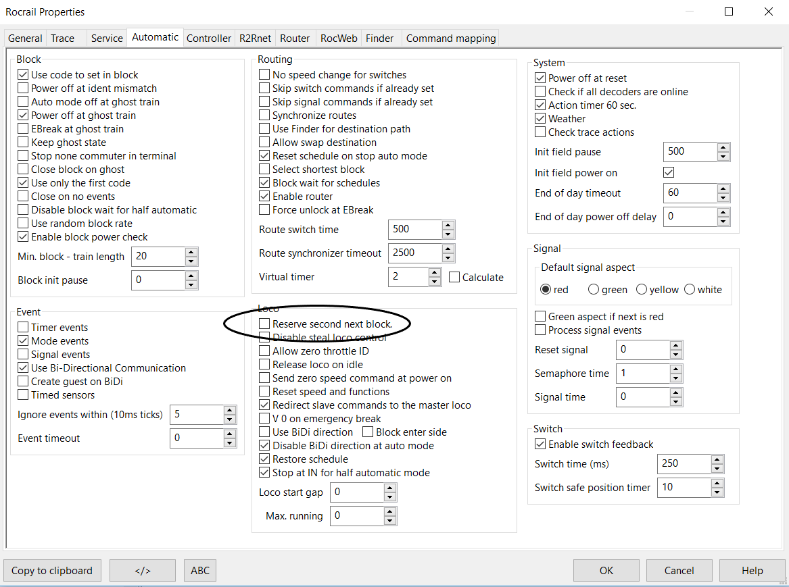
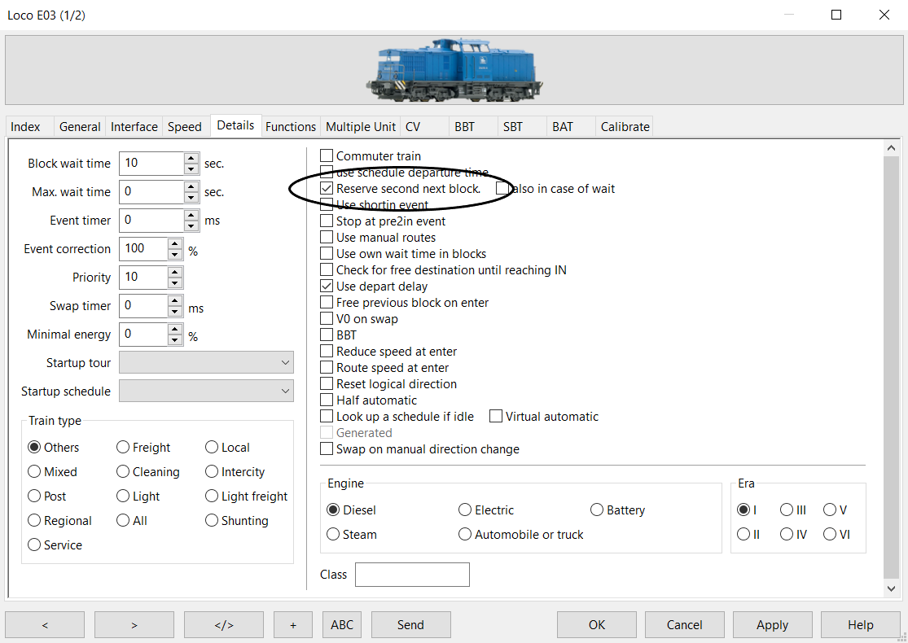
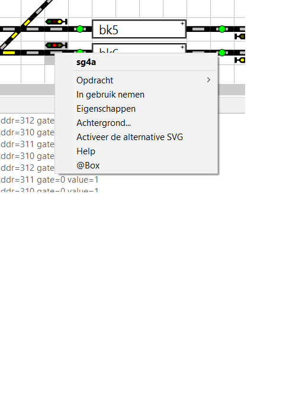
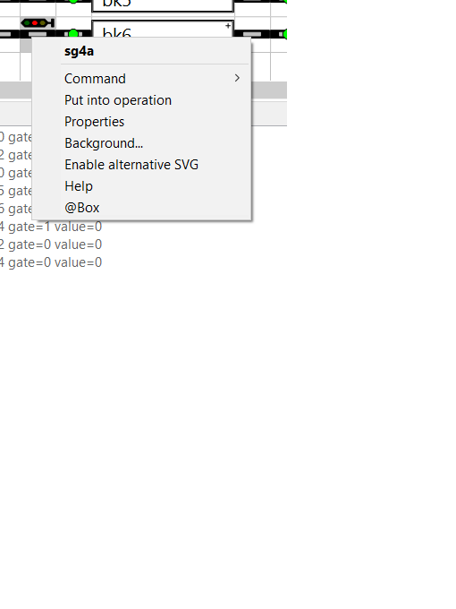

#  Nederlands

[Navigate to English version](#English)
# RocRail tips

In dit hoofdstuk worden diverse instellingen/tips besproken, die  door uitpluizen en navragen bij RocRail-specialisten waaronder Fred Jansen van de HCCm.

## Groene seinen
Bij de eerste opzet van een baan met seinen wilden deze alleen maar rood en geel worden. Toen een algemene RocRail-instellingen gevonden 'reserve second next block'. Toch verliep het automatisch rijden 'houterig', want wat blijkt RR probeert altijd twee blokken te reserveren.

Na een tip van Fred Jansen de algemene eigenschap van RocRail uitgeschakeld en deze per locomotief ingeschakeld. Volgens Fred zal RocRail nu **proberen** twee blokken te reserveren, maar als dat niet lukt reserveert deze er maar één.

## Seinen buiten gebruik
Soms is een sein voorzien van een grijze achtergrond. Dit sein is dan buiten gebruik. Selecteer het sein en klik op de rechtermuis en kies 'In gebruik nemen''.

#  English

# RocRail tips

In this chapter several setting and tips are given found by experimenting and asking RocRail experts like Fred Jansen of the Dutch Model Railroad division of the Hobby Computer Club.

## Green signals
In the first design of a track plan with signals they only turned to red or yellow; not green. In the general RocRail settings there is a 'reserve second next block'. After selecting this signals would turn green but the total flow of trains was a bit clumsy.

After a tip by Fred Jansen the general setting of RocRail switched off and switch on per locomotiv. According to Fred RocRail will now **try** to reserve two blocks, but if not possible then only one.

## Signals out of operation
Sometimes a signal has a gray background meaning the signal is out of operation. Select the signal with the mouse and right click and choose 'Put into operation'.

