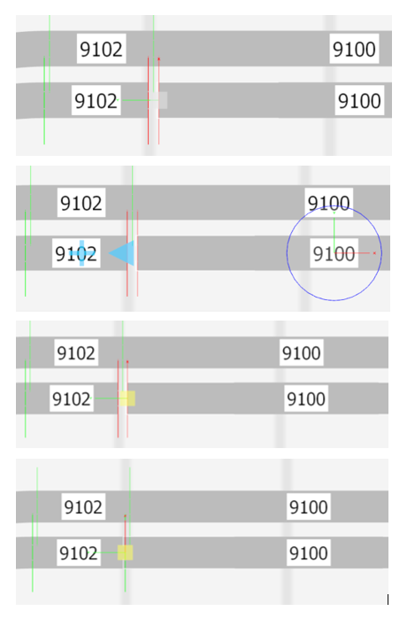

# Nederlands

De volgende digitale gereedschappen zijn gebruikt bij het realiseren van mijn modelbaan:

# English

These are the digital tools used to construct my model railroad:

|Tool|Explanation|Price|
|-----------------------|-------------------|---|
Atom|Text editor for Markdown documentation files used on Github|Free|
Notepad++|Text editor plain ASCII files|Free|
Github|Versioning software; command line commit to Github. Install only. No knowledge needed.|Free|
Github desktop|Commit the work on your local laptop to Github through nice Windows form instead of Git commands|Free|
Snipping tool Windows|Making screenshots and svae as PNG, GIF or JPG|Free|
Paint 3D Windows|Editing screenshots as PNG files
Inkscape|SVG editor|Free|
BeyondCompare|View and show differences between two text files or code pieces
3D Train Studio|Design model railroad track plan (Also known as 3D Modelbahn Studio).|Free (150 objects)/&euro;49
SketchUp|Design physical table|Free|
DR5000 Configuration|Basic software for Digikeijs DR5000 DCC command station configuration & control. Also needed to configure DR4018 and DR4088.|Free|
RocRail|Model railroad software to control locomotives, signals and switches avoiding collisions etc. etc. independant of DCC command station|Free|
Fritzing|Electronic schema design tool. Can also make a wiring diagram. Support is a problem.|Free|
KiCAD|Alternative electronic schema design tool. Can **not** make a wiring diagram.|Free|
Arduino IDE|Building Arduino programs and upload into Arduino like controllers|Free|
Picoscope|Mixed Signal Oscilloscope software|Free|
PulseView|Cheap logic analyzer software with protocol recognition like USB, I2C|Free|
PuTTY|Terminal emulator|Free|
Ultra Serial Port Monitor|Free sniffer on COM-ports for studying Loconet-USB traffic  https://download.cnet.com/Ultra-Serial-Port-Monitor/3000-2094_4-10969502.html|Free|

👍Fine tuning Atom:

* Use ctrl-shift-m to preview
* Go to Settings
* Go to Install
* Look for package 'autocomplete-emojis'
* Install if necessary
* From now emojis are supported with auto-complete (start typing : and one letter) and are visible in edit and preview mode.
* Used on this site: ❌is called 'x' in that package so type ':' followed by 'x' (of course without the apostrophes), 👍 'thumbsup', ✔️ 'heavy_check_mark', ❗ 'heavy_exclamation_mark', ⚠️ 'warning'

👍Using Markdown on Github:

* You can not open a link in a new tab due to the rendering software of Github.
* This rendering engine also limits the use of colors.

👍Fine tuning Notepad++:

* Add the NppExport plugin. With this plugin it is possible to have a selected piece of formatted (colored) code exported to e.g. Word.

👍Fine tuning 3D Studio:
Sometimes using standard rail tracks gaps and misalignments appear in your design. Of version 6 there is a simple solution:

* In the example below we want to manipulate the track right on the bottom
* Click the track. A circle and a red and green arrow appear.
* Click on the blue arrow to pointing to the left. A yellow box appears.
* Drag the yellow square box to make the track bigger until it snaps the the other track.
* The gap is gone.

