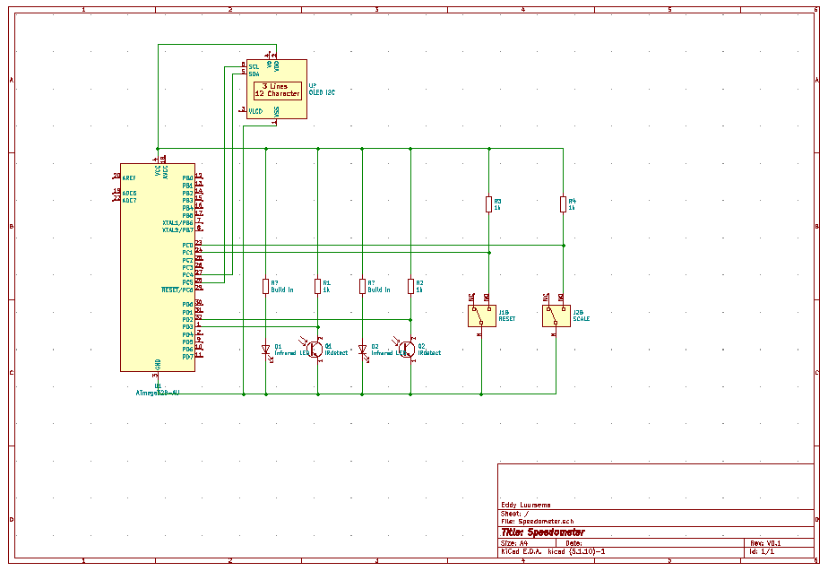
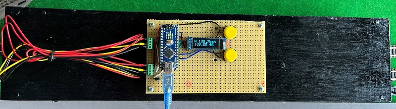
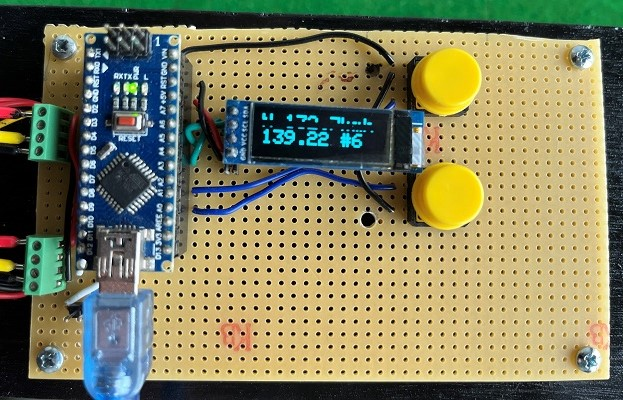

# Nederlands

[Navigate to English version](#English)

# Speedometer

## Inleiding

In dit document wordt een eenvoudige snelheidsmeter voor de modelspoorbaan beschreven. Voor pakketten voor modelspoorbaanbesturing zoals WinDigipet en Traincontroller is een nauwkeurige ijking tussen ingestelde en daadwerkelijke snelheid noodzakelijk om een trein (locomotief) tot op de centimeter ergens te laten stoppen. Die pakketten rekenen in km/h voor de snelheid, maar in centimeters (in combinatie met de op te geven schaal) voor spoorlengtes.
De speedometer is gebaseerd op een eenvoudige Arduino Nano met twee infrarood lichtsluizen. Via meerdere kleine losse projecten wordt de uiteindelijke speedometer opgebouwd.

## Materiaallijst

|Onderdeel|Aantal|Link|Prijs/stuk|
|-----------------------|-------------------|---|---|
|Arduino Nano|1|[link](https://www.tinytronics.nl/shop/nl/development-boards/microcontroller-boards/arduino-compatible/nano-v3.0-compatible)|&euro;6|
|IR onderbrekingssensor|2|[link](https://www.tinytronics.nl/shop/nl/sensoren/optisch/infrarood/infrarood-onderbrekingssensor)|&euro;3,50|
|Drukknop|2|[link](https://www.tinytronics.nl/shop/nl/schakelaars/manuele-schakelaars/drukknoppen-en-schakelaars/drukknop-module-rood)|&euro;1,25|
|OLED|1|[link](https://www.tinytronics.nl/shop/nl/displays/oled/0.91-inch-oled-display-128*32-pixels-wit-i2c)|&euro;6,50|
|Print|1|[link](https://www.tinytronics.nl/shop/nl/gereedschap-en-montage/prototyping-toebehoren/experimenteer-printplaten/experimenteer-printplaat-7cm*9cm-dubbele-eilandjes)|&euro;0,65|
|Schroefconnector 3 aansl.|2|[link](https://www.tinytronics.nl/shop/nl/kabels-en-connectoren/connectoren/schroefterminals/2-pin-schroef-terminal-block-connector-5.08mm-afstand)|&euro;0,75|
|Headers 30 pins|1|[link](https://www.tinytronics.nl/shop/nl/kabels-en-connectoren/connectoren/pin-headers/female/40-pins-header-female)|&euro;0,50|
|Draadjes|diverse|			
|Adereindhulzen|10|		
|Schroefjes/moertjes	3 mm|9|		
|Afstandsbussen|4-6|		
|Multiplex plaatje 40*8 cm|1|		
|Plankjes 70*11 mm|4|		
|Totaal|||&euro;24-30|

## Elektrisch schema



De twee IR-LED's hebben ingebouwde serieweerstanden. De IR-foto-sensoren moeten een 1k serieweerstand hebben volgens de leverancier.

## Constructie






De constructie is zwart gemaakt om reflectie van buitenlicht te verminderen.

## Snelheid op modelspoorbaan berekenen

Gegeven dat een locomotief op een modelspoorbaan een bepaalde afstand L aflegt in T milliseconde betekent dat de locomotief rijdt met een snelheid van:

S = L / T mm/ms  (millimeter / milliseconde)

S = L / T / 1000  m/ms

S = L / T m/s

1 km/h = 1000 / 3600 m/s dus 1 m/s = 3.6 km/h

S = L / T * 3.6 km/h

Bij een schaal N met een verhouding 1:160 rijdt de locomotief dus in werkelijkheid een factor 160 sneller dus

S = L /T * 3.6 * 160 km/h

## Testen  werking lichtsluizen

Attentie: in de documentatie van de leverancier https://www.tinytronics.nl/shop/nl/sensoren/optisch/infrarood/infrarood-onderbrekingssensor staat vermeld dat een pullup-weerstand van 1-10 kΩ nodig is; de interne pullup van een Arduino is volgens https://www.arduino.cc/en/Tutorial/Foundations/DigitalPins 20-50 kΩ. Daarom is een externe pullup -weerstand noodzakelijk.

```c++
/*
  Simple IR gateway detector, built in LED will respond to IR gateway
*/
const int PIN = 12;

void setup() {
  pinMode(LED_BUILTIN, OUTPUT);;
  pinMode(PIN, INPUT_PULLUP);
  Serial.begin(9600);
}

void loop() {
  int value = digitalRead(PIN);
  digitalWrite(LED_BUILTIN,value);
}
```

Dit programma is vooral handig om de werking te testen, maar ook als de sluis fysiek met plankjes gemonteerd moet worden om te controleren of de LED en detector recht tegenover elkaar staan. Verander de constante PIN afhankelijk van de te controleren sluis.

## Meten snelheid van L naar R met twee sensoren

Bestand speedMeasurementFunction.ino is een library met een functie om de snelheid te berekenen. De twee elkaar opheffende stappen met mm en ms zijn commentaar geworden.

```c++
//const int MILLISPERSECOND = 1000;
//const int MILLIMETERPERMETER = 1000;
const float METERPERSECONDTOKMH = 3.6;

float calculateSpeed(int sensorLength, long intervalMillis, int modelScale) {
  float speed = sensorLength / float(intervalMillis); // mm per msec
  //speed  = speed / MILLIMETERPERMETER;              // m per msec
  //speed  = speed * MILLISPERSECOND;                 // m/s
  speed  = speed * METERPERSECONDTOKMH;               // km/h
  speed  = speed * modelScale;                        // km/h in real scale
  return speed;
}
```
Het hoofdprogramma:

```c++
/*
  Simple speed measuring system for model train control using two IR gateways
  Only suited for detection from L to R
*/
const int modelScale = 160;   //the scale the model train is built in e.g. 1:160. Not a constant; can be changed later on
const int sensorLength = 200; //the distance between the sensors in mm
const int LEFTPIN = 12;
const int RIGHTPIN = 11;
long previousMillis;

void setup() {
  pinMode(LEFTPIN, INPUT_PULLUP);
  pinMode(RIGHTPIN, INPUT_PULLUP);
  Serial.begin(9600);
}

void loop() {
  while (digitalRead(LEFTPIN) != 0) { //simple example wait for left sensor to be activated
  }
  previousMillis = millis();
  while (digitalRead(RIGHTPIN) != 0) { //simple example wait for right sensor to be activated
  }
  long intervalMillis = millis() - previousMillis;
  float speed = calculateSpeed(sensorLength, intervalMillis, modelScale);
  Serial.print("Speed is ");
  Serial.print(speed);
  Serial.println(" km/h");
}
```


De snelheid is redelijk constant van deze dieselloc de BR204 van Fleischmann en ligt tussen de 121.93 en 122.30 km/h.
Met dit prototype kan prima worden gewerkt als van L->R wordt gereden en de schaal vast staat.


## Lichtsluis tijdsmeting

Omdat het onbekend is of er door het onderbreken van de lichtstraal contactdender kan ontstaan net als bij een drukknop zijn met een eenvoudige logic analyzer de signalen van links en rechts bekeken en nagemeten of de tijd klopt met die in de software:

Links naar rechts op de voorzijde van de loc 1.653 ms zou betekenen


Op de achterzijde 1.650 ms:


Echter er brandden op de gebruikte baan een aantal rode seinen; deze geven zoals zal blijken helaas ook infrarode straling af. Deze seinen zijn nu uitgeschakeld; dit was mogelijk omdat de seindecoders zo zijn ingesteld dat deze geen seinbeelden geven, maar de individuele LED’s afzonderlijk bestuurbaar zijn. Ook is later de constructie zwart geschilderd.


De glitch links is verdwenen door het uitschakelen van het sein.


## Aansturen OLED

Op schaalgrootte 2 moeten wat concessies worden gedaan t.a.v. het aantal tekens op één regel:
```c++
/*********
  Rui Santos
  Complete project details at https://randomnerdtutorials.com
  Adapted for train by Eddy
*********/
#include <Wire.h>
#include <Adafruit_GFX.h>
#include <Adafruit_SSD1306.h>

#define SCREEN_WIDTH 128 // OLED display width, in pixels
#define SCREEN_HEIGHT 32 // OLED display height, in pixels

// Declaration for an SSD1306 display connected to I2C (SDA, SCL pins)
Adafruit_SSD1306 display(SCREEN_WIDTH, SCREEN_HEIGHT, &Wire, -1);

void setup() {
  Serial.begin(115200);

  if (!display.begin(SSD1306_SWITCHCAPVCC, 0x3C)) { // Address 0x3D for 128x64
    Serial.println(F("SSD1306 allocation failed"));
    for (;;);
  }
  delay(2000);
  display.clearDisplay();
  display.setTextSize(2); //size 2 does work with less letters
  display.setTextColor(WHITE);
  display.setCursor(0, 0);
  display.println("N 123.4kmh");
  display.setCursor(0, 17);
  display.println("432.1 #999");
  display.display();
}
void loop() {

}
```


## Eindproduct: Speedometer

speedCalculationFunction.ino
```c++

/*
  Calculates speed of loc given the time interval passing two IR gateways according to scale and length of gateway
*/
//const float MILLISPERSECOND = 1000.0;
//const float MILLIMETERPERMETER = 1000.0;
const float METERPERSECONDTOKMH = 3.6;

float calculateSpeed(float sensorLength, long intervalMillis, int modelScale) {
  float speed = sensorLength / float(intervalMillis);   // mm per msec
  //speed  = speed / MILLIMETERPERMETER;                // m per msec
  //speed  = speed * MILLISPERSECOND;                   // m/s
  speed  = speed * METERPERSECONDTOKMH;                 // km/h
  speed  = speed * float(modelScale);                   // km/h in real scale
  return speed;
}
```

irGateWay.ino
```c++
/*
  All the setup and functions needed to use the two interrupt pins to detect the passing of the IR gateway
*/
const int LEFTPIN = 2;              //interrupt capable pin must be 2 or 3 on a Arduino Uno/Nano
const int RIGHTPIN = 3;             //interrupt capable pin must be 2 or 3 on a Arduino Uno/Nano

void setupIRGateWay () {
  pinMode(LEFTPIN, INPUT_PULLUP);
  pinMode(RIGHTPIN, INPUT_PULLUP);
  attachInterrupt(digitalPinToInterrupt(LEFTPIN), interruptLeft, FALLING);    //IR gateway goes to LOW when IR is blocked
  attachInterrupt(digitalPinToInterrupt(RIGHTPIN), interruptRight, FALLING);
}
void interruptLeft() {
  currentMillis = millis();          //directly after interrupt to assure accurate measurement
  if (passState == NONE) {           //if there would be second interrupt due to bouncing effect of IR gateway, no problem.
    passState = LEFTIN;              //loc is coming from left, save that
    printDirection = true;           //signal main program loop to print direction only once
    previousMillis = currentMillis;  //time of entrance is saved
  } else if (passState == RIGHTIN) { //loc came from right and is now leaving left, start calculation
    intervalMillis = currentMillis - previousMillis;  //intervalmillis <> 0 means main program loop must print it
    passState = NONE;
  }
}

void interruptRight() {
  currentMillis = millis();         //directly after interrupt to assure accurate measurement
  if (passState == NONE) {          //if there would be second interrupt due to bouncing effect of IR gateway, no problem.
    passState = RIGHTIN;            //loc is coming from left, save that
    printDirection = true;          //signal main program loop to print direction only once
    previousMillis = currentMillis; //time of entrance is saved
  } else if (passState == LEFTIN) { //loc came from left and is now leaving right, start calculation
    intervalMillis = currentMillis - previousMillis;  //intervalmillis <> 0 means main program loop must print it
    passState = NONE;
  }
}
```

controlScale_Functions

```c++
/*
  Functions to alter and to print the scale of the speedometer
*/

SCALETYPE setNextScale(SCALETYPE oldScaleSetting) { //given current scale, return next scale.
  SCALETYPE returnValue;        
  switch (oldScaleSetting) {
    case G: returnValue = O;                        //Attention sequence in case statement must match enum sequence in main program
      break;
    case O: returnValue = S;
      break;
    case S: returnValue = H0;
      break;
    case H0: returnValue = N;
      break;
    case N: returnValue = Z;
      break;
    case Z: returnValue = G;
      break;
  }
  return returnValue;
}

String printScale(SCALETYPE currentScale) {
  String scaleLetter;
  switch (currentScale) {
    case G: scaleLetter = "G";
      break;
    case O: scaleLetter = "O";
      break;
    case S: scaleLetter = "S";
      break;
    case H0: scaleLetter = "H0";
      break;
    case N: scaleLetter = "N";
      break;
    case Z: scaleLetter = "Z";
      break;
  }
  return scaleLetter;
}
```

 
OLED

```c++
/*
  All the setup and functions needed to use the OLED screen
  Print is scalable in several sizes. With size 2 compromises are made in number of characters shown
*/
#include <Wire.h>
#include <Adafruit_GFX.h>
#include <Adafruit_SSD1306.h>

#define SCREEN_WIDTH 128 // OLED display width, in pixels
#define SCREEN_HEIGHT 32 // OLED display height, in pixels
// Declaration for an SSD1306 display connected to I2C (SDA, SCL pins)
Adafruit_SSD1306 display(SCREEN_WIDTH, SCREEN_HEIGHT, &Wire, -1);

void setupOLED () {
  if (!display.begin(SSD1306_SWITCHCAPVCC, 0x3C)) { // Address 0x3D for 128x64
    Serial.println(F("SSD1306 allocation failed"));
    for (;;);
  }
  display.clearDisplay();
  display.setTextSize(1);
  display.setTextColor(WHITE);
  display.setCursor(0, 0);
  display.println("Speedometer V0.1");  //print program, version and author
  display.setCursor(0, 17);
  display.println("Eddy Luursema");
  display.display();
  delay(4000);
}


void printOutput(int scaleSetting, float currentSpeed, float averageSum, int averageCount, state passState) {
  String outputOLED;
  display.clearDisplay();
  display.setTextSize(2);
  display.setTextColor(WHITE);
  display.setCursor(0, 0);
  outputOLED = outputOLED + printScale(scaleSetting) + " ";
  if (passState != NONE) {
    if (passState == LEFTIN) {
      outputOLED = outputOLED + ">> ";
    } else {
      outputOLED = outputOLED + "<< ";
    }
  } else {
    outputOLED = outputOLED + String(currentSpeed, 1);
    if (outputOLED.length() > 6) {  //string does not fit with km/h so print kmh
      outputOLED = outputOLED + "kmh";
    } else
      outputOLED = outputOLED + "km/h";
  }
  display.print(outputOLED);
  display.setCursor(0, 17);
  if (averageCount >= 1) {          //average can be calculated
    display.print(averageSum / averageCount);
    display.print(" ");
    display.print("#");
    display.print(averageCount);
  }
  display.display();
}
```
 
Buttons.ino

```c++
/*
  All the setup and functions needed to use the two buttons with deboucing. Software is capable of handling more buttons
*/
int buttonPins[NRBUTTONS] = {A0, A1}; //pins to which buttons are connected
long buttonActionMillis[NRBUTTONS];   //time first action on given button
const int DEBOUNCE = 10;              //10 msec for debouncing

void setupButtons() {
  for (int button = 0; button < NRBUTTONS; button++) {
    pinMode(buttonPins[button], INPUT_PULLUP);  //set pin to input
    buttonStates[button] = OPEN;                //button state is default not pressed
  }
}

void testButtons() {
  for (int button = 0; button < NRBUTTONS; button++) {                              //wal;k through all buttons
    if ((buttonStates[button] == OPEN) && (digitalRead(buttonPins[button]) == 0)) { //was button pressed?
      buttonStates[button] = ACTION;                                                //this state is used as semaphore between this function and main loop
      buttonActionMillis[button] = millis();                                        //save moment of first press
    } else if ((buttonStates[button] == TOCLOSE) &&
               (millis() - buttonActionMillis[button] > DEBOUNCE)) {                //button was closing and debounce time has passed?
      buttonStates[button] = CLOSED;                                                //button is now officially closed
    } else if ((buttonStates[button] == CLOSED) &&                                  //button is opening?
               (digitalRead(buttonPins[button]) == 1)) {
      //button pressed first time
      buttonStates[button] = TOOPEN;
      buttonActionMillis[button] = millis();
    } else if ((buttonStates[button] == TOOPEN) &&
               (millis() - buttonActionMillis[button] > DEBOUNCE)) {                //button was opening and debounce time has passed?
      buttonStates[button] = OPEN;                                                  //button is now officially opened
    }
  }
}

BUTTONSTATE getButtonState(BUTTONTYPE button) {
  return buttonStates[button];
}
```

Hoofdprogramma

```c++
/*
  Speedometer by Eddy Luursema 2022 Febrary

  Simple speed measuring system for model train control using two IR gatesways, two buttons and an OLED
  This example uses interrupts on pin2 and 3 of the Atmel386P which can be configured for interrupts for a locomotive coming from left of right
*/
enum SCALETYPE {G = 24, O = 48, S = 64, H0 = 87, N = 160, Z = 220}; //these are the scales system supports, adding a new one means also change controlScaleFunctions.ino
SCALETYPE scaleSetting;                                             //actual scale that is set

const int NRBUTTONS = 2;                                  //system has two buttons
int buttonStates[NRBUTTONS];                              //buttonstate is used to prevent bouncing but also as semaphore
enum BUTTONTYPE {SCALEBUTTON, RESETBUTTON};               //name of the buttons in this program
enum BUTTONSTATE {OPEN, ACTION, TOCLOSE, CLOSED, TOOPEN}; //button can be open, closed, bouncing from open to close or open and action

const float sensorLength = 348.0;   //the distance between the sensors in mm specific for each construction
enum state {NONE, LEFTIN, RIGHTIN}; //possible statuses of the loc being outside the gateway, entered from left or entered from right
volatile state passState;           //catual status of the loc; is volatile because is used as semaphore
const int GLITCH = 30000;           //the loc must pass in 30 seconds or passing of IR will be treated as a glitch and loc is supposed to be outside

long previousMillis;          //timestamp of previous passing
long currentMillis;           //timestamp of previous passing
long intervalMillis;          //interval of passing two IR-gateways
float currentSpeed;           //calculated speed according to scale
float averageSpeed;           //average speed over multiple measurements; button can reset average
int averageCount;             //number of measurements
volatile bool printDirection; //indication that main program must print direction; is volatile because is used as semaphore

void setup() {
  setupButtons();         //initialise input ports
  setupOLED();            //initialise OLED; show hello for a few seconds
  setupIRGateWay();       //initialise IR input ports and interrupts
  scaleSetting = N;       //my track is scale N so that is the default
  passState = NONE;       //start without locomotive between gateways
  printDirection = false; //used as semaphore between interrupt routine and main loop. If true print direction
  intervalMillis = 0;     //used as semaphore between interrupt routine and main loop. If unequal 0 print interval and speed
  averageSpeed = 0.0;
  averageCount = 0;
  printOutput(scaleSetting, 0, averageSpeed, averageCount, passState); //print scale and average zero
}

void loop() {
  testButtons();                                //test if any button is pressed
  if (buttonStates[SCALEBUTTON] == ACTION) {    //scale button pressed?
    scaleSetting = setNextScale(scaleSetting);  //set the next scale and print it
    printOutput(scaleSetting, currentSpeed, averageSpeed, averageCount, NONE);
    buttonStates[SCALEBUTTON] = TOCLOSE;        //semaphore: button pressed was detected by function testButtons. Main loop handles action and set state to TOCLOSE so function testButtons can catch debounce
  }
  if (buttonStates[RESETBUTTON] == ACTION) {    //reset button pressed?
    averageSpeed = 0;                           //reset average and print it
    averageCount = 0;
    currentSpeed = 0;
    printOutput(scaleSetting, currentSpeed, averageSpeed, averageCount, passState);
    buttonStates[RESETBUTTON] = TOCLOSE;        //reset semaphore
  }
  if (printDirection) {       //semaphore indicates one of the interrupt functions has direction to print
    printOutput(scaleSetting, currentSpeed, averageSpeed, averageCount, passState);
    printDirection = false;   //reset semaphore so direction is only printed once
  }
  if (intervalMillis != 0) {  //semaphore indicates one of the interrupt functions has interval and speed to print
    currentSpeed = calculateSpeed(sensorLength, intervalMillis, scaleSetting);
    averageSpeed = averageSpeed + currentSpeed;
    averageCount++;
    printOutput(scaleSetting, currentSpeed, averageSpeed, averageCount, NONE);
    intervalMillis = 0;       //reset semaphore so interval is only printed once
  }
  if ((passState != NONE) && (millis() - previousMillis > GLITCH)) {  //both IR gatways not within 30 seconds?
    passState = NONE;                                                 //glitch in IR so assume loc is outside of gateway
    printOutput(scaleSetting, currentSpeed, averageSpeed, averageCount, NONE);
  }
}
```


# English

# Speedometer

## Introduction

In this document a simple speedometer for the model railroad is given. For model railroad controlling computer programs like WinDigipet and Traincontroller an  calibration between the speed set and the actual speed is necessary to halt the train at a specific point with centimeters accuracy. The computer programs set the speed to km/h, but track lengths in centimeters (taking the scale into account). This speedometer is based on two infrared gateways and a simple Arduino Nano. This project is build up of smaller steps.

## Materials

|Parts|Number|Link|Price each|
|-----------------------|-------------------|---|---|
|Arduino Nano|1|[link](https://www.tinytronics.nl/shop/nl/development-boards/microcontroller-boards/arduino-compatible/nano-v3.0-compatible)|&euro;6|
|IR gateway|2|[link](https://www.tinytronics.nl/shop/nl/sensoren/optisch/infrarood/infrarood-onderbrekingssensor)|&euro;3,50|
|Push buttons|2|[link](https://www.tinytronics.nl/shop/nl/schakelaars/manuele-schakelaars/drukknoppen-en-schakelaars/drukknop-module-rood)|&euro;1,25|
|OLED|1|[link](https://www.tinytronics.nl/shop/nl/displays/oled/0.91-inch-oled-display-128*32-pixels-wit-i2c)|&euro;6,50|
|Print|1|[link](https://www.tinytronics.nl/shop/nl/gereedschap-en-montage/prototyping-toebehoren/experimenteer-printplaten/experimenteer-printplaat-7cm*9cm-dubbele-eilandjes)|&euro;0,65|
|Block 3 connectors |2|[link](https://www.tinytronics.nl/shop/nl/kabels-en-connectoren/connectoren/schroefterminals/2-pin-schroef-terminal-block-connector-5.08mm-afstand)|&euro;0,75|
|Headers 30 pins|1|[link](https://www.tinytronics.nl/shop/nl/kabels-en-connectoren/connectoren/pin-headers/female/40-pins-header-female)|&euro;0,50|
|Wires|several|			
|Ferrules|10|		
|Bolts/nuts	3 mm|9|		
|Distance tubes|4-6|		
|Multiplex plate 40*8 cm|1|		
|Wood 70*11 mm|4|		
|Total|||&euro;24-30|

## Elektrical schema


The two IR-LED's have resisters build in. The IR-foto-sensors need a 1k serial resistor according to the website.

## Construction


The construction is painted black to prevent reflection from outside light..

## Speed on a model railroad

Given the fact that a locomotive on a model railroad runs for a distance of L mm in T milliseconds means the locomotive has a speed of:

S = L / T mm/ms  (millimeter / milliseconde)

S = L / T / 1000  m/ms

S = L / T m/s

1 km/h = 1000 / 3600 m/s so 1 m/s = 3.6 km/h

S = L / T * 3.6 km/h

Using scale N (1:160) the locomotive drives a speed with a factor 160 faster so:

S = L /T * 3.6 * 160 km/h

## Test IR gateways

Attention: in the documentation of the supplier https://www.tinytronics.nl/shop/nl/sensoren/optisch/infrarood/infrarood-onderbrekingssensor a pullup resistor of 1-10 kΩ is needed; the internal pullup of an Arduino is according to https://www.arduino.cc/en/Tutorial/Foundations/DigitalPins 20-50 kΩ. That's why an external resistor is needed.

```c++
/*
  Simple IR gateway detector, built in LED will respond to IR gateway
*/
const int PIN = 12;

void setup() {
  pinMode(LED_BUILTIN, OUTPUT);;
  pinMode(PIN, INPUT_PULLUP);
  Serial.begin(9600);
}

void loop() {
  int value = digitalRead(PIN);
  digitalWrite(LED_BUILTIN,value);
}
```

This program is handy to test the installation even when the detectors are installed on the wooden gate.

## Speed from L to R with two sensors

File speedMeasurementFunction.ino is a library with a function to calculate the speed. The two steps with mm en ms are made comment because they annihilate each other.

```c++
//const int MILLISPERSECOND = 1000;
//const int MILLIMETERPERMETER = 1000;
const float METERPERSECONDTOKMH = 3.6;

float calculateSpeed(int sensorLength, long intervalMillis, int modelScale) {
  float speed = sensorLength / float(intervalMillis); // mm per msec
  //speed  = speed / MILLIMETERPERMETER;              // m per msec
  //speed  = speed * MILLISPERSECOND;                 // m/s
  speed  = speed * METERPERSECONDTOKMH;               // km/h
  speed  = speed * modelScale;                        // km/h in real scale
  return speed;
}
```
Main program:

```c++
/*
  Simple speed measuring system for model train control using two IR gateways
  Only suited for detection from L to R
*/
const int modelScale = 160;   //the scale the model train is built in e.g. 1:160. Not a constant; can be changed later on
const int sensorLength = 200; //the distance between the sensors in mm
const int LEFTPIN = 12;
const int RIGHTPIN = 11;
long previousMillis;

void setup() {
  pinMode(LEFTPIN, INPUT_PULLUP);
  pinMode(RIGHTPIN, INPUT_PULLUP);
  Serial.begin(9600);
}

void loop() {
  while (digitalRead(LEFTPIN) != 0) { //simple example wait for left sensor to be activated
  }
  previousMillis = millis();
  while (digitalRead(RIGHTPIN) != 0) { //simple example wait for right sensor to be activated
  }
  long intervalMillis = millis() - previousMillis;
  float speed = calculateSpeed(sensorLength, intervalMillis, modelScale);
  Serial.print("Speed is ");
  Serial.print(speed);
  Serial.println(" km/h");
}
```


The speed of a BR204 by Fleischmann is almost constant between 121.93 and 122.30 km/h. This is a simple and sufficient prototype for measuring speed of the loc goes only from left to right t a fixed scale.


## Gateway time measurement

Whether the signals from the IR detectors are showing any bouncing effects is unknown. Therefore a simple logic analyzer was used to inspect the signals.

Left to right from the front of the locomotive is 1.653 ms


The back of the loc is 1.650 ms:


The signal left shows some strange behaviour due to the fact that a red signal was standing just in from of the wooden tunnel. Swithing off this red train signal resulted in a nice clean digital signal. Later on the construction was painted black.


The glitch left has disappeared.


## OLED control

Using text size 2 some concessions were made to print things on one line:
```c++
/*********
  Rui Santos
  Complete project details at https://randomnerdtutorials.com
  Adapted for train by Eddy
*********/
#include <Wire.h>
#include <Adafruit_GFX.h>
#include <Adafruit_SSD1306.h>

#define SCREEN_WIDTH 128 // OLED display width, in pixels
#define SCREEN_HEIGHT 32 // OLED display height, in pixels

// Declaration for an SSD1306 display connected to I2C (SDA, SCL pins)
Adafruit_SSD1306 display(SCREEN_WIDTH, SCREEN_HEIGHT, &Wire, -1);

void setup() {
  Serial.begin(115200);

  if (!display.begin(SSD1306_SWITCHCAPVCC, 0x3C)) { // Address 0x3D for 128x64
    Serial.println(F("SSD1306 allocation failed"));
    for (;;);
  }
  delay(2000);
  display.clearDisplay();
  display.setTextSize(2); //size 2 does work with less letters
  display.setTextColor(WHITE);
  display.setCursor(0, 0);
  display.println("N 123.4kmh");
  display.setCursor(0, 17);
  display.println("432.1 #999");
  display.display();
}
void loop() {

}
```


##  Finalproduct: Speedometer

speedCalculationFunction.ino
```c++

/*
  Calculates speed of loc given the time interval passing two IR gateways according to scale and length of gateway
*/
//const float MILLISPERSECOND = 1000.0;
//const float MILLIMETERPERMETER = 1000.0;
const float METERPERSECONDTOKMH = 3.6;

float calculateSpeed(float sensorLength, long intervalMillis, int modelScale) {
  float speed = sensorLength / float(intervalMillis);   // mm per msec
  //speed  = speed / MILLIMETERPERMETER;                // m per msec
  //speed  = speed * MILLISPERSECOND;                   // m/s
  speed  = speed * METERPERSECONDTOKMH;                 // km/h
  speed  = speed * float(modelScale);                   // km/h in real scale
  return speed;
}
```

irGateWay.ino
```c++
/*
  All the setup and functions needed to use the two interrupt pins to detect the passing of the IR gateway
*/
const int LEFTPIN = 2;              //interrupt capable pin must be 2 or 3 on a Arduino Uno/Nano
const int RIGHTPIN = 3;             //interrupt capable pin must be 2 or 3 on a Arduino Uno/Nano

void setupIRGateWay () {
  pinMode(LEFTPIN, INPUT_PULLUP);
  pinMode(RIGHTPIN, INPUT_PULLUP);
  attachInterrupt(digitalPinToInterrupt(LEFTPIN), interruptLeft, FALLING);    //IR gateway goes to LOW when IR is blocked
  attachInterrupt(digitalPinToInterrupt(RIGHTPIN), interruptRight, FALLING);
}
void interruptLeft() {
  currentMillis = millis();          //directly after interrupt to assure accurate measurement
  if (passState == NONE) {           //if there would be second interrupt due to bouncing effect of IR gateway, no problem.
    passState = LEFTIN;              //loc is coming from left, save that
    printDirection = true;           //signal main program loop to print direction only once
    previousMillis = currentMillis;  //time of entrance is saved
  } else if (passState == RIGHTIN) { //loc came from right and is now leaving left, start calculation
    intervalMillis = currentMillis - previousMillis;  //intervalmillis <> 0 means main program loop must print it
    passState = NONE;
  }
}

void interruptRight() {
  currentMillis = millis();         //directly after interrupt to assure accurate measurement
  if (passState == NONE) {          //if there would be second interrupt due to bouncing effect of IR gateway, no problem.
    passState = RIGHTIN;            //loc is coming from left, save that
    printDirection = true;          //signal main program loop to print direction only once
    previousMillis = currentMillis; //time of entrance is saved
  } else if (passState == LEFTIN) { //loc came from left and is now leaving right, start calculation
    intervalMillis = currentMillis - previousMillis;  //intervalmillis <> 0 means main program loop must print it
    passState = NONE;
  }
}
```

controlScale_Functions

```c++
/*
  Functions to alter and to print the scale of the speedometer
*/

SCALETYPE setNextScale(SCALETYPE oldScaleSetting) { //given current scale, return next scale.
  SCALETYPE returnValue;        
  switch (oldScaleSetting) {
    case G: returnValue = O;                        //Attention sequence in case statement must match enum sequence in main program
      break;
    case O: returnValue = S;
      break;
    case S: returnValue = H0;
      break;
    case H0: returnValue = N;
      break;
    case N: returnValue = Z;
      break;
    case Z: returnValue = G;
      break;
  }
  return returnValue;
}

String printScale(SCALETYPE currentScale) {
  String scaleLetter;
  switch (currentScale) {
    case G: scaleLetter = "G";
      break;
    case O: scaleLetter = "O";
      break;
    case S: scaleLetter = "S";
      break;
    case H0: scaleLetter = "H0";
      break;
    case N: scaleLetter = "N";
      break;
    case Z: scaleLetter = "Z";
      break;
  }
  return scaleLetter;
}
```

 
OLED

```c++
/*
  All the setup and functions needed to use the OLED screen
  Print is scalable in several sizes. With size 2 compromises are made in number of characters shown
*/
#include <Wire.h>
#include <Adafruit_GFX.h>
#include <Adafruit_SSD1306.h>

#define SCREEN_WIDTH 128 // OLED display width, in pixels
#define SCREEN_HEIGHT 32 // OLED display height, in pixels
// Declaration for an SSD1306 display connected to I2C (SDA, SCL pins)
Adafruit_SSD1306 display(SCREEN_WIDTH, SCREEN_HEIGHT, &Wire, -1);

void setupOLED () {
  if (!display.begin(SSD1306_SWITCHCAPVCC, 0x3C)) { // Address 0x3D for 128x64
    Serial.println(F("SSD1306 allocation failed"));
    for (;;);
  }
  display.clearDisplay();
  display.setTextSize(1);
  display.setTextColor(WHITE);
  display.setCursor(0, 0);
  display.println("Speedometer V0.1");  //print program, version and author
  display.setCursor(0, 17);
  display.println("Eddy Luursema");
  display.display();
  delay(4000);
}


void printOutput(int scaleSetting, float currentSpeed, float averageSum, int averageCount, state passState) {
  String outputOLED;
  display.clearDisplay();
  display.setTextSize(2);
  display.setTextColor(WHITE);
  display.setCursor(0, 0);
  outputOLED = outputOLED + printScale(scaleSetting) + " ";
  if (passState != NONE) {
    if (passState == LEFTIN) {
      outputOLED = outputOLED + ">> ";
    } else {
      outputOLED = outputOLED + "<< ";
    }
  } else {
    outputOLED = outputOLED + String(currentSpeed, 1);
    if (outputOLED.length() > 6) {  //string does not fit with km/h so print kmh
      outputOLED = outputOLED + "kmh";
    } else
      outputOLED = outputOLED + "km/h";
  }
  display.print(outputOLED);
  display.setCursor(0, 17);
  if (averageCount >= 1) {          //average can be calculated
    display.print(averageSum / averageCount);
    display.print(" ");
    display.print("#");
    display.print(averageCount);
  }
  display.display();
}
```
 
Buttons.ino

```c++
/*
  All the setup and functions needed to use the two buttons with deboucing. Software is capable of handling more buttons
*/
int buttonPins[NRBUTTONS] = {A0, A1}; //pins to which buttons are connected
long buttonActionMillis[NRBUTTONS];   //time first action on given button
const int DEBOUNCE = 10;              //10 msec for debouncing

void setupButtons() {
  for (int button = 0; button < NRBUTTONS; button++) {
    pinMode(buttonPins[button], INPUT_PULLUP);  //set pin to input
    buttonStates[button] = OPEN;                //button state is default not pressed
  }
}

void testButtons() {
  for (int button = 0; button < NRBUTTONS; button++) {                              //wal;k through all buttons
    if ((buttonStates[button] == OPEN) && (digitalRead(buttonPins[button]) == 0)) { //was button pressed?
      buttonStates[button] = ACTION;                                                //this state is used as semaphore between this function and main loop
      buttonActionMillis[button] = millis();                                        //save moment of first press
    } else if ((buttonStates[button] == TOCLOSE) &&
               (millis() - buttonActionMillis[button] > DEBOUNCE)) {                //button was closing and debounce time has passed?
      buttonStates[button] = CLOSED;                                                //button is now officially closed
    } else if ((buttonStates[button] == CLOSED) &&                                  //button is opening?
               (digitalRead(buttonPins[button]) == 1)) {
      //button pressed first time
      buttonStates[button] = TOOPEN;
      buttonActionMillis[button] = millis();
    } else if ((buttonStates[button] == TOOPEN) &&
               (millis() - buttonActionMillis[button] > DEBOUNCE)) {                //button was opening and debounce time has passed?
      buttonStates[button] = OPEN;                                                  //button is now officially opened
    }
  }
}

BUTTONSTATE getButtonState(BUTTONTYPE button) {
  return buttonStates[button];
}
```

Main program:

```c++
/*
  Speedometer by Eddy Luursema 2022 Febrary

  Simple speed measuring system for model train control using two IR gatesways, two buttons and an OLED
  This example uses interrupts on pin2 and 3 of the Atmel386P which can be configured for interrupts for a locomotive coming from left of right
*/
enum SCALETYPE {G = 24, O = 48, S = 64, H0 = 87, N = 160, Z = 220}; //these are the scales system supports, adding a new one means also change controlScaleFunctions.ino
SCALETYPE scaleSetting;                                             //actual scale that is set

const int NRBUTTONS = 2;                                  //system has two buttons
int buttonStates[NRBUTTONS];                              //buttonstate is used to prevent bouncing but also as semaphore
enum BUTTONTYPE {SCALEBUTTON, RESETBUTTON};               //name of the buttons in this program
enum BUTTONSTATE {OPEN, ACTION, TOCLOSE, CLOSED, TOOPEN}; //button can be open, closed, bouncing from open to close or open and action

const float sensorLength = 348.0;   //the distance between the sensors in mm specific for each construction
enum state {NONE, LEFTIN, RIGHTIN}; //possible statuses of the loc being outside the gateway, entered from left or entered from right
volatile state passState;           //catual status of the loc; is volatile because is used as semaphore
const int GLITCH = 30000;           //the loc must pass in 30 seconds or passing of IR will be treated as a glitch and loc is supposed to be outside

long previousMillis;          //timestamp of previous passing
long currentMillis;           //timestamp of previous passing
long intervalMillis;          //interval of passing two IR-gateways
float currentSpeed;           //calculated speed according to scale
float averageSpeed;           //average speed over multiple measurements; button can reset average
int averageCount;             //number of measurements
volatile bool printDirection; //indication that main program must print direction; is volatile because is used as semaphore

void setup() {
  setupButtons();         //initialise input ports
  setupOLED();            //initialise OLED; show hello for a few seconds
  setupIRGateWay();       //initialise IR input ports and interrupts
  scaleSetting = N;       //my track is scale N so that is the default
  passState = NONE;       //start without locomotive between gateways
  printDirection = false; //used as semaphore between interrupt routine and main loop. If true print direction
  intervalMillis = 0;     //used as semaphore between interrupt routine and main loop. If unequal 0 print interval and speed
  averageSpeed = 0.0;
  averageCount = 0;
  printOutput(scaleSetting, 0, averageSpeed, averageCount, passState); //print scale and average zero
}

void loop() {
  testButtons();                                //test if any button is pressed
  if (buttonStates[SCALEBUTTON] == ACTION) {    //scale button pressed?
    scaleSetting = setNextScale(scaleSetting);  //set the next scale and print it
    printOutput(scaleSetting, currentSpeed, averageSpeed, averageCount, NONE);
    buttonStates[SCALEBUTTON] = TOCLOSE;        //semaphore: button pressed was detected by function testButtons. Main loop handles action and set state to TOCLOSE so function testButtons can catch debounce
  }
  if (buttonStates[RESETBUTTON] == ACTION) {    //reset button pressed?
    averageSpeed = 0;                           //reset average and print it
    averageCount = 0;
    currentSpeed = 0;
    printOutput(scaleSetting, currentSpeed, averageSpeed, averageCount, passState);
    buttonStates[RESETBUTTON] = TOCLOSE;        //reset semaphore
  }
  if (printDirection) {       //semaphore indicates one of the interrupt functions has direction to print
    printOutput(scaleSetting, currentSpeed, averageSpeed, averageCount, passState);
    printDirection = false;   //reset semaphore so direction is only printed once
  }
  if (intervalMillis != 0) {  //semaphore indicates one of the interrupt functions has interval and speed to print
    currentSpeed = calculateSpeed(sensorLength, intervalMillis, scaleSetting);
    averageSpeed = averageSpeed + currentSpeed;
    averageCount++;
    printOutput(scaleSetting, currentSpeed, averageSpeed, averageCount, NONE);
    intervalMillis = 0;       //reset semaphore so interval is only printed once
  }
  if ((passState != NONE) && (millis() - previousMillis > GLITCH)) {  //both IR gatways not within 30 seconds?
    passState = NONE;                                                 //glitch in IR so assume loc is outside of gateway
    printOutput(scaleSetting, currentSpeed, averageSpeed, averageCount, NONE);
  }
}
```
