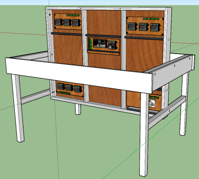
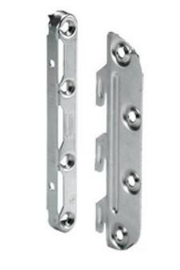
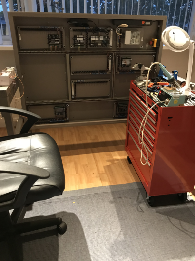
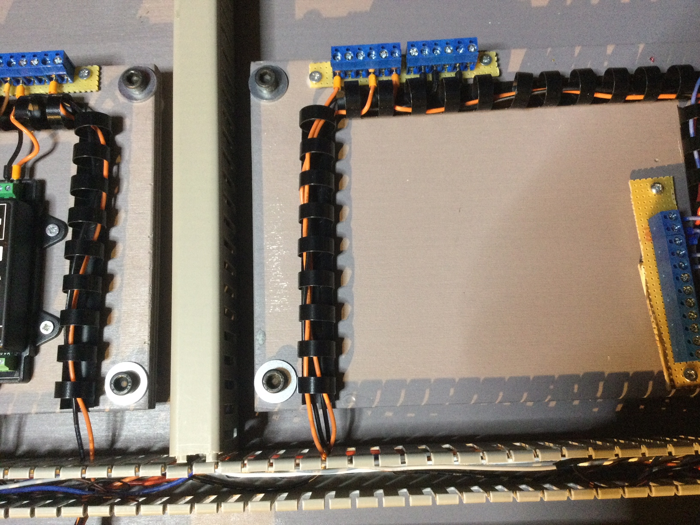
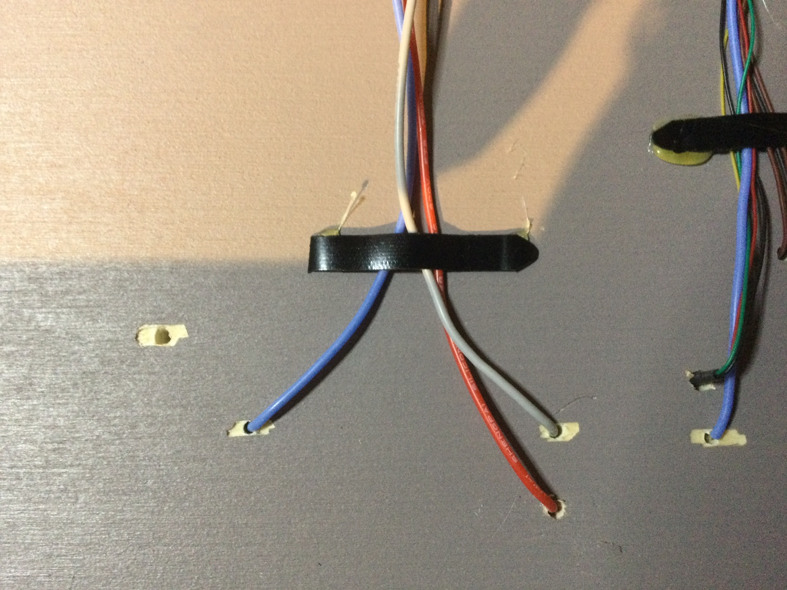
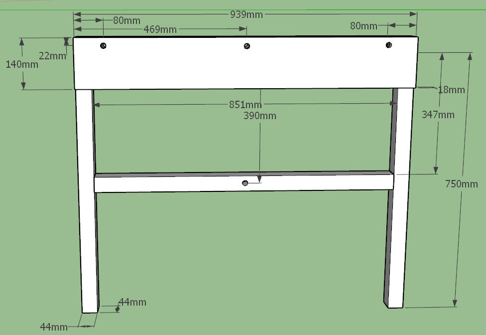
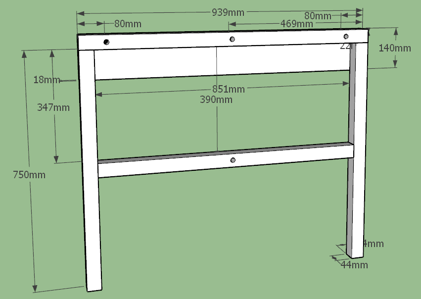
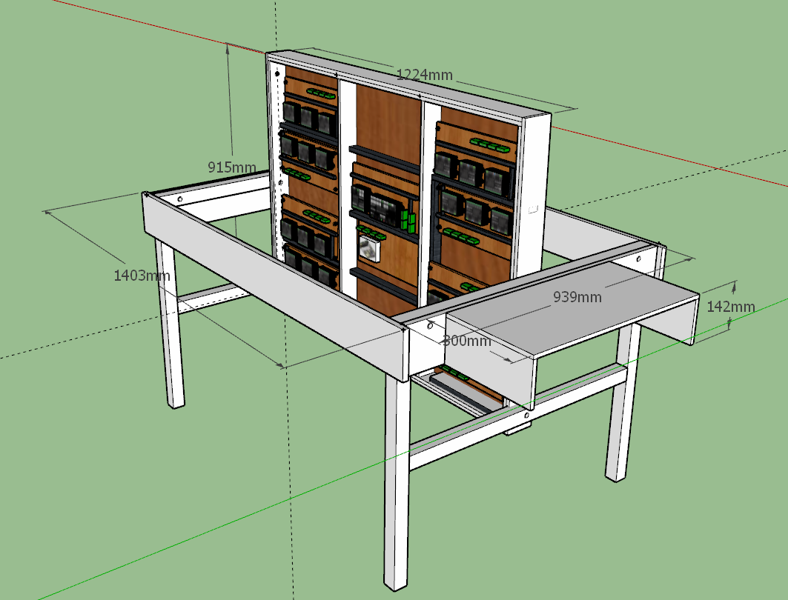

#  Nederlands

[Navigate to English version](#English)

Mijn tafel is getekend m.b.v. SketchUp:

De onderzijde is voorzien van kabelgoten en modules, die met bouten en slagmoeren aan de tafel vastzitten:

De demontabele zijplanken van de tafel zijn bevestigd met ledikanthaken waardoor de planken gedemonteerd kunnen worden:

  

De tafel is kantelbaar waardoor het mogelijk is met een gereedschapswagen en verrijdbare bureaustoel zittend elektronica te monteren:

.

De elektronica inclusief kabelgeleiders zijn gemonteerd op kleine moduleplaten, die met bouten, ringen en afstandbussen onderaan de tafel worden vastgemaakt. Als er nieuwe aansluitingen onder de moduleplaat moeten worden aangebracht, wordt met een klein hoekvormig hulpmiddel de module 90 graden omgeklapt zodat de aansluitingen niet hoeven te worden losgemaakt.

Kabels worden weggewerkt in kabelgoten onder de tafel in combinatie met zgn. bindruggen voor een stapel A4 op de modules:

Onder de tafel worden kleine bosjes kabels bijeen gehouden met een stukje plastic (van een bindrug), die met een lijmpistool op de bodemplaat is vastgeplakt:

Dit idee is afkomstig van "Schattenbahnhof – Anschluss, Verkabeln, Inbetriebnahme | Schreibtisch Modellbahn Spur N" van gebruiker N-Thusia MoBa op Youtube <https://www.youtube.com/watch?v=S9f-oZGuR1M&t=1009s>. Een zeer uitgebreide site met bouwtips trouwens.

Voor de nabouwers zijn hier de afmetingen:

#  English

My table was designed using SketchUp:

Underneath the table cable trays are mounted.  Also modules are present using bolts and nuts with claws to enable quick mounting:

The removable sides of the table are connected to eachother with so called bed mounting clamps:

The table can be tilted to enable a small car with tools and a movable chair to facilitate easy mounting while sitting:

.

The elektronics including cable trays are mounted on small module plates which are connected with bolts, rings and spacers underneath the table. If new connections are needed underneath a plate a small wooden attachment is used to turn the plate 90 degrees without disconnecting all wiring.

.

Cables are put into cable trays underneath the table and on the modules we use plastic rings (used to hold a pack of papers together) :

On the bottom of the tables a small amount of cables is put together by adhesing a small plastic piece using a glue pistol:

This idea was taken from "Schattenbahnhof – Anschluss, Verkabeln, Inbetriebnahme | Schreibtisch Modellbahn Spur N" from user N-Thusia MoBa op Youtube <https://www.youtube.com/watch?v=S9f-oZGuR1M&t=1009s>. By the way a very extended site with construnction tips.

To rebuild this table the dimensions are:

