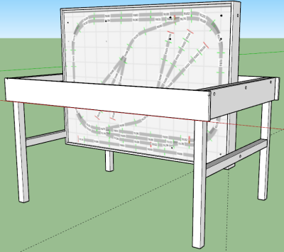
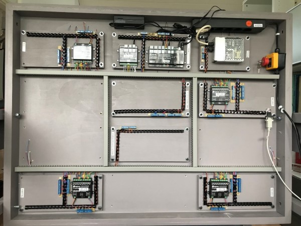

#  Nederlands

[Navigate to English version](#English)

Mijn tafel is getekend m.b.v. SketchUp:

De onderzijde is voorzien van kabelgoten en modules, die met bouten en slagmoeren aan de tafel vastzitten:

De demontabele zijplanken van de tafel zijn bevestigd met ledikanthaken waardoor de planken gedemonteerd kunnen worden:

  

De tafel is kantelbaar waardoor het mogelijk is met een gereedschapswagen en verrijdbare bureaustoel zittend elektronica te monteren:

.

De elektronica inclusief kabelgeleiders zijn gemonteerd op kleine moduleplaten, die met bouten, ringen en afstandbussen onderaan de tafel worden vastgemaakt. Als er nieuwe aansluitingen onder de moduleplaat moeten worden aangebracht, wordt met een klein hoekvormig hulpmiddel de module 90 graden omgeklapt zodat de aansluitingen niet hoeven te worden losgemaakt.

Kabels worden weggewerkt in kabelgoten onder de tafel in combinatie met zgn. bindruggen voor een stapel A4 op de modules:

Onder de tafel worden kleine bosjes kabels bijeen gehouden met een stukje plastic (van een bindrug), die met een lijmpistool op de bodemplaat is vastgeplakt:

Dit idee is afkomstig van "Schattenbahnhof – Anschluss, Verkabeln, Inbetriebnahme | Schreibtisch Modellbahn Spur N" van gebruiker N-Thusia MoBa op Youtube <https://www.youtube.com/watch?v=S9f-oZGuR1M&t=1009s>. Een zeer uitgebreide site met bouwtips trouwens.

In de situatie van een modelspoorbaan is het zeer handig te weten (na het loshalen van een DR4018) welke draden bij welk sein horen. Een tip van collega Theo Goumans van de HCCm. Hij gebruikt gekleurd krimpkous. Kijk ook naar de gebruikte kabelbinders en gekleurde adereindhulzen met dezelfde kleur als de bedrading:

**Kleurcodering seinen**

|Kleur|Dikte|Betekenis|
|-----|-----|---------|
|Rood |AWG24|Rood sein|
|Geel |AWG24|Geel sein|
|Groen|AWG24|Groen sein|
|Oranje|AWG24|15V|

**Kleurcodering wissels**

|Kleur|Dikte|Betekenis|
|-----|-----|---------|
|Bruin|AWG24|Wissel activeren|
|Zwart|AWG24|15V|

**Kleurcodering rails**

|Kleur|Dikte|Betekenis|
|-----|-----|---------|
|Rood|AWG24|DCC K rail|
|Blauw|AWG24|DCC D rail (DCC J na diodebrug)|
|Grijs|AWG24|Bezetmelder|

**Kleurcodering verdeling**

|Kleur|Dikte|Betekenis|
|-----|-----|---------|
|Rood|AWG20|DCC K verdeling|
|Geel|AWG20|DCC J verdeling|
|Blauw|AWG20|DCC D verdeling (DCC J na diodebrug)|
|Oranje|AWG20|15V verdeling|
|Zwart|AWG20|0V verdeling|

Voor de nabouwers zijn hier de afmetingen van de tafel:

#  English

My table was designed using SketchUp:

Underneath the table cable trays are mounted.  Also modules are present using bolts and nuts with claws to enable quick mounting:

The removable sides of the table are connected to eachother with so called bed mounting clamps:

The table can be tilted to enable a small car with tools and a movable chair to facilitate easy mounting while sitting:

.

The elektronics including cable trays are mounted on small module plates which are connected with bolts, rings and spacers underneath the table. If new connections are needed underneath a plate a small wooden attachment is used to turn the plate 90 degrees without disconnecting all wiring.

.

Cables are put into cable trays underneath the table and on the modules we use plastic rings (used to hold a pack of papers together) :

On the bottom of the tables a small amount of cables is put together by adhesing a small plastic piece using a glue pistol:

This idea was taken from "Schattenbahnhof – Anschluss, Verkabeln, Inbetriebnahme | Schreibtisch Modellbahn Spur N" from user N-Thusia MoBa op Youtube <https://www.youtube.com/watch?v=S9f-oZGuR1M&t=1009s>. By the way a very extended site with construction tips.

In the situation of a modeltrain a very usefull tip for knowing which wire belongs to which signal (after disconnecting a DR4018) is to use coloured shrinking tube. This tip came from a college Theo Goumans from the Modeltrain Department of the Dutch Hobby Computer Club. Take also a look at the cable ties and coloured terminal crimps with the same colour as the wires:

.

**Wire color signals**

|Color|Diameter|Meaning|
|-----|-----|---------|
|Red |AWG24|Red signal|
|Yellow  |AWG24|Yellow signal|
|Green |AWG24|Green signal|
|Orange|AWG24|15V|

**Wire color switches**

|Color|Diameter|Meaning|
|-----|-----|---------|
|Brown|AWG24|Activate switch|
|Black|AWG24|15V|

**Wire color rails**

|Color|Diameter|Meaning|
|-----|-----|---------|
|Red|AWG24|DCC K rail|
|Blue|AWG24|DCC D rail (DCC J after diode bridge)|
|Gray|AWG24|Occupation signal|

**Wire color distribution**

|Color|Diameter|Meaning|
|-----|-----|---------|
|Red|AWG20|DCC K distribution|
|Yellow|AWG20|DCC J distribution|
|Blue|AWG20|DCC D distribution (DCC J after diode bridge)|
|Orange|AWG20|15V distribution|
|Black|AWG20|0V distribution|

To rebuild this table the dimensions are:

