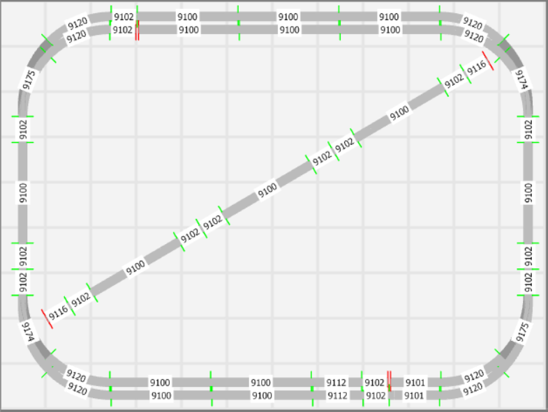
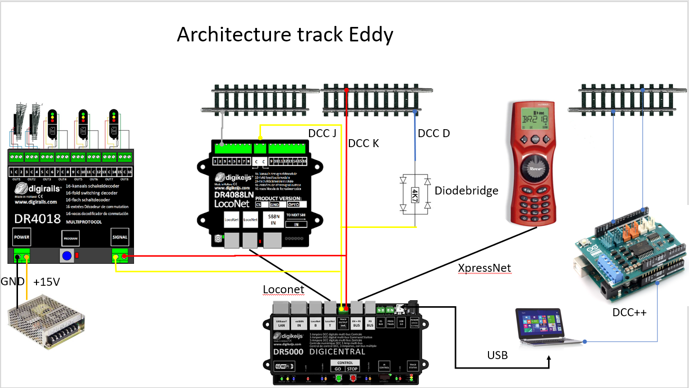
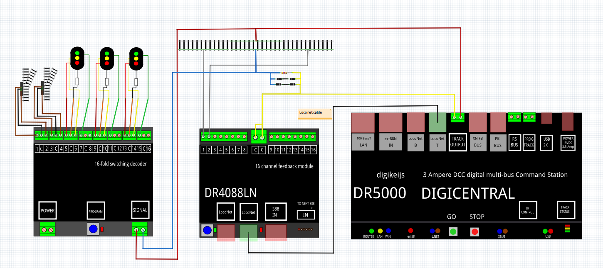

# Nederlands

[Navigate to English version](#English)

Mijn baan is getekend in 3D Modelbahn Studio en in RocRail:

3D Modelbahn Studio is niet helemaal foutloos. Uitsluitend baanstukken zijn gebruikt uit de library en toch sluiten bepaalde stukken niet aan (twee rode vertikale streepjes).

De architectuur van de besturing:

Het elektrische schema is getoond van slechts een van de 4 DR4018. Voorlopig zijn de seinen met 3 lichten aangesloten alsof er 4 lichten zijn. Het DCC-signaal voor de DR4018 is aangesloten achter de diodebrug, omdat dit makkelijker bedraden is onder de tafel. De DR4018 ondervindt hiervan geen hinder.

Het uiteindelijke [RocRail-bestand in XML](./images/plan.xml) om de baan te besturen is bijgevoegd.

# English

My model railroad is drawn with 3D Modelbahn Studio and with RocRail:

3D Modelbahn Studio is not quite perfect. Although only library track pieces are used some pieces do not join (two red vertical stripes).

The control architecture:

The elektrical schema is drawn with only one of four DR4018. At the moment the 3 light signals are connected as 4 light signalswith one spare connection. The DCC signal for the DR4018 is connected behind the diode bridge, because of ease of wiring under the table. The DR4018 has no problems receiving the DCC signal.

The final [RocRail-file in XML](./images/plan.xml) to control my modeltrain track is available.
