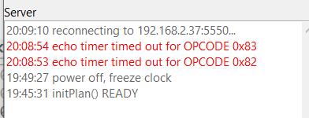

#  Nederlands

### Scenario's op een modelspoorbaan
Er zijn diverse computerprogramma's verkrijgbaar voor het besturen van een modelspoorbaan. Er is een vergelijking gemaakt van een aantal functies en scenario's binnen een modelspoorbaan en hoe dit te realiseren valt met een aantal pakketten. Omdat de schrijver geen oneindig budget heeft en de tijd benodigd om alle scenario's uit te voeren langer is dan de tijd van de proeflicentie is de vergelijking beperkt tot een gratis (RocRail) en een gekocht pakket (Win-Digipet).

De titels in de tabel verwijzen naar een uitlegf met plaatjes onderaan de tabel. Een lege plek betekent dat dit nog onderzocht moet worden.

|Eigenschap/scenario|RocRail|WinDigipet|
|-------------|-------|-------|
|****Editor****| | |
|[Verplaatsen component](#Verplaatsen_component)|👍|👎|
|[Blok selecteren & verplaatsen](Blok_selecteren_verplaatsen)|👎|👍 |
|[Enkelvoudige of samengestelde componenten](#Samengestelde_componenten)|Enkelvoudig|👍Samengesteld |
|[Accessoires](Accessoires)|👎|👍|
|****Seinen****| | |
|Seinbeeld groen-geel-rood|||
|Seinbeeld groen-groen-groen|| |
|Wanneer rood na groen?|👎|👍 |
|Configuratie|👎|👍 |
|****Blokken****| |
|Stoppen|||
|Bezet lange trein|||
|Automatische treinsamenstelling|
|Keerlus|||
|****Communicatie****| |
|USB verbreken|👎||
|TCPIP verbreken|👍||

# Editor

## Verplaatsen component
Bij RR werkt het net als bij iedere grafische editor: klik aan met linker muis, houdt ingedrukt en trek naar nieuwe positie.

Bij WDP is het verplaatsen van één losse component lastiger dan bij RR.

## Blok selecteren verplaatsen
Hoe makkelijk of moeilijk is het als we een in banenplan een rechthoek met onderdelen willen selecteren en verplaatsen.

Bij RR gaat de gebruiker op een vak in het banernplan staan door deze aan te klikken. Vervolgens rechtermuis en Selecteren. De gebruiker moet nu een rechthoek aangeven een de bestemmingspositie en daarna of het een verplaatsen op kopiëren is.

Bij WDP is het rechtermuis klikken en daarna rechthoek trekken met ce muis. Dan kiezen voor uitsnijden, kopiëren of invoegen. Dit werkt makkelijker dan bij RR.

# Samengestelde componenten
Bestaat de bibliotheek uit losse baanonderdelen of zijn er ook complete sets met b.v. een inhaalspoor en 4 seinen?

Bij RR zijn er alleen enkelvoudige componenten:

Bij WDP is er een uitgbreide verzamelijng samengestelde componenten:

## Accessoires

Bevat de library extra componenten zoals bruggen, tunnels, loodsen?

Bij WDP uitgebreide set:

# Seinen

## Seinbeeld groen-geel-rood

Als een trein tenminste twee vrije blokken voor zich heeft, maar het 3e blok daarachter is bezet, dan is het seinbeeld in Nederland dat bij vertrek uit het huidige blok groen wordt gegeven en het volgende sein op geel staat en het sein in het laatste 3e blok rood, omdat het daaropvolgende blok bezet is.

In RRklik je in de configuratie op reserveer 2e blok aan. Pas op: bij wissels kan een verlaagde snelheid zodanig van invloed zijn dat sein toch geel wordt.

## Seinbeeld groen-groen-groen
Als een trein meer dan twee vrije blokken voor zich heeft gaan dan alle seinen op groen?

## Wanneer rood na groen?
In het Nederlandse seinbeeld zal het sein bijna meteen na het passeren van de locomotief of het eerste rijtuig rood worden.
Bij RR wordt vorige blok  pas rood bij entry-melder volgende blok. Bij langere wisselstraat komt dit niet overeen met het grootspoor

## Configuratie
Hoe kunnen verschillende aansturingen van schakeldecoders worden geconfigureerd? Bij RR is de GUI druk. Veel trial & error. Welke velden moet je invullen als je bij Control één van de mogelijkheden kiest? En er zijn drie tabbladen met informatie:

Bij WDP is er duidelijk inzicht in de verbinding adres-dood/groen-seinbeeld:

# Blokken

## Stoppen
Waar kan er gestopt worden bij een blok? Aan het begin, middenin, einde? Bij WDP is een zeer uitgebreide set mogelijkheden omn de trein net voor het sein of halverwege het peroon te laten stoppen inclusief afremgrafieken.

## Opstelspoor
Kunnen er meerdere treinen op één opstelspoor staan?

## Geluid en licht bij blokken
Soms wil je geluid en licht uit bij binnenkomst en/of bij vertrek. Bij opstelsporen juist stilte en licht uit.

## Lange trein
Kan het programma het vorige blok langer bezet houden bij een trein langer dan de bloklengte?

## Automatische treinsamenstelling
Kan je makkelijk een trein met wagons automatisch laten samenstellen door het programma of is er dan scripting o.i.d. nodig?

## Keerlus
Hoe makkelijk is het om op een 2-railbaan een keerlus in te stellen?

## Beveiliging

## Spooktreinen
Detecteert het programma dat een trein een wissel verkeerd heeft genomen?
|
## Defecte trein
Detecteert het programma dat een trein na een startcommando niet gaat rijden door b.v. vervuiling op de baan?

## Deadlock
In hoeverre kunnen treinen elkaar compleet blokkeren?|Op mijn baan gehad
## Communicatiestoringen
Wat gebeurt er als de communicatie laptop - commandocentrale even uitvalt? Bij RR zal na het eruit trekken van de USB-Loconet RocView opnieuw moeten worden opgestart.

## Kortsluiting/ontsporing
Hoe makkelijk krijg je alles weer aan het draaien?

## Deelsluiting
Kan de rest van de baan doordraaien bij een gedeeltelijke kortsluiting? Ziet de software het kortgesloten deel als bezet?

## Logging
Kun je uit een logging fouten opsporen? Dump loconet-berichten

# Instellingen
## Kloksnelheid
Kan de klok van het systeem versneld worden zodat b.v. een gehele dag van 24 uur kan worden afgespeeld in 24 minuten?

## Context sensitive help
Hoe makkelijk vind je hulp bij een bepaald programma-onderdeel?
## Locomotief
## Positiewisseling
Kunnen loc's makkelijk omgewisseld worden van een rijtje wagons?

## Inhalen
Kan er worden ontkoppeld, middels een inhaalspoor worden omgereden en achteraan zojuist losgekoppelde wagons weer aangesloten worden?

## Snelheid
Hoe staan de snelheden in het systeem genoteerd in decoderstappen of km/h?
## Dual loc
Het instellen van twee gekoppelde loc's

# Wissels
## Drieweg
Hoe worden driewegwissels aangestuurd, in één keer of als twee aparte wissels?

## Automatisch rijden

# Communicatie
Wat gebeurt er met het pakket als de communicatie met het computerbesturingsprogramma wordt onderbroken (concreet de stekker er eventjes uit). Bij RR zal na het verbreken van de USB RR opnieuw moeten worden opgestart. RR reconnect wel bij een TCP/IP-verbinding:

Aantekeningen uit de handleidingen

Railware
* Railware snelheidbeperking per sein instelbaar, maar seinen zijn toch cosmetisch (181)?

* Railware 5 instellingen qua snelheid voor 5 seinbeelden (175). Bij anderen niet expliciet gezien.

* Railware koppeling van seinen naar beeld voorliggend sein (179); niet blok?

WDP

* WDP 348 moet ik wissels aan blokken koppeln. Doet ie dat niet zelf middels een soort analyzer?

* WDP werkwijze met terugmeldcontacten vreemd. Niet een melder op een positie, maar stuk rails.

RR

* Tussen CS apart protocol RCP zie de index in  http://www.rocrail.net/doc/rocrail-wrappers/wrapper-en-index.html  en de feitelijke beschrijving in  http://www.rocrail.net/doc/rocrail-wrappers/wrapper-en.html#model

TC

* TC lijkt ook een programmeur zie https://www.freiwald.com/forum/viewtopic.php?f=11&t=36028&p=230573&hilit=Firma#p230573
